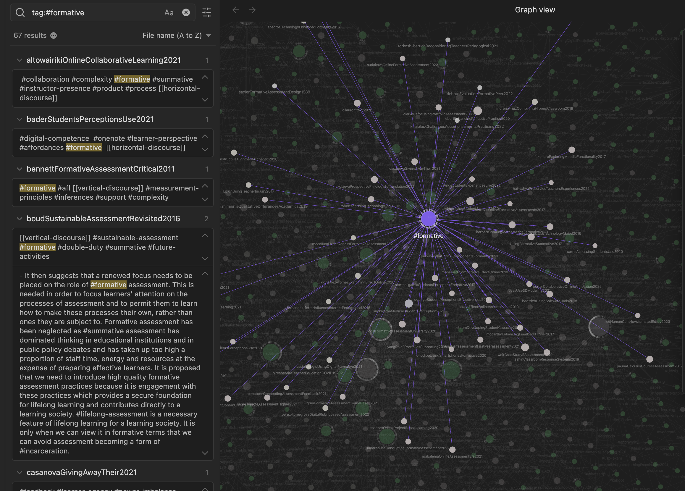

#  Welcome {-}

This is the course book for LDRS 101: Learning with Technology. This book is divided into 6 units of study to help you engage with the course learning outcomes and prepare for the course assessment.  

On the page below you will find a summary of the course syllabus, as well as how to navigate this book.  Please also refer the schedule in Moodle, as well as the Assessment section in Moodle for instructions on assignments.

If you have any questions, do not hesitate to ask. We are here to help and be your guide on this journey.

> The syllabus includes key information about the course schedule, assignments, and policies. Please read the full course syllabus, which you will find in Moodle. For information on how to navigate through this course on Moodle, see [here](https://trinitywestern.teamdynamix.com/TDClient/1904/Portal/KB/?CategoryID=8214).


### Course Description  {-}

Introduces theories and competencies related to learning and thriving in a digital world. Explores how learners are situated in 'the digital' throughout their lives and how they can use digital technologies to enhance and enrich their experience of learning, working, and playing. Learners will begin to build a curated digital footprint, initiate and develop personal and professional learning networks; develop competencies to allow them to evaluate and choose digital platforms and tools that are safe and ethical; and explore how to use digital technologies to discover, curate, connect, and share knowledge with their communities.

### Course Learning Outcomes  {-}

1.	Build and customize technology-integrated workflows to enhance and enrich your learning journey.  
2.	Apply digital literacy skills to evaluate the legitimacy, credibility, and reliability of online resources for academic study.  
3.	Practice evaluative judgment to document your process of learning in complex domains of knowledge.  
4.	Create a personalized narrative to document and express your learning process.  
5.	Evaluate digital tools, platforms, and interactions based on ethical principles.  
6.	Develop personal and professional learning networks to discover and share knowledge, collaborate with others, and become engaged digital global citizens.  
7.	Create inclusive digital communities which embody a sense of belonging, connection, and Christian hospitality.  


<!--

### Meet Your Instructors {-}

[insert]

-->


## Course Notes {-}

### How To Navigate This Book {-}

Take a moment to experiment with the controls in the toolbar at the top of the page. You can search this book for a word or phrase (for example, to look up a definition). To move quickly to different portions of the book, click on the appropriate chapter or section in the table of contents on the left. The buttons at the top of the page allow you to show/hide the table of contents, search the book, adjust the typeface, the font size, and the background colour to make the text easier to read. 

```{r, echo=F, fig.cap="Top menu bar", fig.show="hold", results='asis'}

knitr::include_graphics("assets/course-intro/menu.png")

```

The faint left and right arrows at the sides of each page (or bottom of the page if it’s narrow enough) allow you to step to the next/previous section. Here’s what they look like:

```{r, echo=F, fig.cap="Left and right navigation arrows", fig.show="hold", results='asis'}

knitr::include_graphics("assets/course-intro/left_arrow.png")
knitr::include_graphics("assets/course-intro/right_arrow.png")
```

You can also download an offline copy of this books in a pdf format. If you are having any accessibility or navigation issues with this book, please reach out to your instructor or our online team at [elearning@twu.ca](mailto:elearning@twu.ca)


### Course Units{-}

 This course is organized into 6 units. Each unit of the course will provide you with the following information:

- A general overview of the key concepts and skills that will be addressed during the unit.
- Specific learning outcomes and topics for the unit.
- Learning activities to help you engage with the concepts and practice digital skills. These often include key readings, videos, exploring digital tools, and reflective prompts.
- The Assessment section provides details on assignments you will need to complete throughout the course to demonstrate your understanding of the course learning outcomes.

 ```{block, type='caution'}
 Note that assessments, including assignments and discussion posts will be submitted in Moodle and in WordPress.  See the Assessment tab in Moodle for assignment details and dropboxes.
 ```

### Course Activities{-}

Below is some key information on features you will see throughout the course. 

```{block, type='reflect'}
***Learning Activity***  
This box will prompt you to engage in course concepts, often by viewing resources and reflecting on your experience and/or learning. Most learning activities are ungraded and are designed to help prepare you for the assessment in this course.
```

```{block, type='assessment'}
***Assessment***  
This box will signify an assignment you will submit in Moodle.  Note that assignments demonstrate your understanding of the course learning outcomes. Be sure to review the grading rubrics for each assignment.
```

```{block, type='progress'}
***Checking Your Learning***  
This box is for checking your understanding, to make sure you are ready for what follows.
```

```{block, type='feedback'}
***Note***  
This box signifies key notes, important quotes, or case students. It may also warn you of possible problems or pitfalls you may encounter!
```

<!--
@cmadland could I suggest this tech table from https://course.oeru.org/lida101/course-guide/course-technologies/ instead of introducing Hypothes.is instructions here?  

-->

### Course Technologies{-}

This course is about learning with technology. Digital literacies are closely linked but not limited to digital skills. Consequently, this course will use a number of different online communication and publishing technologies to support your learning.

#### An open philosophy of inclusion {-}

Learning with Technology incorporates a wide range of online technologies and software applications. In this course we want to promote free and open source software because we believe that no learner should be denied access to learning for lack of funds to purchase a proprietary software license.  Nor do we believe that you should be forced to sacrifice your freedoms in software choice.

The course resources and interaction technologies are based entirely on free and open source software and you will be able to complete all the learning activities using open source applications without the need to purchase any software. You are free to use proprietary technology applications of your choice, but you can also use this course to explore and experiment with open technology.

#### Summary of technologies used on this course {-}

The following table provides a summary of the main technologies used in this course.

| **Technology**       | **Details**             |
|----------------------|----------------------------------------|
| Moodle      | TWU uses Moodle as our Learning Management System. For LDRS 101, your course notes, assignment instructions, assignment dropboxes will be found in Moodle. Note that some assignments require you to complete your work in WordPress and Discourse.                                                                                                                                                                                                       |
| Course Book  | Course materials are organized into the Course Book tab in Moodle and contain the instructions to guide your learning. Bookmark this page in your browser.  |
| Discourse   | Discourse is a free, open source social network which is hosted at <https://twu.discourse.group/> (bookmark this page).  We use Discourse in this course for discussions. Go to the [LDRS101 forums](https://twu.discourse.group/c/ldrs101/10) in Discourse to explore some of the topics you might engage with during this course.       |
| Obsidian    | Obsidian is a free note-taking and mind-mapping app. We introduce this digital tool early on in the course as you will use it often for your journal reflections, and for your assignments.   |
| Litmaps | Litmaps is a web app that you can use to discover and manage resources. In this course you will use Litmaps to build a map of the literature related to topics you want to research.    |
| Hypothes.is | We use [Hypothes.is](https://hypothes.is/), an open source web-service that enables users to annotate, discuss and share reflections on web site pages on the Internet.   |
| WordPress    | In Unit 4 we introduce WordPress, a free, open-source platoform used to create websites and blogs. Learners are invited to establish their own **personal course blog**. In this way you will retain control over your own data even when the course is finished.  We recommend WordPress as this tool is supported by TWU, but you may use a blogging platform of your choice.      |
| Zoom     | Zoom is a communications platform that allows you to connect via video, audio, phone, or chat. Note the GX Live sessions may use Zoom for the Learning Lab sessions. GX Prime students are encouraged to take advantage of the Learning Hub, which will have weekly Zoom meetings as well.    |

<!--

| Course feed          | The [Course feed](https://course.oeru.org/lida101/interactions/course-feed) is a unique feature of OERu courses. Course comments and posts tagged with the course code (LiDA101) on the course forums, your course blog, the resource bank, our social network and [Hypothes.is](https://hypothes.is/) will be harvested and incorporated into the live course feed. This is the hub for keeping track of the distributed course interactions on the web. |
| Course resource bank | The [resource bank](https://bookmarks.oeru.org/search.php/all/lida101) is a site used to share web links and summaries of useful resources you find online. We encourage learners to share links publicly with your peers. Remember to vote for links you find useful on the site. Search using the course tag: “LDRS101”   

-->


#### Learn by Doing {-}

Some learners will be familiar with these technologies, while others will be using them for the first time. We use a learn by doing approach and you will be prompted in the course materials when to interact with these different technologies.

Initially the use of different technologies distributed on the web may be confusing. However, this is a course about learning on the Internet and once you have completed this course, you will become a competent user of these online technologies.

Have fun and enjoy the learning experience!


<!--

@cmadland could I suggest this tech table from https://course.oeru.org/lida101/course-guide/course-technologies/ instead of introducing Hypothes.is instructions here?  


The following tools will be introduced in this course. Feel free to explore the links below, or wait until they are introduced in the particular unit in which the tool is required.

#### Course Annotations{-}

[Hypothes.is](https://web.hypothes.is/) is our annotation tool. With hypothes.is you can annotate web pages on the Internet as well as keeping private notes when using the highlight feature.

Hypothes.is enables you to:

- Select text to annotate.  
- Add tags and post publicly or save privately.  - 
Reply to or share any annotation.  
- Link to notes or whole pages.  
- Annotate together in groups.  
- Collaborate privately with others.  
- Search your notes.  
- Explore all public annotations and profiles.  


##### How to annotate a web-page {-}

Four steps to annotating web pages using hypothes.is:

Step 1: [Create an account](https://hypothes.is/signup) on the Hypothes.is website.
Step 2: Add Hypothes.is to your browser. ([Install](https://web.hypothes.is/start/#) the add-on for Chrome or bookmarklet for other browsers).
Step 3: Go to any web page, launch Hypothesis (using the Chrome add-on or browser bookmarklet) and log in using the account you created at Hypothes.is.
Step 4: Highlight the text you want to annotate (see [how to highlight text](https://www.computerhope.com/issues/ch001669.htm) published by computerhope.com), click on the “Annotate” button which appears when you highlight the text, type your annotation and click “Post to Public”.
The following video provides a brief overview of how to post an annotation. Watch [Hypothesis Web Annotations](https://www.youtube.com/watch?v=BFPYqXubTsE)


<div class ="video-container">

<iframe width="560" height="315" src="https://www.youtube-nocookie.com/embed/BFPYqXubTsE" title="YouTube video player" frameborder="0" allow="accelerometer; autoplay; clipboard-write; encrypted-media; gyroscope; picture-in-picture; web-share" allowfullscreen></iframe> 

</div>


##### Resources {-}

Go to the [Get Started](https://web.hypothes.is/start/) page to sign up.
- [Quick Start Guide for Students](https://web.hypothes.is/quick-start-guide-for-students/)
- [Student resource guide](https://web.hypothes.is/student-resource-guide/)
- [Annotating as a group](https://web.hypothes.is/help/annotating-with-groups/) (i.e. share annotations on a page or pages)
If your course is using Hypothes.is to  instructions will be given in the course. Instructions on this can be found here


-->

<!--chapter:end:index.Rmd-->

# Introduction to Digital Literacies for Online Learning

## Overview {-}

Welcome to Unit 1 of Learning with Technology! This course will introduce you to some ideas related to living, learning, and working in our digitally-saturated society. It is our intent to provide you with opportunities to start your university career with an emerging set of skills and literacies related to digital tools for learning. Within your academic pursuits, you will encounter a vast amount of information, and integrating digital tools into your learning journey might be difficult. Your chosen discipline will provide ample learning possibilities, and incorporating digital tools to enhance your learning may prove challenging. This course will give you a head start on using digital tools to build a workflow that will allow you to stay organized and to make your process of learning visible for yourself and your instructors. We will also lead you through readings and thoughts about your digital identity, privacy and security, and sharing your new knowledge in ethical ways.

There will be two primary branches of the course and the tools that we will show you. The first branch will be a workflow that is private to you because it takes place primarily on your own computer, and the second branch is shared as publicly as you are comfortable sharing. You will have control over how public your work is, but we will think about the importance of sharing knowledge and how to do that easily and in ways that preserve your 'ownership' over your work.

In this first unit, there will be both theoretical and practical work for you to do. In order to build a theoretical understanding of digital tools for learning, we will explore the idea of *the digital* in the context of contemporary society. At the same time, there are some important practicalites to manage in order to get set up for the course, so we will lead you through installing some apps on your computer that you will use extensively in this course, and which hopefully will become the backbone of your digital workflow throughout your time in higher education and beyond.

### Topics {-}

This unit is divided into the following topics:

1. Learning with Technology at TWU  
1. Learning Online
1. Understanding the Digital  
1. Starting your Workflow  
1. Digital Literacies  
1. Digital Privacy and Safety  

### Learning Outcomes {-}

When you have completed this unit, you should be able to:

- Explore common digital tools used at Trinity Western University
- Describe your engagement with digital technology  
- Apply digital tools to support learning in an academic environment  
- Explain what digital literacy means to you  
- Examine privacy concerns related to various platforms and tools  
- Describe how to protect yourself and others in the digital environment.  
- Identify the literacies you plan to improve and what steps you will take to achieve your goals.

### Activity Checklist {-}

Here is a checklist of learning activities you will benefit from in completing this unit. You may find it useful for planning your work.

```{block2, type='reflect'}

<span class="blockhead">Learning Activities</span>

- Reflect on why you chose TWU and share your expecations with your peers.
- Write an introduction post on [the Learning Hub](https://twu.discourse.group){target="_blank"} in Discourse.  
- Search online for learning tools to help with note-taking, project managment, writing, etc. Share your findings on Discourse.
- Download and install [Obsidian](https://obsidian.md){target="_blank"}  
- Download and open the course vault in Obsidian. Activate the plugins that came with the Obsidian vault.  
- View the resources provided on the 21st century learner
- Create a Visitors and Residents diagram  
- Get a password manager  
- Use the Terms of Service: Didn’t Read site to look up each of the apps we will learn in this course. 
- Write a reflection on digital literacies in your learning journal.

You will be directed to complete these activities as they come.  

**Note:** The learning activities in this course are designed to prepare you for the graded assigments in this course.  You are strongly encouraged to complete them.


```

```{block2, type='assessment'}

<span class="blockhead">Assessment</span>

- **Assignment 1: Learning Journal** - submit after you have completed Units 1-3.

*See the Assessment section in Moodle for assignment details.*

```
<!--

During this unit you will:

- create a Visitors and Residents diagram  
- download and install [Obsidian](https://obsidian.md){target="_blank"}  
- download and open the course vault in Obsidian  
    - activate the plugins that came with the Obsidian vault  

You will be directed to complete these activities as they come. 

-->

<!--
```{block2, type='reflect'}

<span class="blockhead">Learning Activities</span>

- Watch the introduction video on ...and read... 
- Establish a personal learning environment by setting up your own course blog.
- Ilustrate your engagement with digital technology through a mind map.
- Publish your first blog post, introducing yourself to course participants.	
- Audit your own digital footprint to find out what exists on the internet about you
- Share what social media technologies you use to support learning and how you use them by posting in the community forum in Discourse.
- Build or update your professional online biography and the “About” page of your academic / course website.                                                                                                                                                                                                              	
- Post in Discourse, sharing a comment about your learning on this course. 
- Read an online article and annotate it using Hypothes.is.
- Search, evaluate, select, annotate, tag, and share resource links.
- Post in the Discourse forum, reflecting on the reasons why digital literacy matters to you
- Blog about your personal definition of digital literacies and the digital visitor / digital resident personal learning network (PLN) mapping exercise
- Take the Self-Check Quiz on Unit 1 concepts. (ungraded)  
 
**Note:** The learning activities in this course are designed to prepare you for the graded assigments in this course.  
You are strongly encouraged to complete them.


```
-->

### Resources {-}

- All resources will be provided online in the unit.  

## Learning with Technology at TWU 

### Activity: Why TWU? {-}

```{block2, type='reflect'}

Before we dive in to some digital tools you may use in your academic studies at Trinity, let's pause and think about what TWU means to you.  Why did you choose TWU?  What do you hope to achieve during your time here?

To give you some idea of what life is like at TWU, and why people choose TWU, watch the following video: [Discover being an International Student at Trinity Western University](https://www.youtube.com/watch?v=VkyZjv3ZbXg)


<div class ="video-container">

<iframe width="560" height="315" src="https://www.youtube-nocookie.com/embed/VkyZjv3ZbXg" title="YouTube video player" frameborder="0" allow="accelerometer; autoplay; clipboard-write; encrypted-media; gyroscope; picture-in-picture; web-share" allowfullscreen></iframe> 

</div>


What do you think? Consider the following prompts:

- I'm excited to join the TWU community because ...
- I have questions about TWU: ...
- I am confident that ...
- I am concerned about ...

```

### Activity: Join the Hub!  {-}

```{block2, type='reflect'}

Head over to [the Learning Hub](https://twu.discourse.group){target="_blank"}, which is an app called *Discourse* that we use to build community among learners in the GX program. Find the *Leadership 101* category and respond to the *Welcome* forum.  As you introduce yourself, share your thoughts and questions you have about TWU.

```

In this first topic we focus on the digital tools you should be familiar with as you start university.  Let's dive in to some common technology tools in academia. 

Below is a checklist of the technical skills, hardware, software, accessories, and other tools required for study at TWU.  Click on the titles below for information on the tools and skills you are most interested in:

<details>

<summary>**Technology Proficency**</summary>

First, let's tackle what technical skills you will need as you start your studies.  As you read, check off skills you have acquired and feel comfortable using.

- Basic computer skills  
- Sending/receiving email  
- Sending and receiving attachments via email  
- Using a web browser  
- Finding resources through search engines (e.g. Chrome or Firefox)  
- Downloading and installing software  
- Familiarity with using browser plug-ins (e.g. PDF reader, video, audio)  
- Using a word processing, presentation software, or other productivity applications  
- Experience/familiarity with a variety of file formats such as: .pdf "Portable Document Format", .rtf "Rich Text Format", .doc or .docx "Microsoft Word Document", or .txt "Text document"  
- The ability to be self-directed in learning new technology skills (e.g. following a handout, a step-by-step tutorial, online video help, or access to support to learn necessary skills)  

This last skill is essential, as you will likely come across some tech tool that you need to figure out.  Consider how much you've learned in this course so far. You've got this!

</details>

<details>

<summary>**Basic Hardware, Software & Accessories**</summary>

This next section will outline basic hardware and software, and accessories you will likely need as a TWU student. As you read, check off items you have, and/or feel comfortable using.

##### Hardware {-}
- Computer - PC, Mac, Chromebook or tablet  

##### Software {-}
- Windows 10 or newer  
- Mac OS 10.14 or newer  
- Microsoft 365  

##### Recommended Accessories {-}  
- Speakers, Microphone or Headphones  
- Video Camera (Webcam)  
- Scanner or Camera	  

</details>

<details>

<summary>**Internet Access, Browsers & Connection Speed**</summary>

- Wi-Fi  
- High speed Broadband Internet Connection is Required  
- Internet Browser: The most recent release of Chrome or Firefox is recommended.  

***Recommended Internet speeds:***  

- Download speed of at least 25 mbps  
- Upload speed of at least 3 mbps  
- Ping response of less than 100ms  

```{block, type='feedback'}

Test your Internet speed using [speedtest.net](speedtest.net) 

```

Please consider the following while participating in online/hybrid courses:  

- Using a shared Internet connection will impact connectivity, such as additional household members use of streaming TV, gaming, and other Internet usage.  
- Wireless connections may be impacted by the distance from the router and interference from microwaves and other electronics. (Wired connections are recommended.)  
- Your Internet Service Provider’s performance may vary throughout the day based on community usage.

</details>

<details>

<summary>**Shared Drive, Sharing & Backup**</summary>

**[Data & Cloud Storage and Sharing](https://trinitywestern.teamdynamix.com/TDClient/1904/Portal/KB/ArticleDet?ID=128533){target="_blank"}**  

Cloud storage software provides web access to your online file storage, file sharing, and file synchronization. The only TWU approved Cloud Storage & Sharing services are:  

- [Microsoft OneDrive](https://trinitywestern.teamdynamix.com/TDClient/1904/Portal/KB/ArticleDet?ID=71260){target="_blank"}  
- [Microsoft SharePoint](https://mytwu.sharepoint.com/){target="_blank"}  
- [OwnCloud](https://trinitywestern.teamdynamix.com/TDClient/1904/Portal/KB/ArticleDet?ID=15681){target="_blank"}  

The responsibility for storing TWU documents and files lies with the person who stores the data. Judgment is required about how and where TWU data will be stored.  

TWU has a formal Information Security Policy and related Information Security Guidelines. This article provides some additional direction based on this set of policy and guidelines.  

Different data is governed by different regulations, laws, agreements, and rules; each requires different means of protection and reporting.  

**What about other 3rd party cloud storage solutions (Dropbox, Google Drive, Box, WeChat etc...)?**
In general, the use of unauthorized 3rd party cloud storage is not a good idea. TWU provides faculty and staff with the tools needed to collaborate internally and externally. The reasons below elaborate on the reasoning behind this position.  

*Lack of Visibility* - Since these software are not integrated into our network, there is no way we can retrieve data stored in these systems if an employee or faculty member leaves the institution and fails to disclose the usage of that account, or has it attached to a personal email account. If TWU data are present in those accounts, then it can be easily lost or compromised, which can lead to institutional and legal consequences.  

*Lack of Accountability* - There is no way to effectively manage information security if a faculty or staff member is using unauthorized cloud storage. Additionally, there is no way to know if those data have been compromised and no ability for our forensics team to conduct analyses on these data in the event of a security incident.  

*Lack of Support* - We don't offer technical support to these services. So, if something goes wrong, is lost or compromised, IT will have no way to help users who have lost data or been locked out of accounts.  

*Collaboration* - We each have our own preferences when it comes to the various technologies we like to work with. There is not always a best tool for everyone. However, collaboration becomes more difficult when each individual or department selects there own collaboration platforms, prioritizing individual needs above the whole.  

*Student Centred* - We will put students first. These guidelines ensure we are protecting information and ultimately protecting our students. We have been entrusted with a great deal of personal and private information and must ensure the decisions we make are protecting that information.  

**How to Share Data**
With Microsoft OneDrive and SharePoint, you can securely share files internally and externally. However, it is important to understand the different Data Classification levels and acceptable ways to share your files (Data Protection Guidelines).  

Guidance Table for Sharing Data  

| **Link Type**                        | **Confidential**             | **Sensitive**                | **Public**                                   |
|--------------------------------------|------------------------------|------------------------------|----------------------------------------------|
| **Specific People Internal User**    | Acceptable                   | Acceptable                   | Acceptable                                   |
| **Specific People External User**    | Acceptable Use good judgment | Acceptable Use good judgment | Acceptable                                   |
| **People in TWU (Internal Link)**    | Never                        | Acceptable Not Advisable     | Acceptable                                   |
| **Anyone with the link (Open Link)** | Never                        | Never                        | Acceptable Use expiration date when possible |

</details>

<details>

<summary>**Other Common Tools Supported at TWU**</summary>

Some courses may require you to attend virtual class sessions, upload videos, conduct surveys, create e-portolfios, or develop other media.  We recommend the following:  

- [MS Teams](https://trinitywestern.teamdynamix.com/TDClient/1904/Portal/KB/?CategoryID=17821&SIDs=11353){target="_blank"}  
- [MS Stream](https://trinitywestern.teamdynamix.com/TDClient/1904/Portal/KB/?CategoryID=23454){target="_blank"}  
- [Zoom](https://trinitywestern.teamdynamix.com/TDClient/1904/Portal/KB/?CategoryID=17478){target="_blank"}  
- [Survey Monkey](https://trinitywestern.teamdynamix.com/TDClient/1904/Portal/KB/ArticleDet?ID=47076){target="_blank"}    
- [WordPress](https://trinitywestern.teamdynamix.com/TDClient/1904/Portal/KB/?CategoryID=4746){target="_blank"}    
Also see [Media Creation tutorials](https://trinitywestern.teamdynamix.com/TDClient/1904/Portal/KB/?CategoryID=6940){target="_blank"} for Audio editing, Video editing, and other media tips.  

</details>

```{block, type='feedback'}

Note that the [***TWU Service Hub***](https://trinitywestern.teamdynamix.com/TDClient/1904/Portal/KB/ArticleDet?ID=16267){target="_blank"} is here to help!  Please reach out if you have any questions. TWU also has a [Knowledge Base](https://trinitywestern.teamdynamix.com/TDClient/1904/Portal/KB/){target="_blank"} website with guides on technology tools you will likely need to use.  Please see the [Online Learning](https://trinitywestern.teamdynamix.com/TDClient/1904/Portal/KB/?CategoryID=4747){target="_blank"} section and the [Information Technology](https://trinitywestern.teamdynamix.com/TDClient/1904/Portal/KB/?CategoryID=21800){target="_blank"} section for help with the tools mentioned below.

```

## Learning Online 

Having acquainted yourself with the essential technical tools required for your studies, it's time to delve into the crucial aspects of effective online learning. The following tips are from [Learning to Learn  Online](https://pressbooks.bccampus.ca/learningtolearnonlinereview/chapter/learning-skills/){target="_blank"}.

Online learning requires additional skills differing from face-to-face learning, and since online learning is typically self-directed, an absence of these skills will make a students’ learning experience difficult. These skills include:

- Time management (i.e. effectively managing deadlines, schedules)  
- Organization (i.e. creating a dedicated study space, ability to easily access material)  
- Self-motivation (i.e. scheduling set times for coursework, peer study accountability)  
- Self-regulation (i.e. strategies can include breaks, physical activity, meditation)  
- Strong written and oral communication (i.e. technical writing skills, ability to communicate with others and ask for assistance if needed)  

In face-to-face teaching environments, the requirement to physically attend class, coupled with community accountability, makes a learners’ individual learning skills less relevant for academic success. However, when learning online there is less instructor oversight, motivation, and accountability, requiring the student to have the skills required to learn effectively. While a face-to-face instructor may notice that their student is absent, confused, or falling behind, and will check in on their well-being and offer support for their success, an online instructor often has less opportunity to do this. The learner is therefore required to have strong learning skills, recognize their responsibility as a self-directed learner, and practice these skills accordingly.


### Activity: Learning Online Effectively  {-}

```{block2, type='reflect'}

If you search online for "tips for online learning" or "strategies for learning online" you will find some good advice to set you up for success in your online studies.  Take a quick look at the following resources.  As you skim the content, what tips do you see that could work for your online learning routine?

- [Self-motivation for online students](https://www.purdueglobal.edu/blog/online-learning/online-learning-self-motivation/){target="_blank"}  
- [Tips for Success Online](https://www.unlv.edu/online/tips){target="_blank"}  
- [Tips for Taking Classes and Studying Online at Home](https://www.ualberta.ca/current-students/academic-success-centre/resources/working-online.html){target="_blank"}  
- [15 Tips to Succeed in an Online Class](https://online.umn.edu/story/15-tips-succeed-online-class){target="_blank"}  
- [Tips for Taking Online Classes: 8 Strategies for Success](https://graduate.northeastern.edu/resources/tips-for-taking-online-classes/){target="_blank"}  
- [Tips for Learning Online](https://scpd.stanford.edu/tips-learning-online){target="_blank"}  
- [How to be a Successful Online Learner](https://www.trentu.ca/online/student-support/be-a-successful-online-learner){target="_blank"}  


Next, watch [Study Tips to Succeed as an Online Student](https://www.youtube.com/watch?v=-1DRETk-mns){target="_blank"}.

<div class ="video-container">

<iframe width="560" height="315" src="https://www.youtube-nocookie.com/embed/-1DRETk-mns?si=8GzM-pxoA4Wmtfiy" title="YouTube video player" frameborder="0" allow="accelerometer; autoplay; clipboard-write; encrypted-media; gyroscope; picture-in-picture; web-share" allowfullscreen></iframe>

</div>

Here is another interesting perspective on studying online. Watch [Time management case study using Pomodoro method](https://www.youtube.com/watch?v=z7e7gtU3PHY){target="_blank"}.

<div class ="video-container">

<iframe width="560" height="315" src="https://www.youtube-nocookie.com/embed/z7e7gtU3PHY" title="YouTube video player" frameborder="0" allow="accelerometer; autoplay; clipboard-write; encrypted-media; gyroscope; picture-in-picture; web-share" allowfullscreen></iframe> 

</div>

Finally, view the following infographic explaining how to be a successful online student.


After reading articles online and watching pertinent videos, what tips will you implement in your online studies?
Make a list of your ***Top Ten Study Tips for Online Learning***.  Next, reflect on how you can make the most of your online courses.  What are your goals? What steps will you take to achieve your goals?


```

### Activity: Online Discussions  {-}

```{block2, type='reflect'}

Engaging in discussions with your peers is a vital component of numerous online courses, whether through a Moodle Discussion Forum, a WordPress blog, a Discourse post, or other platforms. Here are some tips and considerations to enhance your participation in online discussions:

- [Online Discussions: Tips for Students](https://uwaterloo.ca/centre-for-teaching-excellence/catalogs/tip-sheets/online-discussions-tips-students){target="_blank"}  
- [Engaging in Online Discussions: Top 10 Tips for Students](https://blogs.qub.ac.uk/digitaldiscovery/2020/07/21/engaging-in-online-discussions-tips-for-students/){target="_blank"} 

If you're interested in why discussions are included in online courses, skim these articles: 

- [Asynchronous discussions – how and why](https://www.timeshighereducation.com/campus/asynchronous-discussions-how-and-why){target="_blank"} 
- [What are the Benefits of Asynchronous Discussion?](https://adjunctworld.com/blog/what-are-the-benefits-of-asynchronous-discussion/){target="_blank"} 
- [Students' engagement in asynchronous online discussion: The relationship between cognitive presence, learner prominence, and academic performance](https://twu.idm.oclc.org/login?url=https://search.ebscohost.com/login.aspx?direct=true&db=edselp&AN=S1096751619304105&site=eds-live&scope=site){target="_blank"} from *The Internet and Higher Education*, October 2019.  Feel free to skim this article, paying particular attention to the Introduction, Discussion, and Conclusion. 

Another important concept in online dicussions is Netiquette.  Watch [What is Netiquette?](https://www.youtube.com/watch?v=CWbtbycHZok){target="_blank"} and consider the guidelines you feel are important in online discussions.  

<div class ="video-container">

<iframe width="560" height="315" src="https://www.youtube-nocookie.com/embed/CWbtbycHZok" title="YouTube video player" frameborder="0" allow="accelerometer; autoplay; clipboard-write; encrypted-media; gyroscope; picture-in-picture; web-share" allowfullscreen></iframe> 

</div>


```

#### Discussion Guidelines for LDRS 101  {-}

In this course, we will ask you to discuss ideas with your peers via Discourse, WordPress and other social media platforms. These discussions are <b><i>ungraded</i></b> and an important part of your assignments in this course. Consider for example, two course learning outcomes that relate to online discussions:

- Develop personal and professional learning networks to discover and share knowledge, collaborate with others, and become engaged digital global citizens.  
- Create inclusive digital communities which embody a sense of belonging, connection, and Christian hospitality.  

Your discussion posts may be used as learning artifacts to demonstrate your understanding of the course learning outcomes (see Assignment details in Moodle).

In LDRS 101, we do not require a specific word count, proper APA formatting, or a certain amount of references, although you may take some courses with these guidelines.  

All postings should be carefully written and edited before being posted. Opinions should be well supported. Responses should also be communicated in professional language, respectful of others, and to the point.  

In online discussion forums, learners are encouraged to respond substantively. What does this mean?

Substantive responses may include:

- Providing a new thought, idea, or perspective;  
- Citing an experience or example of what we are learning;  
- Adding a new twist on a perspective;  
- Critically thinking about an idea/concept;  
- Questioning or challenging a principle/perspective;  
- Asking a question or making a comment that shows you are interested in what another person says or encourages another person to elaborate on something they have already said;  
- Sharing a resource (a reading, web link, video) not covered in the syllabus that adds new information or perspectives to our learning;  
- Making a comment that underscores the link between two people’s contributions and making this link explicit in your comment. Or making a summary observation that takes into account several people’s contributions and that touches on a recurring theme in the discussion.  

What Substantive Participation is NOT:

- Very basic comments such as “I agree” or “I disagree;”  
- Restating what has been said (unless there is a direct purpose in doing so);  
- Disrespectfully disagreeing;  
- Pat answers that are not thought-provoking or do not move the dialogue forward;  

Below are examples of how to stimulate your own and others’ thinking:

- What would happen if…
- Other times it may be helpful to…  
- It is my understanding…what is your experience with this?  
- You might approach this from…  
- Is it possible that…  
- Would you consider…  
- Maybe…  
- Possibly…  
- Sometimes…  
- I’m wondering if…  
- Do you think…  

For more on substantive participation, read [Writing A Substantive Discussion Post for An Online Class Forum](https://apuedge.com/writing-a-substantive-discussion-post-for-an-online-class-forum/){target="_blank"}. 

Again, in LDRS 101, we do not specify a word count or evaluate your grammar.  We want to encourage you to use discussion forums as opportunities to connect with your peers and practice your digital literacy skills.


### Activity: Start a Conversation!  {-}

```{block2, type='reflect'}

Head over to [the Learning Hub](https://twu.discourse.group){target="_blank"} on *Discourse* and find the *Leadership 101* category. Start a conversation about something that has interested you in this topic.  Or perhaps, share your goals as an online learner.  How will you stay motivated in this course?  What digital literacy skills do you hope to gain, and how will those benefit you in your academic and professional career?

```

## Understanding the Digital

Our next topic is an introduction to the idea of *the digital*. You may recognize that digital tools are deeply embedded in modern society. It is not uncommon for people of all ages to interact with apps and tools that claim to connect people in conversations or networks, or to perform complex tasks for work, or to control various systems in our vehicles. Digital technology is really everywhere we look. Thinking about these tools is one way to conceptualize how we interact with digital tools, but we can also recognize that our social practices and norms have been impacted by digital tools. An example of this, at least in North America, is that the names of companies have become verbs. If people want to learn something about a topic, they *Google* it. Mobile phones are often essential tools for communication, social media, internet browsing, messaging, entertainment, photography, navigation, online shopping, mobile banking, productivity, and health and fitness management. In other cases, such as in social media, it is almost impossible to participate in public discourse without access to technology. 


<!--
rewrote this:

"It is deeper than that, though, as the COVID-19 pandemic led to many jurisdictions relying on mobile phones for allowing people to confirm their vaccination status in order to access restaurants or other public venues in the midst of restrictions creating barriers for those who don't have mobile phones."

to this: The COVID-19 pandemic underscored this digital impact, with mobile phones becoming crucial for verifying vaccination status and accessing public spaces, which created barriers for those who don't have mobile phones. 

Then I deleted it.  Do we need this reference to covid times?  It could be a trigger for so many.

-->

Modern universities are also deeply impacted by *the digital*. Every system involved in higher education has been digitized in some manner, including recruitment, accounting, and fundraising.  As you begin your university career, here are some digital systems you will likely encounter: 

- courses are designed and often delivered digitally, 
- course logistics (discussion forums, assignment submissions, quizzes, gradebooks) happen in large digital tools called learning management systems (LMS) or virtual learning environments (VLE) (e.g. Moodle), 
- assignments must often be created digitally (word processors, presentation software, video editors, website builders),
- research data is gathered, stored, analyzed, and shared digitally.

There are many other processes and procedures that rely on *the digital* in higher education, but the important thing for you to realize as you begin your higher education journey is that there are many tools that you will be required to learn and use throughout your journey. Some are more obvious, like word processors, presentation software, email, the library website, and LMSs, but some are less obvious and won't necessarily be taught specifically, other than in this course.

Some of the digital tools we will introduce to you will help you build a *workflow* for you to manage the huge amount of information and resources that you will have to sort through to complete many of your assignments. You will learn to use AI to find *relevant* resources on whatever your topic might be. As you know from searching Google, a simple search of the web can turn up thousands or millions of hits, but there are tools that can help you highlight the 20 most relevant resources in just a few clicks. Once you find resources, we will show you tools that will allow you to track all your references, create citations in your writing quickly and easily, and then create a perfectly formatted reference list. Do not waste your time creating your own bibliographies! This one tool will save you days and likely weeks of work during your degree (quite literally). We will show you another tool that will allow you to make connections between ideas and notes so that you build a network of connected ideas. Curating this network of ideas is possibly one of the most useful things you can do in higher ed. You will end up with a searchable network of everything you've learned, and be able to visualize it at the click of a button. We will help you think through the implications of how you present yourself on the web so that you can make wise decisions about what you share and how you share it. We will also help you make connections on the web that could become a key resource for your learning and working in your career.


## Digital Literacies


> ::: {.definition name="Digital Literacy" #diglit}
Digital literacy is a person’s knowledge, skills, and abilities for using digital tools ethically, effectively, and within a variety of contexts in order to access, interpret, and evaluate information, as well as to create, construct new knowledge, and communicate with others. From [B.C.’s Post-Secondary Digital Learning Strategy](https://www2.gov.bc.ca/assets/gov/education/post-secondary-education/institution-resources-administration/digital-learning-strategy/digital_learning_strategy.pdf){target="_blank”}
:::

Literacy, as we commonly understand it, is the ability to *understand* the meaning of texts. It is more than just being able to 'read'. In the same way, digital literacy is the ability to make meaning using digital tools. It is more than simply being able to post to Instagram or TikTok, or whatever app you might use. As the definition above indicates, digital literacy involves using tools *ethically*, to *access, interpret, evaluate, create, construct, and communicate* information and knowledge.


>“In today’s world, being literate requires much, much more than the traditional literacy of yesterday.”
>—Rebecca Alber

What digital tools do you use to help you make meaning?  What is your "go-to" app for note-taking, organizing files, tracking references, and connecting ideas?  One valuable tool we are going to show you is called Obsidian, a free note-taking and mind-mapping app.  Before you go through the instructions in the activity below, watch the following video [This is Obsidian](https://www.youtube.com/watch?v=d2FNqEDGc8g){target="_blank”}.


<div class ="video-container">

<iframe width="560" height="315" src="https://www.youtube-nocookie.com/embed/d2FNqEDGc8g" title="YouTube video player" frameborder="0" allow="accelerometer; autoplay; clipboard-write; encrypted-media; gyroscope; picture-in-picture; web-share" allowfullscreen></iframe> 

</div>


### Activity: Getting Started with Obsidian {-}

```{block2, type='reflect'}

Follow the steps below to install Obsidian on your computer.

1. Go to [obsidian.md](https://obsidian.md/download){target="_blank"} and [follow these instructions to install Obsidian on your computer.](https://help.obsidian.md/Getting+started/Download+and+install+Obsidian){target="_blank"}
    - It is recommended that you use a computer, rather than a mobile phone to install Obsidian, but please let your instructor or facilitator know if you are on mobile.
    - You do NOT need to purchase any upgrades such as **Obsidian Sync** or **Obsidian Publish**.
2. Work through the **Getting Started** section of the Obsidian help pages starting with **[Create a vault](https://help.obsidian.md/Getting+started/Create+a+vault){target="_blank"}**.
    - When you create the vault in this step, we recommend that you name it **TWU** or something similar. Later, you can create as many vaults as you would like.
3. It is recommended that you [use one of the sync services listed here](https://help.obsidian.md/Getting+started/Sync+your+notes+across+devices){target="_blank"} so that your files are backed up.   

If you are having any difficulty in installing Obsidian, feel free to reach out for support on [the Learning Hub](https://twu.discourse.group/c/ldrs101/10){target="_blank"}.  There are also several tutorials and videos online, so you are encouraged to seek out these resources.  One example is [Obsidian for Beginners: Start HERE — How to Use the Obsidian App for Notes](https://www.youtube.com/watch?v=QgbLb6QCK88){target="_blank"}.  The first minute shows how to set up Obsidian...and if you'd like a sneak peek at the amazing features this tool has to offer, watch on!  We'll get to these additional uses of Obsidian later in the course.

```

Obsidian will become a backbone of this course as we will use it to learn how the web works and give you a workflow that will help you stay organized. One of the advantages of Obsidian is that everything you do in the app happens on your own computer, rather than *the cloud*, which is just another way of saying *someone else's computer*. However, the drawback to that is that you need to ensure that you have a backup of your vaults in a secure location, either one of the sync services mentioned in step 3, above, or another backup system. [Please check the Learning Hub](https://twu.discourse.group/c/ldrs101/10){target="_blank"} or talk your your instructor or facilitator for help with this.

### Activity: Download the Starter Vault {-}

```{block2, type='reflect'}

To give you a head start, we have created a **starter vault** for you to download and use. Follow the instructions below to access the starter vault.

1. [Click this link to download the vault.](https://github.com/twu-innovation/ldrs101-vault/archive/refs/heads/main.zip){target="_blank"}
    - This will download a file called `ldrs101-vault-main.zip` to your computer.
2. Move the file to your `Documents` folder.
3. Unzip or extract the contents of the file.
4. Rename the folder to `ldrs101`.
5. Open the **Obsidian** app and click the `Open another vault` icon in the bottom left corner.


6. Choose the `ldrs101` folder, and then Obsidian will ask you to trust this vault. Click 'Trust author and enable plugins'.
7. Once you are in the vault, feel free to take a look around. You will notice a `HOME` page, a `Tools` folder with some files in it, and a `VR Diagram Canvas`.


```

Now that you have a place to record your course notes, let's jump back into the discussion about digital literacy.  Traditionally, literacy was about speaking, listening, reading and writing. Literacy has taken on a much broader and complex meaning. Today there’s also digital literacy, media literacy, new literacy etc. In the activity below you are invited to reflect on how your literacies have changed, when compared to your parents and to speculate on new literacies the next generation of learners may need for the future.


### Activity: Reflection on the 21st Century Learner {-}

```{block2, type='reflect'} 

The following video, published by the MacArthur Foundation, questions how digital media are changing the way young people learn, play, socialize, and participate in civic life. John Seely Brown a researcher with particular interests in radical innovation and digital culture suggests that today’s gaming oriented children want to be measured and feel that if they are not learning, it is not fun. How does this relate to how you feel about learning?

Watch the video and think about:

- What “literacy” skills have you acquired when compared to your parents?  
- What “literacy” skills will be important for future learners in higher education?  

<div class ="video-container">

<iframe width="560" height="315" src="https://www.youtube-nocookie.com/embed/c0xa98cy-Rw" title="YouTube video player" frameborder="0" allow="accelerometer; autoplay; clipboard-write; encrypted-media; gyroscope; picture-in-picture; web-share" allowfullscreen></iframe> 

</div>

Reflect on the following writing prompts:

- My parents did not need to …  
- A new literacy I acquired is the ability to …  
- Higher education students of the future will need to …  
- … is an important 21st century skill for future employment  

To complete this activity, click 'Open Today's Daily Note' in your Obsidian vault and write your reflections. Feel free to add images and other media! Please make sure you add tags to your note. Suggested tags might be #digital-literacy #ldrs101 #macarthur-foundation #john-seely-brown.

Notice that tags start with a hashtag and contain no spaces. Separate words with a hyphen.

```

Let's dive a little deeper into this topic of digital literacy.  What is it?  How would you define digital literacy?

In the next activity, you will start to unpack this term and prepare your own initial definition of digital literacy.

### Activity: Definining Digital Literacy {-}

```{block2, type='reflect'}

Let's take a look at the definitions of digital literacy and digital skills on the web and identify the difference.  Follow the steps below and feel free to jot down some notes in your Obsidian journal.

1. Read Wikipedia’s definition of [Digital literacy](https://en.wikipedia.org/wiki/Digital_literacy){target="_blank"} – Is this a good description?
1. Scan the [#diglit](https://twitter.com/i/flow/login?redirect_after_login=%2Fhashtag%2Fdiglit%3Fs%3D03){target="_blank"} hashtag on X (Twitter) – Did you find any valuable links to defining digital literacy?
1. Conduct a Google search for “digital literacy.” Select a few definitions you like and record the urls, for example by adding these to your browser bookmarks.
1. Conduct a Google search for “digital skills.” Select one or two definitions you like and record the urls.
1. Conduct a Google search for “digital fluency” Select one or two definitions.
1. What are the differences between digital literacies, digital fluency, and digital skills? How are these concepts related?
1. Read: [What is digital literacy?](http://pomo.com.au/blog/digital-literacy/){target="_blank"} published by POMO – Is this a reliable source?
1. How would you rate the academic quality of the definitions you found (e.g. low / high quality)?
1. What did you discover? Share your thoughts and experiences by posting on the LDRS 101 Discourse chat.  For example:

- The major difference between digital skills and literacies is …
- I didn’t realise that …
- For me, digital literacy means …”


```


### Activity: Why Digital Literacy Matters {-}

```{block2, type='reflect'}

A key component of digital literacy and networked learning relates to the ability to engage meaningfully in online learning communities.

This learning activity will provide you with another opportunity to connect with your peers in Discourse and contribute to online learning discussions.

Watch the following video and jot down the reasons why digital literacy matters to you, then complete the steps which follow.

Watch: [Digital literacy and why it matters](https://www.youtube.com/watch?v=p2k3C-iB88w){target="_blank"}

<div class="video-container">

<iframe width="560" height="315" src="https://www.youtube-nocookie.com/embed/p2k3C-iB88w?si=qEFFGcjTJi20t6Ll" title="YouTube video player" frameborder="0" allow="accelerometer; autoplay; clipboard-write; encrypted-media; gyroscope; picture-in-picture; web-share" allowfullscreen></iframe>

</div>

Next, go to the LDRS 101 section in Discourse.  Post a contribution to the discussion on digital literacies and why they are important for you  
Try to post one or two replies to interesting contributions. (You should also “like” good contributions, use the person's username when replying, and if appropriate quote a reply when responding.)  

```

### Digital Literacies & Skills {-}

Digital literacies for academic learning involves more than Facebook, Snapchat or X (Twitter) and the associated technical skills in using these technologies. 

As you explore the concept, you will find online resources which confuse digital skills with digital literacies. The activities which follow aim to provide an initial introduction to the wide range of digital literacies associated with academic learning. We will explore the concept of digital literacies in greater depth as we progress with the course. When exploring these online resources, we encourage you to differentiate between skills and literacies and to develop a critical disposition. Digtial literacies involve issues, norms, and habits of mind surrounding technologies used for a particular purpose. However, these literacies are closely related to technical proficiency in using a range of digital applications.  

### Activity: What Are Digital Literacies? {-}

```{block2, type='reflect'}

Watch educator and researcher Doug Belsahw as he discusses his digital literacies framework: [The essential elements of digital literacies](https://www.youtube.com/watch?v=A8yQPoTcZ78){target="_blank"}

<div class="video-container">

<iframe width="560" height="315" src="https://www.youtube-nocookie.com/embed/A8yQPoTcZ78" title="YouTube video player" frameborder="0" allow="accelerometer; autoplay; clipboard-write; encrypted-media; gyroscope; picture-in-picture; web-share" allowfullscreen></iframe>

</div>


Next, read [Quick guide - Developing students’ digital literacy](https://digitalcapability.jiscinvolve.org/wp/files/2014/09/JISC_REPORT_Digital_Literacies_280714_PRINT.pdf){target="_blank"} 

The JISC guide defines digital literacies as “those capabilities which fit an individual for living, learning and working in a digital society”. Furthermore, this report distinguishes between seven types of digital literacies:


 


Do you agree that these are the key literacies you need to live, learn and work in today's society?  What would you add?

Conduct a quick Google search for "digital literacies" and throw in terms such as "essential", "top", "21st century".  What other literacies or skills are emphasized?  What would your list be for digital literacies that are important for you?

```


### Activity: Am I Digitally Literate? {-}

```{block2, type='reflect'}

Digital literacies encompasses a wide range of capabilities which extend beyond the digital skills associated with different technologies.

1. Consider the digital literacies you identified from the previous activity.  
1. Jot down one or more technologies or tools you would recommend for each of the skills and assess your competence in using each particular technology/tool (e.g. below average, average, above average and excellent).  
1. Next, use your searching skills to discover online tests for assessing your digital literacies (Don’t spend more than 15 to 20 minutes on the self-assessment activity).  
   - Conduct a Google search using: “digital literacy self-assessment”  
   - Choose a link to conduct a self-assessment of your digital literacy.  
   - **Alternatively, you can choose from these resources:**  
   - Take the [Digital Literacy Self-Assessment](https://supportedemployment.ca/training-and-events/certificate-programs/digital-literacy/digital-literacy-self-assessment/) from the Canadian Association for Supported Employment**or**  
   - Use the [Digital Literacy Self-Assessment Tool](https://thinkspace.csu.edu.au/digitalcitizenshipguideetl523/) from the Digital Literacy Guide.
   - Explore the What is digital literacy? page of the [Digital Literacies Toolkit](https://www.elanguages.ac.uk/digital_literacies_toolkit.php) developed by the University of Southampton.  

<span class="blockhead">Questions to consider</span>

- Did the self-assessment you chose focus on digital skills or digital literacies?
- What did you learn from this exercise?
- Share your thoughts by posting on Discourse:


```

### Visitors and Residents

One way to start thinking about digital literacy is to create a map of the apps and tools that you use, how you use them, and what traces of your presence you leave behind on the web. We call this a *Visitors and Residents Diagram*. To complete this activity, we'll first discuss some key concepts.

Have you encountered the terms 'digital natives' and 'digital immigrants'?  What are your initial thoughts on their definitions?

<!--

Thinking of a high school, first year uni student... they may not have encountered this conversation.

It is likely that you have encountered and may believe that there is a distinction between digital 'natives' and 'immigrants'.

also changing *kids these days* below and "those of us whose formative years pre-date the advent of the internet"

-->


```{block2, type='caution'}

 **Note:**  [Marc Prensky](https://marcprensky.com/) coined the terms 'digital natives' and 'digital immigrants'. We recognize that the term 'native' should not be used to talk about people.

```


The essential argument is that certain generations have changed in that they have this innate ability to use and learn technology because they have grown up using technology, and those generations whose formative years pre-date the advent of the internet are forever at a disadvantage compared to *kids*. You can read a bit more about the idea on Wikipedia, linked below. There is also a link in that article to Prensky's original article.

<a class="embedly-card" data-card-controls="0" href="https://en.wikipedia.org/wiki/Digital_native">Digital native</a>
<script async src="//cdn.embedly.com/widgets/platform.js" charset="UTF-8"></script>

Aside from the problematic framing of learners as kids, there are some distinct challenges with the idea of digital literacy being a fixed trait rather than a matter of comfort, familiarity, and a skill that can be practiced and learned. It is no secret that more young people are comfortable using social media apps like TikTok, Instagram, SnapChat, Weibo, WeChat, and the like, but this doesn't imply a superior aptitude for learning technology compared to older generations or an inherent proficiency in doing so. For example, are most 1st-year university students proficient in using a spreadsheet to create a budget? If they have created a budget, it's more likely they use an app than a spreadsheet.

We'd like to introduce you to a different way to conceptualize your relationship with digital media, and that is that you may be a *visitor* in some web spaces and a *resident* in others. Places on the web where you might be a visitor are those places where you, quite literally, visit, but importantly, don't leave a public trace of your time there. You don't spend any time interacting with people, but rather, you take a rather utilitarian approach by visiting a site, doing a thing, and leaving.

Alternately, there are places and spaces on the web, where *you* reside as a persona, where you interact, socialize, and leave traces of yourself online. For some, that may be Facebook, where you keep in touch with friends and family, or X (formerly Twitter), or maybe it's a blog, or social site. The important distinction is that these are places where you connect with other people; where you are socially *present*.

At the same time, if we can imagine the visitor <--> resident continuum on a horizontal axis, there is also a personal <--> professional (or educational) continuum on a vertical axis, leading to 4 quadrants where you might situate your technology use.

### Activity: Where Am I Online? {-}

```{block2, type='reflect'}

The video below explains a process to help you think about where you reside on the web (7 mins).

[Watch: *Visitors and Residents*](https://www.youtube.com/watch?v=sPOG3iThmRI){target="_blank”}

<div class ="video-container">

<iframe width="560" height="315" src="https://www.youtube-nocookie.com/embed/sPOG3iThmRI" title="YouTube video player" frameborder="0" allow="accelerometer; autoplay; clipboard-write; encrypted-media; gyroscope; picture-in-picture; web-share" allowfullscreen></iframe> 

</div>

<span class="blockhead">Questions to Consider</span>

- What surprised you as you watched the video?
- How can you apply the concepts presented to your experience in learning with technology?

Feel free to jot down your notes in Obsidian.


```
Now to the task of creating your own *Visitors and Residents Diagram*.

See the VR Diagram below...keep in mind that this diagram represents a set of tools that I have been using for a decade or more and that I have invested my career in educational technology. There is a lot here, but yours might look significantly different with only a few tools here and there. Or perhaps your VR diagram has a plethora of tools you use regularly.  The key idea of visitors and residents is for you to think about which technologies you use as a resident, and then to think about which tools you may have tried or are interested in pursuing.  From there, we can begin to plan for tools we can use that afford us the opportunity to reside there.

<!--

original text:
I've shared my VR Diagram below...keep in mind that this diagram represents a set of tools that I have been using for a decade or more and that I have invested my career in educational technology. There is a lot here, but yours might look significantly different with only a few tools here and there. The main thing I would like to communicate with this idea of visitors and residents is for you to think about which technologies you use as a resident, and then to think about where your learners reside on the web. From there, we can begin to plan for tools we can use that afford us and our learners the opportunity to reside there.

@cmadland- this last part should be rewritten.  What's the purpose in this diagram for 1st year students?  We need more explicit connections to why this map is important and what it could mean for them starting out at TWU.


-->


It is certainly notable that I am very much a visitor in Moodle! This does not mean that I don't spend much time there, I spend a significant portion of every day working in Moodle, rather, the work that I do there leaves very little trace of my personality. You will (hopefully) see Moodle as much more of a place where you reside. But this foregrounds the question of whether Moodle is actually designed to promote residencies. Certainly the forums allow for users to project their persona into the system, as do a few of the other features, but the system itself is very heavily templated. There are profiles that can be edited, but users are limited to one very tiny image and virtually no opportunity to determine for themselves what they want to share. There is little room for customization, and every time a course ends, every single user must recreate their persona in a new course site (or five).


For many university students, a Learning Management System (LMS) like Moodle is a perfectly reasonable place to reside and they feel comfortable accessing course materials, finding their grades, communicating with classmates, etc. And just like our physical homes, the quality of the community that lives there isn't determined by the features of the house itself, but by the people who share the space and how they structure their time and interactions.

<!--

original text:
For many, or most, of you, Moodle is a perfectly reasonable place to reside and you are able to make learners feel at home there. We encourage that. And just like our physical homes, the quality of the community that lives there isn't determined by the features of the house itself, but by the people who share the space and how they structure their time and interactions.

deleting - focused on facilitators
If you don't already, I encourage you to subscribe to this excellent podcast called *Teaching in Higher Ed* by [Bonni Stachowiak](https://twitter.com/bonni208), or, just take 47 minutes to listen to this episode in which Bonni interviews Dave White about the idea of visitors and residents.

<a class="embedly-card" data-card-controls="0" href="https://teachinginhighered.com/podcast/digital-visitors-and-residents/">Digital Visitors and Residents, with David White - Teaching in Higher Ed</a>
<script async src="//cdn.embedly.com/widgets/platform.js" charset="UTF-8"></script>

deleting - focused on facilitators

Read the following blog post which I believe provides a fitting summary of this particular unit.

<a class="embedly-card" data-card-controls="0" href="https://www.seanmichaelmorris.com/technology-is-not-pedagogy/">Technology is not Pedagogy</a>
<script async src="//cdn.embedly.com/widgets/platform.js" charset="UTF-8"></script>

-->

### Activity: Visitor and Resident Diagram {-}

```{block2, type='reflect'}

I hope this activity will help you think about how the tools we use shape and sometimes determine the nature of our interactions with each other. Do the tools you use fall on the visitor or the resident end of your continuum? How do these tools impact your learning?


- **Read** [ Visitors and Residents: A new typology for online engagement ](https://firstmonday.org/ojs/index.php/fm/article/view/3171)  
- Create a new 'Canvas' in your Obsidian vault and create your own ***Visitor/Resident*** map. We have created a sample VR Diagram in the vault. 


```

```{block, type='feedback'}
***Note***  
This VR diagram can be used to demonstrate your understanding of the course learning outcomes. See the Assessment tab in Moodle for how this activity relates to the assessments in this course.

```


<!--


```

<!-- @cmadland, I'm moving the PLE, blog, & digital footprint sections to unit 4 -->


## Digital Privacy & Safety

Now that you have assessed  some of your digital skills or literacies, let's focus our attention on privacy and safety. In this section we summarize important practices as a reminder to remain vigilant in protecting your privacy and security online. If you are unsure about good security practices, there are a wealth of online resources you can (and should) consult.  

#### Privacy  {-}

Your privacy is fragile, easy to lose instantaneously, and difficult to retrieve in an environment that requires so much online interaction.  

- [**Identity theft**](https://en.wikipedia.org/wiki/Identity_theft){target="_blank"} happens, frequently.  
  - Never put your social security number, your birthday, your mother’s maiden name, or any other personal facts, anywhere online. Everyone on the Internet will be able to access this information.  
  - Always assume that anything you write online (including email) can, and probably will, eventually leak. Keep your email address private – to avoid receiving spam. If your email is published in a plain form anywhere online, even if it is part of an archived email list, spammers will “harvest” it for their databases.  
- **Spam email [(at least half of all email being sent)](https://securelist.com/spam-report-2019/96527/){target="_blank"}** – is an unfortunate fact of our modern lives.  
  - If you must publish your email address online, consider creating a “sacrificial” email address, or one you only use to publish online. You can create an email “alias,” which you can set to automatically forward to your primary email, and easily disable if your spam volumes increases.  Many email services will automatically generate random email addresses that you can use to hide your true address.
  - Another approach is to avoid publishing the email address as something like *myname@somewebdomain.net*... Instead you might use more confusing text, such as myname-at-somewebdomain-net. Some websites support using these types of obfuscation methods, but the spammers who "scrape" email addresses from websites to populate their spam databases use increasingly sophisticated methods to defeat these methods.  
  - Basically, avoid publishing the email addresses you value online to decrease the amount of spam you receive.  

#### Passwords {-}

What about passwords? Many people have just one, or maybe a few. Given the number of websites and web services which require password-based authentication, this is not good enough to avoid an identity disaster.

The problem with having only a few passwords is that even resource-rich and security-critical organizations have [suffered massive leaks](https://gizmodo.com.au/2017/05/over-560-million-passwords-discovered-in-anonymous-online-database/){target="_blank"}. If even one of them suffers a data leak, identity thieves will obtain your password and try to use it on other websites. It is easy for them to do this using computer technologies.

Other ways someone can get your password include:

- Sniffing traffic when you log into a non-secure website that uses http:// rather than https:// – the “s” stands for secure because your data transmission’s encrypted. Look for the Lock icon.png in your address bar.  
- Sniffing emails – your email, unless encrypted, is not secure. Never send a login and password along with the web address of a service (similarly, don’t send credit card numbers).  
- [Phishing](https://en.wikipedia.org/wiki/Phishing){target="_blank"} attacks – where someone sends you an email that looks like it is from a trusted sender, such as from a friend, your bank, an online store you frequent, or a government agency, and they ask you to enter your password to confirm it. No one should ever ask you to enter your password via email.  
- Always check the web address (hover over the link) to make sure it corresponds to the right place, or call the sender to confirm the request over the phone.  
- Brute force – hackers often use computers to guess your password, beginning with a list of [common passwords](https://www.passwordrandom.com/most-popular-passwords){target="_blank"}, and try different combinations until they get it right, or until the system locks them out for trying too many times.  
- “How secure is my password” sites – you should avoid these sites and never type your password into a website or email response that is not appropriate, especially when you know the sender also knows your email.  
- Once your email and any password combination are known, identity thieves will try to use them at various websites, because they know most people only use a few passwords. A thief who discovers a password you created for a website you rarely use will try to compromise the security of a website that is important to you – such as your email system, your workplace, social media accounts, or bank account.  

Here is a table that shows how quickly passwords can be cracked using brute force methods. Note that the best passwords are both long and include a mix of numbers, lower-case and upper-case letters, and symbols.


There are services you can use to check if your email is part of a leaked password data set. So, what can you do to protect yourself?

**Password Managers**

Get a [password manager](https://en.wikipedia.org/wiki/Password_manager){target="_blank"}. They are incredibly helpful and convenient now that many of us use several computers and mobile devices. Password managers help you manage your passwords.  

- When you choose a password manager, make sure you create one [strong password](https://www.howtogeek.com/195430/how-to-create-a-strong-password-and-remember-it/){target="_blank"}, such as a full sentence with some numbers and special characters. This is all you need to remember – the password manager remembers the others. The ensures you generate a different, fully-random password for each website you use that requires a password.  
- Good password managers only ever store your details in an encrypted form, where even the company that stores it cannot see your passwords. To access your passwords, you log into the password manager service using your single, strong password (via a secure web link – usually the default, but always check!).  
- There are many [password manager options](https://www.google.co.nz/search?q=password+managers&bshm=rimc/1){target="_blank"}. Some widely used proprietary options include [Lastpass](https://www.lastpass.com/){target="_blank"} and [1password](https://1password.com/){target="_blank"}. Open source options also exist, such as [Bitwarden](https://bitwarden.com/){target="_blank"}. Sadly, some of the most popular password managers have suffered from software bugs that have exposed user passwords.

### Activity: Get a Password Manager {-}

```{block2, type='reflect'}

If you don’t already use a password manager, set up an account with [Lastpass](https://www.lastpass.com/){target="_blank"}, [1password](https://1password.com/){target="_blank"}, or the free password manager, [Bitwarden](https://bitwarden.com/){target="_blank"} to familiarize yourself with how password managers work.

1. Read the instructions in the article: "[*How to Start Using a Password Manager*](https://www.makeuseof.com/how-to-start-using-password-manager/){target="_blank"}" published by Makeuseof.com  
1. Create an account on the password manager site and establish a Master Password. (Conduct an online search for advice on choosing a secure Master Password.)  
1. Install the browser extension for your local browser.  
1. Choose one of the TWU course websites and set up a new secure password using your password manager.  
1. Log out of the TWU course website, and log in again using the password manager.  
1. Install the mobile phone app for your operating system, and/or desktop application for your computer (optional). Synchronize the local app with your online vault.  
1. Consider using the Password manager for your online accounts so you can easily set up and maintain a unique password for each online account you use.  

```

#### Good Messaging Hygiene  {-}

Always assume that anyone can and will read anything you write in an email. Email is not a secure form of communication. Few people encrypt their email, because it is an extra step that even the most technically-inclined users are reluctant to take. Both sender and recipient have to be technically proficient.  

Text messages and instant messaging, such as Facebook messenger, are also insecure. Anyone, including government officials and the organization that runs the service, such as Facebook employees, can read it.  

**Secure your Own Privacy**  

Never send any sensitive data, such as your social security number, credit card number, password, or other personal information via email or text. Call the person to provide this information over the phone.  

You can use a secure, encrypted, text message service, such as Signal if necessary. It is available at no cost, works on most platforms, and encrypts text messages on your phone. If you text someone else with Signal installed, the entire transaction is encrypted.  

**Secure the Privacy of Others** 

Another element of good digital hygiene is to protect the identity of others. For example, never send group emails using To: or CC: (carbon copy) for each email address. You will reveal the email addresses for everyone on your list. This is especially problematic if you or another person saves the email message and displays it on the web, such as in a mailing list archive. This makes it easy for spammers and hackers to access and download all of those email addresses.  

Use BCC: (blind carbon copy), to hide the email addresses from your recipients, to protect everyone’s privacy. Use your own email address, and BCC the rest of the recipients, if your email software requires you to insert an email address into the To: box.  

When using an email mailing list, where you send messages to a single email address to a list of people, never CC: someone else in the same message. This will compromise the privacy of every CC’d recipient and the privacy of the list. Always check with the people on the list to ensure you are not taking unacceptable liberties.  

If someone asks you to share an email address of a friend or colleague, you should ask permission to share their email address, and state why the third party is requesting their email.  

**Be a Thoughtful Sceptic**  

So how can we protect ourselves if new threats are emerging all the time?  

- Be conscious of where you put information that is “private” to you.  
- Beware of the terms of service of social media providers, such as Facebook. Use a service like “[TOSDR](https://tosdr.org/){target="_blank"}" to help identify risky, overreaching services. You may be able to use certain privacy settings to protect your information.  
- Always check the identity of a website before you enter any passwords or personal information. Secure certificates are generally trustworthy, but be sure check the names and details.  
- Always ask whether you should trust a provider or a government agency. Always ask “who benefits when I do this?” What are their incentives?  
- Protect your own data and be even more protective of others’ private information. For example, be cautious before posting information about yourself or someone else. Be especially cautious when posting pictures or videos of their children.  
- Remember, complacency and unwarranted trust are your biggest enemies. A healthy paranoia is good for your digital health. Think about the great amount of time and effort it will take to regain your identity (and credit rating) if your information is compromised.  

### Activity: ToS Analysis {-}

```{block2, type='reflect'}

Use the [Terms of Service: Didn't Read](https://tosdr.org/){target="_blank"} site to look up each of the apps we will learn in this course. Each tool currently has it's own file in your Obsidian vault with a template ready to go for you. Fill out the template for each tool based on what is available on tosdr.org and your own exampination of the ToS for each tool. 

Feel free to add components to the template.

```


### Activity: Introduction to the Reflective Journaling {-}

```{block2, type='reflect'}

For the final activity of Unit 1 you will be asked to write a reflective journal entry in Obsidian on the topic of Digital Literacy. This entry relates to Assignment 1: Learning Journal.

Prior to completing this activity, let's discuss the practice of writing in a Reflective Journal.  

A reflective journal is simply a record of your thoughts. It is a reflection of the way you think and the manner in which you respond to your learning.  Journals can consist of traditional note taking, mind maps, pictures, stream-of-consciousness writing, recordings, quotes, sketches, or drawings: whatever you choose to include. Experiment and have fun. The purpose of journaling is to make you an active participant in your learning experiences as you engage in the various activities throughout the course’s readings, activities, and discussions. Reflecting upon these learning events will help you gain a deeper understanding of the course materials and help integrate your learning into applied practice in your everyday life and work. Throughout the course, we will remind you to write in your journal, as we want to be sure you are actively learning the material. To assist you, we have provided you with questions you can ask yourself in order to get your creative energies flowing. Reflective journaling is an activity you can and should complete on a regular or daily basis, even beyond the prompting in course activities. 

Watch the following video on how to write reflectively: [Reflective Writing](https://www.youtube.com/watch?v=QoI67VeE3ds){target="_blank"}

<iframe width="560" height="315" src="https://www.youtube-nocookie.com/embed/QoI67VeE3ds" title="YouTube video player" frameborder="0" allow="accelerometer; autoplay; clipboard-write; encrypted-media; gyroscope; picture-in-picture; web-share" allowfullscreen></iframe>

As you continue your studies with TWU, you will likely be asked to write in a Reflective Journal, or submit a Reflective Essay.  Here are some common questions used for Reflective Journaling.  As you read them, consider what you have learned in this first unit.

- In your view, what were the most important points in the readings or activities?  
- What information did you already know?  What skills did you already have?
- What new knowledge, skills, or perspectives have you gained?  
- What information was easy to remember or learn? Why?  
- What concepts or skills did you find more difficult? Why?  
- How can you apply this knowledge to your studies or future career?  
- How has this knowledge helped you to make sense of your current or previous experience?  
- Has your understanding of a personal or work-related situation changed after studying these concepts?  
- Did you agree or disagree with any of the material? If yes, how did you react and why?  
- If you could have the opportunity to engage in further learning, what would it be?  
- What further questions would like to ask about the concepts presented in this unit?  
- What other concepts, resources or discussions would be of interest?  

```

<!--

@cmadland I replaced the video, as it seemed a bit long and couldn't hold my attention.  There's another video on Reflective Writing I use in unit 5: https://twu-innovation.github.io/inno101/building-a-network-of-people.html#part-1-written-reflection.  Should we use that here? 


please watch the following video on how to write reflectively. Keep in mind that you are not writing an essay for these reflective notes, but the 5Rs will help guide you to creating robust reflective writing.

<iframe width="560" height="315" src="https://www.youtube-nocookie.com/embed/whKSAKSMFs8?si=uq8v9HnkEOqe2QeU" title="YouTube video player" frameborder="0" allow="accelerometer; autoplay; clipboard-write; encrypted-media; gyroscope; picture-in-picture; web-share" allowfullscreen></iframe>

-->

### Activity: Digital Literacies for Online Learning {-}

```{block2, type='reflect'}

In this activity you are asked to write a reflective journal entry on the topic of Digital Literacy. 

First, let's get you set up in Obsidian. 

Click the little calendar icon in the sidebar of Obsidian to 'Open today's daily note'.


Next, respond to the following prompts:

- Your personal definition of digital literacies justified from your reading of the literature (about 100 to 150 words)
- Describe what digital literacies mean for you in a sentence.
- Create a link to your VR diagram map in your entry.
- Summarise an action plan for improving your digital literacies. Identify the literacies you plan to improve including the reasons why and how you aim to achieve this.
- Ensure that your references are cited appropriately.


```

```{block, type='feedback'}
***Note***  
This journal entry can be used to demonstrate your understanding of the course learning outcomes. See the Assessment tab in Moodle for how this activity relates to the assessments in this course.

```


## Summary {-}

In this first unit, you have had the opportunity to learn about some of the impacts of *the digital* on your life; you've started to build an academic knowledge management workflow, and how to protect yourself in digital and online contexts. 

## Assessment {-}


```{block2, type='assessment'}

<span class="blockhead">Assignment 1: Learning Journal</span>

The learning activities in this unit are designed to support you as you build your *Learning Journal* (Assignment 1).  Please see the Assessment section in Moodle for details on this assignment.  Note the activities also relate to your Digital Literacy Portfolio (Assignment 3), so be intentional about completing each activity in this unit to support your in these assignments.

All assignment details, including the grading rubrics, are located in the Assessment section in Moodle.  Please read the instructions carefully and don't hestitate to reach out for support.

```

## Checking your Learning {-}

```{block2, type='progress'}

Before you move on to the next unit, check that you are able to:

- Describe your engagement with digital technology  
- Apply digital tools to support learning in an academic environment  
- Explain what digital literacy means to you  
- Examine privacy concerns related to various platforms and tools  
- Describe how to protect yourself and others in the digital environment.  
- Identify the literacies you plan to improve and what steps you will take to achieve your goals.


```


<!--chapter:end:02-u1.Rmd-->

# Discovering and Curating Resources 


## Overview {-}

In this module, we'll dive into three important aspects of utilizing digital resources effectively. Firstly, we'll explore the art of discovering and selecting valuable resources for your academic and professional needs. You'll learn how to search efficiently, critically assess sources for credibility and relevance, and fine-tune your search techniques.  

Next, we'll delve into the world of citation management. Properly citing your sources is vital in academic writing to avoid plagiarism, and we'll introduce you to various citation styles like APA, MLA, and Chicago. You'll also gain practical experience with citation management tools to help streamline the citation process and manage your references efficiently.  

Finally, we'll discuss the concept of openness in education. We'll explore open educational resources (OER), the benefits and challenges of open access, and the role of Creative Commons licenses in educational materials. This discussion will open your eyes to the changing landscape of educational resources and the ethics surrounding them. Throughout these topics, you'll engage in hands-on activities, group projects, and discussions to enhance your critical thinking skills and promote responsible use of digital resources.  


### Topics {-}

This unit is divided into the following topics:

1. Finding & Selecting Resources  
2. Citation Management  
3. Openness in Education
  

### Learning Outcomes {-}

When you have completed this unit, you should have made progress toward the following course outcomes:

- Build and customize technology-integrated workflows to enhance and enrich your learning journey
- Apply digital literacy skills to evaluate the legitimacy, credibility and reliability of online resources for academic study.
- Evaluate digital tools, platforms, and interactions based on ethical principles


 


### Activity Checklist {-}

Here is a checklist of learning activities you will benefit from in completing this unit. You may find it useful for planning your work.


```{block2, type='reflect'}

<span class="blockhead">Learning Activities</span>


- Explore [Litmaps](https://litmaps.com){target="_blank"} to find articles of interest.
- Visit the TWU Library and view the libguides.
- Download and Install Zotero

 
**Note:** The learning activities in this course are designed to prepare you for the graded assigments in this course.  You are strongly encouraged to complete them.


```

```{block2, type='assessment'}

<span class="blockhead">Assessment</span>

- See the Assessment section in Moodle for assignment details and due dates.

```


### Resources {-}

- All resources will be provided online in the unit.  


## Finding and Selecting Resources

Throughout your university career, you will encounter tasks in your courses that will require you to produce some original writing. It is very important that you give yourself more time than you think you might need to complete these tasks. Good writing in university doesn't just happen. It takes work. You will find that a large amount of that work isn't actually writing at all, but reading. Then writing, and reading some more. Then re-writing, revising, editing, reading some more, and editing again.

One of the most important tasks in all that, is finding the resources you need to read, making sure they are *academic* resources, copying down all the information about the resource, then making sure you can keep track of what you have found, read, and learned. This unit will help you build a workflow for doing just that. You need a workflow and a system, because there is far too much information available to you than you will ever be able to digest and read, let alone remember. It is impossible to memorize everything you need to know, so you need a way to manage your knowledge and resources.

In the previous unit, we introduced you to Obsidian, and you are going to continue to use Obsidian in this unit, but we will add some awareness of features that will take you along the path of becoming a workflow wizard. We will also introduce two new tools, Litmaps and Zotero, along with a couple of Zotero plugins that help extend the capabilities of the software. We will also integrate some knowledge of how to use the library to assist.

We recognize that we are introducing several tools to you, and that may feel overwhelming, however, there are no tools that do everything that you need to do, and if a tool claims to be able to do everything, it likely does only a few things well, and the rest is poorly implemented.

### Finding Resources {-}

Litmaps is a web app that you can use to build a map of the literature regarding your topic. For now, presume that you need to write a paper on transformational servant leadership. That is a very broad topic, and you are only beginning to learn about it, so you need to start by doing some reading...but what should you read? Your instructor might have given you an article to read, or there are likely some good articles published on your course syllabus, but you might also have to start on your own. Here is how.

#### Find a Literature Review {-}

When academics begin writing a research paper, they always start by reviewing what is already known about a subject, in this case, transformational servant leadership. This is called a literature review, and you can often find a section called "Literature Review" at the beginning of every article you read. Sometimes, though, the whole research article will be a literature review. Reviewing the literature in this way is sometimes called a systematic review, or maybe a scoping review. These approaches to lit reviews have different foci, but the intent is to publish an article that follows very specific procedures so that other researchers or learners can confirm the process. These types of reviews are very useful in getting started in a new topic.

One of the quickest ways to get started on a search is to use [Google Scholar (scholar.google.com)](https://scholar.google.com), but Google Scholar has some problems in that it will return a huge number of results. Notice that the image below shows over 91,000 results. Far too many for you to sort through.


The top result, shows some promise though. Notice a few things about it.

- it has all your key words right in the title - that's good
- it has over 2700 citations (that's very good)
- it was published in 2004 (that's not great...it's old)

One of the easiest ways to find literature reviews in Google searches is to include 'literature review' in your search. When we do that, we get a better list. This time, there are more results (97,000), but they are better results. Notice the third item...


- all your keywords
- lots of citations
- much more recent (2019)
- AND it is a systematic review

This is the only article you need for now. Click the link.


In fact, you don't even need to read this article yet. All you need is the DOI - the *Digital Object Identifier*. A DOI is a critical piece of information about an article that provides a piece of evidence that this is a legitimate article published in a legitimate journal. A DOI will always start with `10.`. Sometimes, it is included as part of a URL, like in this case, but you only need the code that follows '10.'. The DOI for this article is `10.1016/j.leaqua.2018.07.004`

Copy the DOI. Sometimes you need to copy the whole URL, and that is ok.

#### Log in to Litmaps.com {-}

[Link to LitMaps](https://litmaps.com)

Paste the DOI.


You will notice that LitMaps will be able to find the article and will present it as an option for you to click. Go ahead...click.

LitMaps will create what they call a `Seed Map`, which you can see in the image below.


The seed map shows an AI-generated map of the 20 most relevant articles related to the seed article. Each dot represents an article. The seed article is shown as a dot with a little sprout in the middle. The size of the dot is related to how many references are in the article (smaller dot = fewer references). Dots near the top of the map have more citations, and dots near the right side of the map are more recent. The map will always look like a bit of a waterfall as older articles tend to have more citations. This map can be very helpful in finding very impactful, recent articles as those articles will be in the top right quadrant of the map.

When you are signed in to LitMaps, you are able to create 'Collections' of articles. To do this, click on an article in the seed map, then read through the abstract. This might tell you that the article is not related to your search, but if it is, as in the image, then click 'Edit Collections' then 'New Collection'. Give the new collection a name, and click 'Done'.


Next, add Hoch, 2018 to your new collection (it is closest to the upper right quadrant), and finally add Greenleaf, 1979 (all the articles seem to cite this article, so it is likely very important in the field, sometimes called a 'seminal article').

Notice that the articles you added to your new collection are all coloured the same as the collection.


Next, click 'Discover' in the left-hand menu bar, then click 'New Search', then 'Add from your Library'.


Make sure you are in the correct Collection, and click 'Add 3 Inputs'.


Click 'Find Related Articles'.


This will result in a new set of articles that are related to all three of your initial input articles. As you add more inputs, you will get a more refined result list until you have a nicely curated list of related articles.


To add an input article, click on it in the map or list and choose 'Add to Search', then 'Expand search' to execute a new search with the new articles you added.


Notice that this search turned up another impactful article. Make sure to add that to your list!


Click 'Your Library' and choose the library you just created. There should be 8 or so references in the library. This is likely enough to synthesize into a short paper, but some disciplines may require more. Select all of the items in the library by clicking the checkbox that says '0 Selected'. Then click the 'Export' icon on the right side of the screen.


Choose 'RIS' in the dropdown, then click 'Download'.


For more tutorials on using Litmaps, search online.  For example, The [Litmaps YouTube channel](https://www.youtube.com/@litmaps){target="_blank"} has some helpful videos.


<div class ="video-container">

<iframe width="560" height="315" src="https://www.youtube-nocookie.com/embed/QTIZxc3BaGg" title="YouTube video player" frameborder="0" allow="accelerometer; autoplay; clipboard-write; encrypted-media; gyroscope; picture-in-picture; web-share" allowfullscreen></iframe> 

</div>

### Activity: Using Litmaps  {-}

```{block2, type='reflect'}

1. Choose a research topic that interests you.  Tip: Consider the course you are taking, or will take in the future. What key topics do you want to learn more about? Here are some other links that may help you decide: 
 - [Choosing a Topic](https://owl.purdue.edu/owl/general_writing/common_writing_assignments/research_papers/choosing_a_topic.html){target="_blank"} from Purdue University
 - [Building Your Research Skills](https://libguides.twu.ca/ResearchSkills/Home){target="_blank"} from the TWU Library.
 - [How do I choose a research topic?](https://www.library.wisc.edu/college/research-help/how-do-i/how-do-i-choose-a-research-topic/){target="_blank"} from University of Wisconsin-Madison
 - Conduct a general Internet search for “Topical issues in Business” or “Topical issues in Higher Education” and scan whether any of these issues are of personal interest. 


2. State your topic in the form of a question. For example:  
  - How will robotics impact on the future of work?  
  - What can businesses do to run successful loyalty programmes?  
  - How can technology prepare learners for a future that is increasingly defined within the context of globalization and technology?  
  - How will mobile technology impact on diagnosis and health care?  


3. Review your draft research question taking into account:   
  - *Personal interest*: Does the research question interest you?   
  - *Suitability for academic investigation*: Some questions are not possible to answer through academic enquiry, for example “How beautiful is the colour orange?” Identify a few keywords related to your proposed research question and conduct a general search to determine if there is published and accessible research outputs related to your question.  
  - *Attainability*: Make sure that your question can be answered taking the amount of time you have. For example, “How do we solve global disease?” is too broad. Whereas, “What is my neighbour’s favourite colour” is too narrow. You will be looking to target between 8 to 15 scholarly references to prepare an annotated bibliography, including books, journal articles and reputable web site references in support of your analytical essay.

4. Use Litmaps to explore the literature on the topic of your choice.  

5. Take a screenshot of your Litmaps map and paste it to a journal entry in Obsidian.  Reflect on your use of this tool.  What was difficult to learn? How might you use this tool in your future studies?


```


### Activity: The TWU Library {-}

```{block2, type='reflect'}

Some of your best advocates on campus or online are the librarians who work at the Norma Marion Alloway Library in Langley. They are extremely knowledgable about finding things that are hard to find, so it is ALWAYS a good idea to talk to a librarian about what you are trying to do. They are literally paid to help you succeed! One of the ways they like to help is by creating what is known as a 'LibGuide', and I encourage you to [access their LibGuide on using the search feature on the library website.](https://libguides.twu.ca/LibraryOneSearch){target="_blank"}.

Take some time to browse the [TWU Library](https://www.twu.ca/academics/library){target="_blank"} website.  

See if you can find the answer to the following questions: 
 - Is it possible to borrow or download an e-book? 
 - I'm a distance student. Can I request to have books or articles sent from the TWU Library to my location?  
 - Do you have books in languages other than English?  
 - Do you have e-books?  
 - Can I Email a Trinity Western librarian anytime with my research questions?   
 - What is AskAway? 
 - What do I do if I have trouble logging in to library databases from off-campus?  

```


### Activity: Advanced Search {-}

```{block2, type='reflect'}

Improving search skills will save you time and result in more productive searches. Although we focus on LitMaps and the TWU Library in this course, another tool we want to share is the Google search engine.  It provides a number of features to improve your searches in finding academic resources.
In this activity, you will select two open resources using the Google advanced search operators in support of your research topic.

1. Read the [Google advanced search operators cheat sheet](https://www.webfx.com/blog/seo/google-advanced-search-operators-cheat-sheet/){target="_blank"} and try a few searches using the operators. Also see [Google Search Cheatsheet](https://quickref.me/google-search.html){target="_blank"} for a more comprehensive list.   
1. Use the Google search operators (you enter these directly into the search text area) to:  
 - Identify at least ten pdf documents which have Open Educational Resources in their titles. (Are they all accessible for download?)  
 - Find a pdf version of the editorial entitled: Scholarship and literacies in a digital age (Who are the authors?).  
 - Find the article with the following citation in text: the term digital literacies is contested with differing uses of the term revealing competing and even contradictory theoretical perspectives (Who is the author?)  
1. Visit the [Google Advanced Search](https://www.google.com/advanced_search){target="_blank"} web interface:  
 - Conduct a search for digital literacies and scan the results
 - Go back to the Google Advanced Search web interface and remove words from the search, for example “skills” or “school” and compare the results.
 - Click on tools and find results for the date range 1 May 2020 to 1 May 2023
 - Click on images and find versions which are licensed for reuse with modification (useful when sourcing images for your course blog with the necessary legal permissions for reuse).

**Other Search Engines**:  
- [Google Scholar](https://scholar.google.com/){target="_blank"} is a good search engine to find scholarly publications. The downside is that Google Scholar does not distinguish between closed and open resources. However, search results which show a pdf next to the listing will probably provide access to a full text version.  
- [Unpaywall](https://unpaywall.org/){target="_blank"} is a free and legal way to identify authored-uploaded pdfs. There are extensions for the Chrome and Firefox open source browsers. Read the frequently asked questions for more information.  

```

### Activity: Database search {-}

```{block2, type='reflect'}

This activity focuses on searching database repositories. Most databases provide advanced search features, however there are differences in how each database site implements search functionality. 

1. View the following resources on searching using databases.  

- [Top ten database search tips](https://www.berkeleycitycollege.edu/library/2011/04/04/databasesearchtips/) published by Berkley City College Library.  
- [Searching in databases](https://web.library.uq.edu.au/research-tools-techniques/search-techniques/where-and-how-search/searching-databases) published by the University of Queensland Library.  
- [Directory of Open Access Journals (DOAJ)](https://doaj.org/) – see also FAQs  
- [BASE Advanced Search](https://mobile.base-search.net/Search/Advanced/)  

2. View the following video on using the [Directory of Open Access Journals (DOAJ)](https://www.youtube.com/watch?v=ndvLm9MIfKA).


<div class ="video-container">

<iframe width="560" height="315" src="https://www.youtube-nocookie.com/embed/ndvLm9MIfKA" title="YouTube video player" frameborder="0" allow="accelerometer; autoplay; clipboard-write; encrypted-media; gyroscope; picture-in-picture; web-share" allowfullscreen></iframe> 

</div>


3. Using your keywords and synonyms generated for your research question, search for journal articles using the DOAJ search engine and/or the BASE Advanced Search. 
- As appropriate, adapt your search by narrowing or expanding. Remember to be flexible; if one term doesn’t work, try a different one.  
- Select a minimum of two resources, more if you like to save time later in the course.   
4. Based on the resources you find, think about whether you need to modify your research question.  

How was your progress with this activity? Feel free to share your thoughts in Obsidian. For example:

- Finding resources for my topic was …  
 I found …. helpful.  
- Database search tip: When …  

```


## Citation Management

Now that you have a handful of references to keep track of, it's time to get started with Zotero to help you manage your references. I promise that learning to use a reference manager like Zotero will save you MANY hours per semester, and likely days or weeks over the course of your degree. Do *Future You* a huge favour and get in this habit now.

### Download and Install Zotero {-}

The RIS file you exported from LitMaps isn't going to be very useful unless you have software that can read it properly. Your best option is Zotero as it is free and open source and has a good number of plugins and integrations you can use to connect with other apps.

Go to [zotero.org](https://zotero.org) and click the red 'Download' button. Then follow the instructions to install Zotero on your computer. If you want to sign up for free storage (300MB) and backup for your library, you can also do that here.

Once you have installed Zotero, there are some plugins that will help you in your studies. These are listed below with links to instructions on how to install and configure the plugin.

1. [Zotfile](http://zotfile.com/#how-to-install--set-up-zotfile) - allows you to find and manage PDFs in your Zotero library
2. [Citation Counts Manager](https://github.com/eschnett/zotero-citationcounts#installing) - automatically update citation counts for items in your library
3. [scite.ai](https://github.com/scitedotai/scite-zotero-plugin#installation) - provides a breakdown of how references are cited in the literature

Now that you have Zotero ready to go, it's time to import your first references. Find the 'untitled.ris' file in your downloads folder and double-click it to open. You might have to confirm that you want to open with Zotero.

Keep in mind that each journal system will name the downloaded file differently, but they should all end in .ris.

### Zotero and the Library {-}

LitMaps is not the only way that you can connect to Zotero. You can also export items directly from a search in the library databases.

Go to [twu.ca/library](https://twu.ca/library) and search for 'transformational servant leadership'. On the results page, you might notice that you are prompted to sign in to see certain items. There is a yellow banner at the top of the page with a link to login.

Click on the top item in the list of results


Then click on the 'Export' button on the right side. Then choose 'Direct Export in RIS Format', then 'Save'


You might get a message to install the Zotero Connector in your browser, go ahead and do that. Once you have imported the reference, you will have a brand new item in your Zotero library!

From here on to the day you graduate with your BA, then your MA, and finally your PhD, Zotero will be with you and you may find yourself using it every day. I (Colin) am finishing my PhD, and Zotero is ALWAYS open on my computer. It is absolutely indispensible.

### Activity: Using Zotero {-}

```{block2, type='reflect'}

Now that you have connected LitMaps to Zotero, let's explore how to use Zotero in your studies.  

1. Let's review the basics of Zotero by watching [What is Zotero?](https://www.youtube.com/watch?v=5xClqW2Jv04)

<div class ="video-container">

<iframe width="560" height="315" src="https://www.youtube-nocookie.com/embed/5xClqW2Jv04" title="YouTube video player" frameborder="0" allow="accelerometer; autoplay; clipboard-write; encrypted-media; gyroscope; picture-in-picture; web-share" allowfullscreen></iframe> 

</div>

2. Now, let's start using it!  Go to the TWU Library or Google Scholar and find articles that interest you.  

3. Add a couple of articles to your Zotero library by using the Zotero plugin.

4. Next, play with some of the Zotero annotation features.  Watch [How to Annotate PDFs in Zotero | Highlight, create notes, and capture PDF screenshots](https://www.youtube.com/watch?v=lGeJCsNHBR4) for instructions.

<div class ="video-container">

<iframe width="560" height="315" src="https://www.youtube-nocookie.com/embed/lGeJCsNHBR4" title="YouTube video player" frameborder="0" allow="accelerometer; autoplay; clipboard-write; encrypted-media; gyroscope; picture-in-picture; web-share" allowfullscreen></iframe> 

</div>


5. If you want to take the next step, let's make your tools work together!  Watch the video [Zotero Obsidian Integration](https://www.youtube.com/watch?v=CGGeMrtyjBI) and see the features offered when you integrate these tools.

<div class ="video-container">

<iframe width="560" height="315" src="https://www.youtube-nocookie.com/embed/CGGeMrtyjBI" title="YouTube video player" frameborder="0" allow="accelerometer; autoplay; clipboard-write; encrypted-media; gyroscope; picture-in-picture; web-share" allowfullscreen></iframe> 

</div>

6. Finally, reflect on your use of this tool.  In Obsidian, add a journal entry about your learning process and how you might use Zotero or another citation management tool in your studies.


```


## Openness in Education

At this point in the unit you have used various tools to discover and curate resources.  In this topic we would like to introduce you to a value in education that we believe is important for creating a true community of inquiry in higher education. If you haven't already noticed from the title of this topic, we are thinking about *openness*. Here is a quick overview from the OER Foundation.

<iframe src="https://player.vimeo.com/video/557927481?h=726585dd92" width="640" height="512" frameborder="0" allow="autoplay; fullscreen; picture-in-picture" allowfullscreen></iframe>
<p><a href="https://vimeo.com/557927481">Open Access Explained</a> from <a href="https://vimeo.com/user17299535">OER Foundation</a> on <a href="https://vimeo.com">Vimeo</a>.</p>

And here is an article you can read (for free) from the British organization Wonkhe.

<iframe src="https://wonkhe.com/blogs/intro-to-open-access/" width="700" height="800"></iframe>


[Reflective Writing](https://www.youtube.com/watch?v=QoI67VeE3ds)


## Summary {-}

In this unit, you have had the opportunity to develop crucial skills for navigating the digital resource landscape. You are now able to effectively find and evaluate resources, manage citations, and understand the importance of openness in education. These skills will enhance your ability to use digital resources for academic and professional growth responsibly and effectively.


## Assessment {-}

```{block2, type='assessment'}

<span class="blockhead">Assignment 1: Learning Journal</span>

The learning activities in this unit are designed to support you as you build your *Learning Journal* (Assignment 1).  Please see the Assessment section in Moodle for details on this assignment.  Note the activities also relate to your Digital Literacy Portfolio (Assignment 3), so be intentional about completing each activity in this unit to support your in these assignments.

All assignment details, including the grading rubrics, are located in the Assessment section in Moodle.  Please read the instructions carefully and don't hestitate to reach out for support.

```


## Checking your Learning {-}

```{block2, type='progress'}

Before you move on to the next unit, check that you are able to:

- Describe your engagement with digital technology  
- Apply digital tools to support learning in an academic environment  
- Explain what digital literacies mean for you in a tertiary education context  
- Examine your digital footprint  
- Build your professional online biography  
- Examine privacy concerns related to various platforms and tools  
- Describe how to protect yourself, other students and colleagues, to stay safe in the digital environment.  


```


<!--chapter:end:03-u2.Rmd-->

# Connecting Ideas for Learning


## Overview {-}

Welcome to our third unit in *Learning with Technology*, where we explore the symbiotic relationship between technology and knowledge synthesis. In this unit, we will unravel the intricacies of sense-making through hyperlinks and tags, discovering their pivotal roles in creating a cohesive web of information. You will delve into the transformative realm of digital note-taking, learning how to capture, organize, and review key ideas efficiently. As we progress, we will unlock the potential of visual representations through concept maps, using digital tools to illustrate complex relationships and hierarchies that foster a deeper understanding of interconnected ideas. Moreover, we'll venture into a curated selection of digital tools designed to support and augment the learning process, evaluating their benefits in catering to diverse learning styles and preferences.  By the conclusion of this unit, you will not only have mastered the art of connecting ideas through hyperlinks, tags, note-taking, and concept maps, but you will also be equipped with a toolkit of digital resources to enrich your learning journey.

### Topics {-}

This unit is divided into the following topics:

1. Sense-making through Hyperlinks
2. Sense-making through Tags
3. Note-Taking
4. Concept Maps
5. Digital Tools to Support Learning
  

### Learning Outcomes {-}

When you have completed this unit, you should be able to demonstrate your ability to achieve the following course outcomes:

- Build and customize technology-integrated workflows to enhance and enrich your learning journey.  
- Practice evaluative judgment to document your process of learning in complex domains of knowledge.  
- Evaluate digital tools, platforms, and interactions based on ethical principles.  
 


### Activity Checklist {-}

Here is a checklist of learning activities you will benefit from in completing this unit. You may find it useful for planning your work.


```{block2, type='reflect'}

<span class="blockhead">Learning Activities</span>

- Practice using links and tags to connect your ideas in Obsidian.  
- Write a reflective post on your learning experiences.
- Practice various note-taking skills.
 
**Note:** The learning activities in this course are designed to prepare you for the graded assigments in this course.  
You are strongly encouraged to complete them.


```


```{block2, type='assessment'}

<span class="blockhead">Assessment</span>

- See the Assessment section in Moodle for assignment details and due dates.

```


### Resources {-}

- All resources will be provided online in the unit.  


<!--
comment
-->


## Sense-making Through Hyperlinks

In higher education, your task as an undergraduate is to build on the skills you bring from high school and apply those skills in a much more focussed field of study. Previously, you might have been able to succeed in school by having a great memory, but increasingly in university, you will be asked to do much more. You will be required to understand the theoretical basis of ideas (analysis) and also make connections between ideas to create new ideas (synthesis). This may feel challenging at first, but you will learn.

One of the challenges is that there is simply far too much information for you to analyze for any task that you might need to do for an instructor. In a previous unit, you learned some basic skills in finding and managing resources that you will need, and in this unit, you will learn some ways to begin to analyze and synthesize information and documents in a systematic way.

If you learn this workflow well, and learn how to customize it to your needs (that's synthesis), you will be ahead of the game when it comes time to complete papers in other courses.

The key to this component of your workflow is the lowly [hyperlink](https://en.wikipedia.org/wiki/Hyperlink){target="_blank"}. You likely know that if you click or tap on that highlighted word, you will be taken to another website, in this case, the wikipedia article on hyperlinks. That is a hyperlink and it is the most basic unit of the entire internet, which is simply a massive collection of documents all linked together. At it's most basic form, a hyperlink is simply a connection between two documents where a hyperlink in one document allows you to open the second document.

In this workflow, instead of just linking two documents together, you will link two ideas together (by linking documents). Your Obsidian vault is essentially a website that is only accessible on your computer, and instead of links going to documents on other servers, you link to documents within the vault (although you can still link to the web).


### Linking in Obsidian {-}

There are two methods of building hyperlinks in Obsidian: wikilinks and markdown links, and we will cover both here.

#### Wikilinks {-}

A wikilink, the default in Obsidian, is really simple to build. All you have to do is type two opening square brackets, like this `[[`, and Obsidian will do a couple things automatically. First, Obsidian will create the closing brackets to match, so you end up with this `[[]]`, with your cursor in the middle, and second, Obsidian will present a list of all the pages in your vault, from which you can choose the page you want linked.


Once you choose a page, Obsidian will do the rest, and you will end up with this view: 


As you can see, I am on the 'Hypothes.is' page, and I have created a link to the 'Zotero' page. If I press and hold the 'Command' (macOS) or 'CTRL' (Windows) button on my keyboard and then hover over the link, I will get a preview of the Zotero page. If I press and hold the 'Command' (macOS) or 'CTRL' (Windows) button on my keyboard and then click the link, I will be taken to the page. Once I am on the Zotero page, I can scroll to the bottom of the page and see the 'Backlinks' (a link back to the 'hypothes.is' page). If you don't see the backlinks, click the three dots in the top, right corner of the page and choose 'Backlinks in document'.

#### Markdown Links {-}

While wikilinks are the default in Obsidian, and are the easiest way to link within your vault, sometimes you might want to link to a site on the web. The syntax for a markdown link is a bit different, but is still very simple. There are two parts you need to remember:

- the link text
  - this is what you want your reader to see on your page.
- the link URL
  - this is the web address of the site you want them to visit.

Here is the syntax - `[Link text between single square brackets](URL inside parentheses)` So if I want someone to see the word 'YouTube' on the page, and for them to be taken to the YouTube website when they click the link, the syntax would be `[YouTube](https://youtube.com)` which will display like this [YouTube](https://youtube.com). Notice that there are no spaces between the closing square bracket and the openning parenthesis.

### Why link? {-}

Creating links to other related topics in your notes is a way that you can start to build connections in your mind about how different ideas are related. For example, if you are studying 'trees', you might want to link over to the previous notes that you created on 'plants', 'forests', or 'climate change'. During your study on trees, you might want to create notes on 'deciduous' and 'coniferous' trees or 'xylem' and 'phloem', and link those articles to 'trees'. by continually linking notes that are related, you are creating a web of your knowledge as well as reminders of how ideas are related. So linking is a way for you to make sense of the information that is coming into your conciousness.

Once you have links created between different files in your vault, you can visualize these links using the 'Graph View' in Obsidian. Here is part of the graph view for a major paper I wrote recently. Each of the white dots represents a file in my vault and the size is relative to the number of pages linked to that article.  You can see that there are three really big pages that have many links. Those are clearly very important pages.


### Activity: Link, Connect & Reflect {-}

```{block2, type='reflect'}

Follow the directions above to add notes to Obsidian on a topic of interest.  Search online for interesting articles and videos you want to add to your notes.  Practice using wikilinks and markdown links.  Locate the ‘Graph View’ in Obsidian to see the connections between the ideas you've added.

After spending some time practicing this new skill, write a reflective journal entry on the process you followed and what your experience was like.  What did you struggle with?  How did you troubleshoot?  What are the advantages of organizing your notes using this method?

Feel free to discuss your experience on [the Learning Hub](https://twu.discourse.group){target="_blank"} in *Discourse*.  You can also post any questions you have about this process and get technical support from your instructors and facilitators.   

```


## Sense-making Through Tags

A tag is a very short, descriptive word or phrase you can apply to an idea. You are likely familiar with the idea of a hashtag `#` from various social media apps as a way to quickly find information on a specific topic. A tag in Obsidian works just like a hashtag in social media. If you type `#trees` on a file about trees, and then do the same on your pages about 'xylem', 'phloem', 'climate change', 'plants', 'forests', 'deciduous', and 'coniferous', you could click on that tag on any one of those pages, and Obsidian will find every page that contains that tag.

This acts like a super-fast search of your notes for a particular topic or ideas related to a topic.

We recommend that you put your tags in the same spot on each page so you know where to find them. You can also put those tags at any place in your notes and Obsidian will show you the specific spot in your notes where the tag lives.

You can also show tags in your graph view, as below. Green dots are tags and white dots are still files. You can see in this image that there are many more connections.


You can click on one of the tags in Obsidian and see highlighted connections and search results for that tag, allowing you to go directly to notes of interest.



Using links and tags together, you can build a very powerful and easily searchable vault of all the ideas in your courses. This can be incredibly valuable when it comes time to write a paper or prepare for an exam, you can have all your notes easily accessible rather than having to search through pages and pages of hand-written notes.

### Activity: Tag, Link, Connect & Reflect {-}

```{block2, type='reflect'}

Follow the directions above to add tags to your notes in Obsidian.  Again, spend some time on this.  The more you practice, the easier the process will be.  More than that, as you continue to use tags and links, you will be able to experience the advantages of connecting your ideas using this method. 

Add to your reflective journal your thoughts and experience on using tags.  What were your struggles or "a-ha" moments?  What questions do you have?  Remember to reach out for support on [the Learning Hub](https://twu.discourse.group){target="_blank"} in *Discourse*.     

```


<!--
notes below from LIDA https://course.oeru.org/lida101/learning-pathways/learning-in-a-digital-age/reading-and-note-taking/

-->

## Note-Taking

In this section we will discuss note-taking strategies and effective ways to use digital tools to organize your notes. 


Some learners prefer taking notes with pen and paper, but in this activity you will be required to use a note-taking application. You can, always use pen and paper to prepare your first draft before recording a digital text version of your notes. Most citation management tools provide note taking capabilities which you can associate with items stored in your library, however for the purposes of this activity you will directed to use Simplenote (an open source tool) because we will be using features of this tool for other course activities.

### Activity: Listening & Note-taking {-}

```{block2, type='reflect'}

Read the following articles: 
- [What’s the best, most effective way to take notes?](https://theconversation.com/whats-the-best-most-effective-way-to-take-notes-41961){target="_blank"} published by The Conversation. 
- [Effective listening and note taking](https://www.student.unsw.edu.au/note-taking-skills){target="_blank"} published by University of New South Wales. 

Next, watch [How to take Cornell Notes in Obsidian: Full Workflow](https://www.youtube.com/watch?v=WkfEKI469J8){target="_blank"}

<div class ="video-container">

<iframe width="560" height="315" src="https://www.youtube-nocookie.com/embed/WkfEKI469J8" title="YouTube video player" frameborder="0" allow="accelerometer; autoplay; clipboard-write; encrypted-media; gyroscope; picture-in-picture; web-share" allowfullscreen></iframe> 

</div>


```

### Activity: Open Video and Audio Lectures {-}

```{block2, type='reflect'}

Search for a video or audio lecture on a topic of interest. Use your advanced search skills or browse the following sites to find a suitable recording aligned with your interests.

- [Open culture](https://www.openculture.com/freeonlinecourses): Over 30,000 hourse of free audio and video lectures. 
- [Open Yale courses](https://oyc.yale.edu/){target="_blank"}: Free and open access to a selection of introductory courses including video lectures from Yale University. 
- [Open learning at Harvard](https://extension.harvard.edu/online-learning/){target="_blank"}: Series of video lectures from Harvard University. 
- [MIT Opencourseware](https://ocw.mit.edu/search/?f=Lecture%20Videos&f=Lecture%20Audio&s=department_course_numbers.sort_coursenum){target="_blank"}: Series of audio and video lectures from Massachusetts Institute of Technology. 
- [Tedx talks](https://www.ted.com/){target="_blank"}: Extensive database of video presentations in the form of short, powerful talks. (See also [list of topics](https://www.ted.com/topics){target="_blank"}). 

Using Obsidian, record your notes from the lecture.
- The first line is used for the title of the note.  
- Remember to include a link to the source of the information.  
- Use tags and links to connect your ideas. 


```

Next, let's focus on reading and note-taking. In this section, you will demonstrate your note-taking skills based on reading an academic publication. You will also have the opportunity to practice using the Markdown markup language. Semantic markup is an important digital skill which separates formatting (e.g. headings, bold, italics, lists etc.) from the content using designated characters without the use of rich text editors. This provides the capability to use plain text files that can be converted to formatted text online. Markdown is one of many markup protocols, and is used here to demonstrate the principles of semantic markup.

### Activity: Reading & Note-taking {-}

```{block2, type='reflect'}

Read the following articles and take notes in Obsidian.  
- [Effective note taking](https://www.student.unsw.edu.au/effective-reading-and-note-taking){target="_blank"} published by the University of New South Wales. 
- [Reading for Understanding: The SQW3R Method](https://www.student.unsw.edu.au/reading-understanding){target="_blank"} published by the University of New South Wales. 
- [How to (seriously) read a scientific paper](https://www.science.org/content/article/how-seriously-read-scientific-paper){target="_blank"} 

Try using Markdown to format your text.
- [Basic formatting syntax](https://help.obsidian.md/Editing+and+formatting/Basic+formatting+syntax){target="_blank"} - Using Markdown in Obsidian

```


### Activity: Writing a Summary of your Readings {-}

```{block2, type='reflect'}

In this activity you will read an academic article and write a summary in Obsidian and Zotero.

1. First, search for a peer reviewed journal article in support of a research topic of interest.
2. Remember to add the source to your citation management tool, Zotero.
3. Prepare a summary of the journal article based on this example.
4. Use the Markdown formatting in Obsidian. Your summary must at a minimum demonstrate the following text formats:
 - Headings and subheadings
 - Bold and italics
 - Numbered or unordered list
 - Labelled link
 - Horizontal rule
 - Block quote for one or more citations from the article

5. Copy your summary prepared in Obsidian and paste this text summary into Zotero using the notes feature so that you have a copy for your personal library as backup.

6. Reflect on your progress in practicing these digital skills.  Share you thoughts in your Reflective Journal and/or in Discourse.


```


#### Digital Tools to Support Learning {-}

In this course, you have had opportunities to explore a number of learning tools, including [Obsidian](https://obsidian.md){target="_blank"}, [Hypothes.is](https://trinitywestern.teamdynamix.com/TDClient/1904/Portal/KB/ArticleDet?ID=146716){target="_blank"}, [Zotero](https://www.zotero.org/){target="_blank"}, and [LitMaps](https://www.litmaps.com/){target="_blank"}.

We anticipate these tools will help you think critically, collaborate, and ultimately succeed in your studies.

There is a plethora of other learning tools out there. We encourage you to explore various apps and evaluate them based on criteria you value (effectiveness, privacy, cost, data ownership, accessibility, etc.).


### Activity: Tools for Learning in University  {-}

```{block2, type='reflect'}

Search for the following apps/websites using the key words listed below.  Try adding "top" "best" "free" "university" "students" and see how that changes your search results.

- Note-taking Apps
- Annotate Web Resources
- Collaborative Tools
- Project Management Tools
- Graphic Organizers
- Study Tools
- Focus Tools
- Research Tools
- Writing Tools

In Discourse, share some tools that you've used, or that you plan to use to help in your studies.

<!--
give examples?
[Coggle: Simple Collaborative Mind Maps & Flow Charts](https://coggle.it/){target="_blank"}
[MindMup](https://app.mindmup.com/){target="_blank"}
[Canva](https://www.canva.com/){target="_blank"}

-->

```


## Summary {-}

As we conclude our unit, reflect on the your learning. Throughout this unit, you've acquired a multifaceted skill set that empowers you to harness the potential of technology in synthesizing and organizing knowledge. From understanding the intricate dance of hyperlinks and tags to mastering the art of digital note-taking, you've explored tools and strategies that redefine how we connect ideas in the digital age.

Concept maps have become your canvas, allowing you to visually articulate complex relationships and hierarchies with precision and clarity. The curated digital tools we've explored are now at your disposal, enhancing your learning experience and catering to your unique preferences. Remember, this unit isn't just about understanding concepts; it's about applying these newfound skills in real-world scenarios.

As you move forward, carry this digital toolkit with you, leveraging technology as a powerful ally in your ongoing pursuit of knowledge. Your ability to connect ideas seamlessly through hyperlinks, tags, note-taking, and concept maps positions you as a dynamic learner in an ever-evolving educational landscape. The skills you've honed here are not just for this course but are lifelong assets that will continue to enrich your learning journey.


## Assessment {-}


```{block2, type='assessment'}

<span class="blockhead">Assignment 1: Learning Journal</span>

The learning activities in this unit are designed to support you as you build your *Learning Journal* (Assignment 1).  Please see the Assessment section in Moodle for details on this assignment.  Note the activities also relate to your Digital Literacy Portfolio (Assignment 3), so be intentional about completing each activity in this unit to support your in these assignments.

All assignment details, including the grading rubrics, are located in the Assessment section in Moodle.  Please read the instructions carefully and don't hestitate to reach out for support.

```


## Checking your Learning {-}

```{block2, type='progress'}

Before you move on to the next unit, check that you are able to:

- Build and customize technology-integrated workflows to enhance and enrich your learning journey.  
- Practice evaluative judgment to document your process of learning in complex domains of knowledge.  
- Evaluate digital tools, platforms, and interactions based on ethical principles.  
 

```

<!--chapter:end:04-u3.Rmd-->

# Building Your Online Presence

## Overview {-}

Welcome to Unit 4!  In previous units, you've been introduced to the world of digital literacies and how to use various tools for organizing and connecting ideas. You have started to build a workflow to help you learn more effectively, and have applied the critical skill of metacognition to explain your process for learning. 

Now, let's delve into the next phase of our learning journey.

In the second half of the course, you will continue to build your digital skills and apply critical thinking to document your learning process. Our focus will shift from creating a personal collection of ideas to presenting your learning in a more open platform. It's important to emphasize that *you* will decide how public you want to be. We'll also consider why sharing knowledge is important and explore user-friendly ways to do so while still maintaining your control over your work and handling privacy matters. As you begin this unit, reflect on your personal and academic goals as they relate to digital literacy. Consider which digital tools you'd like to explore and reflect on how your online contributions can not only benefit you, but also make a positive impact on others.

### Topics {-}

This unit is divided into the following topics:


1. Personal Learning Environments  
2. Building a Learning Blog  
3. My Digital Footprint  
4. Evaluating Digital Tools  

<!--
//todo #4
-->
 

### Learning Outcomes {-}

When you have completed this unit, you should be able to:

- Create a personalized narrative to document and express your learning process  
- Examine your digital footprint and develop a positive digital online identity  
- Evaluate digital tools, platforms, and interactions based on ethical principles  
- Critically evaluate the affordances and restraints of digital tools and platforms  
- Identify the digital skills needed in your field of study  
- Describe how to protect yourself, other students and colleagues, to stay safe in the digital environment  
- Practice evaluative judgment to document your process of learning in complex domains of knowledge  

<!--

Course Learning Outcomes related to this unit: 
- Practice evaluative judgment to document your process of learning in complex domains of knowledge
- Create a personalized narrative to document and express your learning process
- Evaluate digital tools, platforms, and interactions based on ethical principles
-->


### Activity Checklist {-}

Here is a checklist of learning activities you will benefit from in completing this unit. You may find it useful for planning your work.


```{block2, type='reflect'}

<span class="blockhead">Learning Activities</span>

- Reflect on your Personal Learning Enviroment as you view the resources on PLEs.  
- Create a new blog on WordPress and personalise your blog site.  
- Conduct a Digital Footprint Audit  
- Document and share your learning experience by posting a blog entry.  
- Evaluate a digital tool, considering the ethical implications  
- Read the artical on Digital Wisdom, and reflect on how we use technology for our own benefit and to benefit others.  
 
**Note:** The learning activities in this course are designed to prepare you for the graded assigments in this course.  You are strongly encouraged to complete them.


```

```{block2, type='assessment'}

<span class="blockhead">Assessment</span>

- **Assignment 2: Digital Citizenship Blog** 
*See the Assessment section in Moodle for assignment details.*

```


### Resources {-}

- All resources will be provided online in the unit.  

```{block, type='feedback'}
***Resource Reminders***  

- Don't forget to add resources to your Zotero library that align with your individual learning path.  
- Remember, your fellow students are a valuable resource! Engage with your online community for assistance, and don't hesitate to exchange helpful resources and valuable insights.  
```


## Personal Learning Environments 

The primary purpose of this topic is to enable you to set up your own Learning Blog, which will form the hub of your Personal Learning Environment (PLE). Blog posts are a useful way of reflecting on your learning and a means to network with your peers. It also provides our TWU learning community with a way to see how you are engaging with the course and to help where we can. The purpose of a PLE is to put the learner at the centre of the online learning environment, which will be enabled by establishing a personal blog for this course. 

**So what is a Personal Learning Environment?**

> 'Personal Learning Environments are systems that help learners take control of and manage their own learning. This includes providing support for learners to set their own learning goals, manage their learning; managing both content and process, communicate with others in the process of learning, and thereby achieve learning goals. A PLE may be composed of one or more sub-systems: As such it may be a desktop application, or composed of one or more web-based services.' [PLE Wiki](https://edutechwiki.unige.ch/en/Personal_learning_environment){target="_blank"}

> A Personal Learning Environment is "a structure and process that helps learners organize the influx of information, resources and interactions that they are faced with on a daily basis into a personalized learning space or experience. In a PLE, the learner develops an individualized digital identity through the perceptual cues and cognitive affordances that the personal learning environment provides, such as what information to share and when, who to share it with, and how to effectively merge formal and informal learning experiences ([Castañeda, Cosgrave, Marín, Cronin, 2016](https://naerjournal.ua.es/article/view/v6n1-introduction#){target="_blank"}) cited in [Personal Learning Environments: Research-Based Practices, Frameworks and Challenges](https://naerjournal.ua.es/article/view/v6n1-introduction){target="_blank"}.

What elements of the two definitions resonate with you?  How do you organize your daily interations and influx of information? How do you share your learning with others? What are your learning goals? 


### Activity: What is a PLE? {-}

```{block2, type='reflect'}

Before you start building your PLE, read the following article:  

- [“*7 Things you should know about personal learning environments*"](assets/u4/U4_7-things-you-should-know-about-PLNs.pdf){target="_blank"}


<span class="blockhead">Questions to Consider</span>

After reading the article, consider the following:

- How do PLEs promote authentic, student-centred learning?  
- What are the benefits of a PLE?  How would it benefit you?  
- What tools do you currently use as part of your learning environment?  

Finally, consider the approach taken at TWU as it supports inquiry-rich learning.  As you watch the short video below, think about how you could use your PLE to enrich your learning at TWU.

[Watch: *Inquiry-Rich Learning*](https://www.youtube.com/watch?v=SCa9Nt3X1vU){target="_blank”}

<div class ="video-container">

<iframe width="560" height="315" src="https://www.youtube-nocookie.com/embed/SCa9Nt3X1vU" title="YouTube video player" frameborder="0" allow="accelerometer; autoplay; clipboard-write; encrypted-media; gyroscope; picture-in-picture; web-share" allowfullscreen></iframe> 

</div>

```

## Building a Learning Blog

In the next activity, you will gain first hand experience in using blog technology for publishing your own website. You will “declare” yourself online using your PLE (as an alternative to posting an introduction in a closed course forum typically used in a conventional online course). Note that TWU online courses often use Moodle Discussion Forums to facilitate conversations.  By using a platform such as Wordpress, you can retain the contents of your posts, as well as the comments of your peers.  In an LMS (Learning Management System) such as Moodle, you may lose access to what you have posted in discussions, and more importantly, conversations with your peers.  As you create your personal blog in WordPress (or your own selective blog site), you control your data and who can see it.

You will retain control of your data and learning outputs generated during this online course, even after the course is completed.
You get to choose:

- The blog service you would like to use, although **we recommend WordPress as it is supported by TWU**.  
- Whether to accept comments on your blog from your peers  
- Whether to register your blog for the aggregated course feed so that any posts tagged with the course code (LDRS101) will be harvested for the feed.  

A key teaching philosophy of this course is to embed the acquisition of new digital literacies into your learning journey. Knowledge of how to use the Internet and social media technologies will better prepare you for life in a digital world. If this is your first time blogging, you should spend time in setting up your personal digital learning environment. Please remember that your Learning Blog and the social media technologies you use on this course are public, and that you take full responsibility for anything you publish. Do not disclose any confidential information and respect the privacy of others. In short, don’t say anything that you would not want to read on the Internet.


### Activity: Setting Up Your Learning Blog {-}

```{block2, type='reflect'}

As this is a course focusing on digital literacies, you are asked to establish a Learning Blog, as this will improve your skills and enable you to network with your peers. We recommend using WordPress, as it is supported by TWU. WordPress is an open source website builder and is one of the most popular systems out there because of its versatility. If you already have your own website or you have previous experience using WordPress, you may set up your blog on it and skip the set-up steps described below, but you still need to complete the learning activities.

<!--

need to modify video

Watch the following video tutorial on how to create a website using WordPress. This video provides you with an overview of all the necessary steps. Do not worry if you start to feel overwhelmed — we will break these steps down for you one by one in the learning activities in this course.


<div class ="video-container">

<iframe width="640" height="360" src="https://web.microsoftstream.com/embed/video/f45737c6-fc7b-4c6e-a13f-f656c808ea06?autoplay=false&showinfo=true" allowfullscreen style="border:none; position: absolute; top: 0; left: 0; right: 0; bottom: 0; height: 100%; max-width: 100%;"></iframe>


</div>

-->


> We are here to help you create your site, so do not hesitate to ask for technical support. Below you will find a number of resources, but if you get stuck, please reach out on Discourse, or email elearning@twu.ca

To get started on creating your site we suggest the following steps:

<details>
<summary>**1. Sign up to create a website**</summary>

Go to **[create.twu.ca](https://create.twu.ca/){target="_blank"}** to sign up for your free WordPress site. *Please read all the prompts and instructions carefully!*
Be sure to read the Privacy Statement carefully before clicking “I Agree.” The information provided gives you excellent guidance regarding digital citizenship, privacy, and how to build a professional digital persona.

You will be prompted to **create a domain name**, which is your website’s address on the Internet. Often this is referred to as a URL (Uniform Resource Locator). This is what your users will type in their browsers to reach your site. Make sure that you choose a domain name that is related to you, easy to pronounce and spell, and easy to remember. Once you have done that, we suggest you write all this information somewhere you can access it easily – just in case. 

You will also be asked to **select a theme** for your website. You are free to choose any template you wish. TWU Spark, TWU Hope, and TWU Spartans portfolio are simple to set up and provide easy navigation.

When you choose your theme, your new site will come with a simple menu and instructions for portfolio and website creation. 

When you have activated your site (look for a notification in your TWU email), then you are ready to create.  

</details>

<details>
<summary>**2. Explore your dashboard**</summary>

The dashboard is the initial area you see when you log in to TWU Create. It’s the centre for your site management and where you create content. From the Dashboard you can navigate to content, settings, themes, plugins, and more.

When logged in to TWU Create, you will always have access to an **admin menu** visible on your sites. From the menu item that is the name of the blog (second from left), you can find the link to the dashboard. While in the dashboard, the same menu can be used to return to the front view of your site.

Determine the difference between the dashboard used for editing and the published view of your blog. (It is important to know the difference because, when you register your blog for the course feed, you must use the url for the public view of your blog).  
*Progress check:*  
- Do you know how to open the published (public view) of your blog in a new window?  
- Have you added a browser bookmark to your dashboard and public version of your blog?  

**Help Tips:** When you are in the site administration area of your site, you can get tips on what you are doing by clicking the “Help” menu on the top-right corner. Click on "Help" and read through the Overview describing the elements of the dashboard.

insert - Animation showing location of WordPress help tab - from [https://create.twu.ca/eportfolios/wordpress/](https://create.twu.ca/eportfolios/wordpress/){target="_blank"} 

 </details>


<details>
<summary>**3. Review your settings**</summary>

Review and customise your blog settings from the dashboard according to your preferences. 

-   
**Enable Categories and Tags**
We recommend that you enable **categories** and **tags** on your blog.  
**Categories** are best used for broad groupings of topics. For example, if you’re creating a site that reviews pop culture, you might use categories such as Books, Film, and TV.

**Tags** are more specific keywords that you want to use to associate related content. For example, if you were creating a site that reviews pop culture, you might want to use tags such as science fiction, horror, and action adventure.

You can combine the two! For our review site example, you might be reviewing a romantic comedy. You can assign the broader category Film to the post, then give it some more specific tags such as romantic comedy, or even use the name of the actors and director as tags. People who view that post could use the tags to find related posts around that topic.

**Set up Comments Settings (Optional)**  
WordPress comes with a built-in comment system allowing your users to leave comments on your posts. This comment system is great for user engagement, but it can also be targeted by spammers as well. If you don't want comments on your posts, then ensure that the 'Allow comments' box is unchecked at the bottom of the editor page.  

If you do want comments, but want to manage the spam, you’ll need to enable comment moderation on your website.

Visit Settings » Discussions page and scroll down to ‘Before a comment appears’ section. Check the box next to ‘Comment must be manually approved’ option.

</details>

<details>
<summary>**4. Personalise your blog**</summary>  
Visit the appearance option on your dashboard and personalise your blog by:   
- Changing your theme, header image, background colours and/or image  
- Add at least one widget to your blog.  Remember —  “less is more“. One or two of the following are functional choices: Archives, recent posts, categories or category cloud, and blogs I follow.  

You need to hit the **“Save”** button to save your changes.

 </details>

<details>
<summary>**5. Add a page & a post**</summary>

Pages and posts are where the content is housed on WordPress. The biggest difference between the two is that posts are timestamped, whereas pages are timeless.

**Pages** are for static content. They do not need a publish date. Use pages you want your visitors to always be able to see that content in that spot, no matter when they visit.

**Posts** are for timely content. They have a publish date, and they are displayed with the newest content at the top (reverse chronological order) of your site’s blog page. Older posts can “fall off” the blog page (the content is still kept, but no longer visible). Posts are what you should think of when you hear the term “blog post.” Usually posts have a comment section, and this is where viewers can write a comment in response to your post. This may be a handy way to receive feedback from your peers. Also, you can categorize or tag your posts, which is useful to help readers locate posts on your blog.


To add a new Page or Post, click the Pages or Posts menu option and then click the Add New link underneath.  Another way is to hover your cursor over Pages or Posts and click the Add new link in the fly-out menu.

***BLOG CHALLENGE!***  

**Edit a Page:** Complete your personal details for display on the “About” page of your blog.  
- *Progress check:* Can you see the updates on your “about” page in the published view of your blog?


**Edit a Blog Post:**  Reflect on your experience of this activity on creating a blog.
Click on “save draft” (so you can review before publishing live on the web). Your reflection could for example:  
- Introduce yourself and reflect on what you would like to achieve by maintaining a blog to support your learning  
- Reflect on what you thought of the activity; Was it easy or hard?  
- Share links to any additional resources you found useful in completing the tasks.  
- Provide tips for future learners who will be completing this activity. If you were to set up a new blog again, what would you do differently?  
- Add anything your readers may find interesting or useful.  

 </details>

<details>
<summary>**6. Add media**</summary>

Using different types of media to represent your artifacts is a great way to make your portfolio dynamic and keep your audience engaged. Text-heavy pages can get cumbersome regardless of how you arrange it. Media can help with breaking up content or replacing text all together. Consider how you can “show what you know” rather than just simply telling. Media can also be an alternative to simply hyperlinking all your artifacts. Instead of sending your audience off to another site or tab, media can be embedded (see [Media Library](https://create.twu.ca/eportfolios/wordpress/media-library/){target="_blank"}) to keep your audience contained to your page.

The Media Library on your WordPress site houses the media you upload to your site. WordPress supports a variety of media types such as images, audio, video, and documents. We do suggest that you host your video files in your TWU Microsoft Stream account for optimal playability. Other types of media are typically uploaded and inserted into the text editor when writing a post or page.

***BLOG PHOTO CHALLENGE!***

**Choose a photo** to add to your blog post.   
- Be sure you have permission to upload the photo.  We suggest using an open licence site, such as [Pixabay](https://pixabay.com/){target="_blank"}, [Unsplash](https://unsplash.com/){target="_blank"}, [Pexels](https://www.pexels.com/){target="_blank"}, [Wikimedia Commons](https://commons.wikimedia.org/wiki/Main_Page){target="_blank"}, or [Flickr](https://www.flickr.com/search/?text=pho&license=2%2C3%2C4%2C5%2C6%2C9){target="_blank"}.  
- Alternatively, upload your own photo, take a selfie or ask someone to take a photo of you working on this blog post challenge.  


<div class ="video-container">

<iframe width="560" height="315" src="https://www.youtube-nocookie.com/embed/W89wPcVU60c" title="YouTube video player" frameborder="0" allow="accelerometer; autoplay; clipboard-write; encrypted-media; gyroscope; picture-in-picture; web-share" allowfullscreen></iframe> 

</div>


<div class ="video-container">

<iframe width="560" height="315" src="https://www.youtube-nocookie.com/embed/9admKGpM3A0" title="YouTube video player" frameborder="0" allow="accelerometer; autoplay; clipboard-write; encrypted-media; gyroscope; picture-in-picture; web-share" allowfullscreen></iframe> 

</div>

***BLOG VIDEO CHALLENGE!*** (Optional)

You may find as you continue the course that you want to share videos you find on the web, or perhaps even your own!  

If you're up for the challenge, consider recording a short video introduction and embed this in your blog post.

Here is a tutorial on how to add a Youtube video or embed one of your own videos to your blog:

<div class ="video-container">

<iframe width="560" height="315" src="https://www.youtube-nocookie.com/embed/3hCMpnok2Kw" title="YouTube video player" frameborder="0" allow="accelerometer; autoplay; clipboard-write; encrypted-media; gyroscope; picture-in-picture; web-share" allowfullscreen></iframe> 

</div>

 </details>

<details>
<summary>**7. Publish!**</summary>

Review your draft post and, when you’re happy with what you’ve written, click on the **“Publish post”** button.

 </details>

<details>
<summary>**7. Share your blog**</summary>

Add a **category** or **tag** for your post using the course tag: LDRS101

Post in the **LDRS 101 Discourse forum** to let your peers know the web address of your blog and ask them to post a comment. This will give you the opportunity to experience how comments function on your blog and to test if they are working properly.


 </details>


<details>
<summary>**Additional Customizations**</summary>

When you’re ready to start customizing your blog and putting content in, check out some tutorials available to you:

- [TWU's Wordpress Support Page](https://www.twu.ca/academics/academic-professional-support/online-learning-resources/wordpress){target="_blank"}

- TWU's Wordpress Video Tutorials - new sharepoint address?

- [WordPress Support Website](https://wordpress.com/support/){target="_blank"}

- [Beginner’s guide for WordPress](https://www.wpbeginner.com/start-here/){target="_blank"} by WPBeginner

- [WordPress Tutorials](https://onlineacademiccommunity.uvic.ca/wordpress-tutorials/){target="_blank"} from University of Victoria


 </details>


> If you are confused about anything it is always good to do an initial Google or YouTube search, reach out on Discourse, or email elearning@twu.ca


```

Congratulations!!  You created your PLE for TWU!


## My Digital Footprint 

Now that you have created your Learning Blog and introduced yourself online, let's take a closer look at the information about you available on the internet. Imagine if potential employers were to search for you online. What would they discover, and what would you prefer them to find? As we examine online identities in this topic, we will ask you to consider how you can improve your digital identity in support of your online learning, as well as future employment prospects.

First, let's clarify some key terms.

We need to distinguish between the technical and human elements of online identity. In this course, we are more interested in the human side of online identity, but in part, this is determined by how technology automates the process of building your digital footprint.

>**Digital identity** refers to the information utilized by computer systems to represent external entities, including a person, organization, application, or device. When used to describe an individual, it encompasses a person's compiled information and plays a crucial role in automating access to computer-based services, verifying identity online, and enabling computers to mediate relationships between entities. Digital identity for individuals is an aspect of a person's social identity and can also be referred to as online identity. ([Wikipedia](https://en.wikipedia.org/wiki/Digital_identity){target="_blank"}: Online).

>**Digital footprint** or digital shadow refers to one's unique set of traceable digital activities, actions, contributions, and communications manifested on the Internet or digital devices. Digital footprints can be classified as either passive or active. The former is composed of a user's web-browsing activity and information stored as cookies. The latter is often released deliberately by a user to share information on websites or social media. While the term usually applies to a person, a digital footprint can also refer to a business, organization or corporation. ([Wikipedia](https://en.wikipedia.org/wiki/Digital_footprint){target="_blank"}:Online).


### Activity: What is a Digital Footprint? {-}

```{block2, type='reflect'}

Watch the following video and consider the steps you would take to control your digital footprint.

<div class ="video-container">

<iframe width="560" height="315" src="https://www.youtube-nocookie.com/embed/dmQGq_FNBpE" title="YouTube video player" frameborder="0" allow="accelerometer; autoplay; clipboard-write; encrypted-media; gyroscope; picture-in-picture; web-share" allowfullscreen></iframe> 

</div>

```

### Activity: Who am I Online...and Why Should I Care? {-}

```{block2, type='reflect'}

Read the following articles:

- [Understanding your Online Identity](assets/u4/U4_Understanding-your-Online-Identity-An-Overview-of-Identity.pdf){target="_blank"}.
- [How To Manage Your Digital Footprint: 20 Tips for Students](https://research.com/education/how-to-manage-digital-footprint){target="_blank"}

<span class="blockhead">Questions to Consider</span>

Consider the following questions:

- How does your real-world identity differ from your online identity?  
- What factors inhibit or support the sharing of information in building an online identity?  
- What is the value of an online identity for learning?  

> Reminder: As you view online resources in this course, feel free to annotate and discuss web resources publicly in support of your learning. (Digital Tools: Hypothes.is, Discourse, WordPress, etc.)

In addition to evaluating who you are online, ask yourself, "Why Should I Care?"

First, watch the following video, [Four Reasons to Care About Your Digital Footprint](https://www.youtube.com/watch?v=Ro_LlRg8rGg){target="_blank"}

<div class ="video-container">

<iframe width="560" height="315" src="https://www.youtube-nocookie.com/embed/Ro_LlRg8rGg" title="YouTube video player" frameborder="0" allow="accelerometer; autoplay; clipboard-write; encrypted-media; gyroscope; picture-in-picture; web-share" allowfullscreen></iframe> 

</div>

Next, select from these resources to inform your views:

- [Students turn to Internet to build online presence, showcase work](https://www.huffpost.com/entry/students-turn-to-internet_b_3518598){target="_blank"}, published on Huffingtonpost.
- [Your Online Presence](https://help.open.ac.uk/your-online-presence){target="_blank"} published by the Open University
- [10 Ways to Build your Online Identity](https://www.careercast.com/career-news/10-ways-build-your-online-identity){target="_blank"}
- UBC's [Digital Tattoo project](https://digitaltattoo.ubc.ca/){target="_blank"}
- [Policy Brief: Privacy](https://www.internetsociety.org/policybriefs/privacy/){target="_blank"} from the Internet Society

Finally, consider how much someone could find out about you from your digital footprints.  Here's an interesting video that might cause you to reconsider what you post online.

<div class ="video-container">

<iframe width="560" height="315" src="https://www.youtube-nocookie.com/embed/F7pYHN9iC9I" title="YouTube video player" frameborder="0" allow="accelerometer; autoplay; clipboard-write; encrypted-media; gyroscope; picture-in-picture; web-share" allowfullscreen></iframe> 

</div>


```


### Activity: Digital Footprint Audit {-}

```{block2, type='reflect'}

In this activity you will audit your own digital footprint in order to find out what exists on the internet about you, and reflect on what you want your online identity to be.  Follow the steps below to begin.

1. Conduct a Google search of your own name (using an incognito or private window in Chrome or Firefox). Search for your first name and surname without parenthesis (for example: snow white) and then with parenthesis (for example: “snow white”). Explore the results of your search.  
1. Conduct a Google search of your name with the name of current and previous employers.  
1. Conduct a Google search of your name with the name of previous schools you attended.  
1. Expand your search to include social media sites, for example: “snow white” twitter; “snow white” facebook; “snow white” youtube etc.  
1. Note any interesting or surprising findings.  

```

### Activity: Blog: My Digital Footprint {-}

```{block2, type='reflect'}

Prepare and publish a short blog post of about 250 to 300 words focusing on what you hope to achieve with your online digital identity for learning. Your post can include:

1. **Reflection**: Share your thoughts on the outcomes of your footprint audit. Remember that your blog post is public, so only share what you are comfortable sharing with the world. You don’t need to be specific; for example, you can generalise: "I am satisfied with my digital footprint because ..." or "I would like to improve my digital footprint for learning because ..."  
1. **Professional versus private**: Consider how you want to separate your “private” online identity from your professional and / or learning identity. If you already maintain an online presence (existing blog or social media accounts) think about how you will separate professional / learning posts from private and social life interactions online. For example, maintaining a separate course or learning blog is one way to achieve this distinction. Will you link your personal online identities (e.g. an existing X (formerly Twitter) username or Facebook account) with your learning blog? Will you link your professional online identity (e.g. published online biography or resume) with your learning blog?  
1. **Objectives**: List a few objectives for developing or improving your online identity.  
1. **Tag**: Add a category or tag to your post using the course tag: LDRS101 (This is needed to harvest links to posts from registered blogs for the course feed.)  

**Remember**: You are in charge of what you post online and you decide what you would like to share for your digital identity for the purposes of this course. Don’t share high risk personal details like physical address, date of birth, name of first pet, etc., which may make it easier for identity thieves to appear more credible. If unsure, consult online resources for internet safety; for example [Get Cyber Safe](https://www.getcybersafe.gc.ca/en/secure-your-accounts/social-media){target="_blank"} from the government of Canada.


```

## Evaluating Online Tools

So far in Unit 4, you have created a Learning Blog in WordPress, explored your social media platforms, and used a range of other tools like Zotero, Hypothes.is, Discourse, Obsidian, and more. 

As we step into this new topic, we encourage you to engage in a critical examination of the online tools you use or are interested in. Beyond the basic considerations of functionality and user-friendliness, we invite you to assess digital tools, platforms, and interactions through the lens of ethical principles.

So how do we evaluate technology on ethical principles?  Here are some guiding questions from [Ethical EdTech](https://ethicaledtech.info/wiki/Meta:About){target="_blank"}:

>**Guiding Questions**  
>  
>- Where does power lie, and where are we expected to place our trust?  
>- To whom is it accessible—for instance, in terms of usability and cost?  
>- Does it lock us into closed, commercial systems or invite us into open communities?  
>- Does it give us more control over the learning process, or does it cede that control?  
>- Does it respect and protect our privacy appropriately?  
>- Can we access, study, and modify the underlying code or design?  
>- Who owns the infrastructure and our usage data? Does it produce private profit or public commons?  

These crucial questions highlight the importance of privacy, data ownership, and accessibility.  What other questions would you ask to ensure a tech tool is ethical? 

### Activity: What Are My Criteria?  {-}

```{block2, type='reflect'}

Read the following [Rubric for Digital Tool Evaluation](assets/u4/U4_Rubric-for-Digital-Tool-Evaluation.pdf).  Note there are a number of criteria, some that may not apply to the tool you choose to evaluate.  In this activity, create your own criteria for evaluating digital tools.  Set up a spreadsheet or notepad (in Obsidian for example) and as you list your criteria, consider why that detail is important to you.

To help you select your criteria, read the following:

- [Privacy policy](https://www.internetsociety.org/policybriefs/privacy/){target="_blank"} from the Internet Society  
- [Ethical EdTech](https://ethicaledtech.info/wiki/Meta:About){target="_blank"}  

This next website might be a bit of an eye-opener.  You may want to browse through some common tech examples and see their score.  

- [Terms of service. Didn’t read](https://tosdr.org/){target="_blank"}  

Finally, read the following questions and consider what you want to add to your rubric considering the context of the tool, the terms of service, and the purpose.

<details>
<summary>**Business Context**</summary>
  
- Who owns the tool?  
- Who is the tool maker or CEO?  
- What are their politics? Does that matter?  
- What is the tool’s history?  
- How do they market themselves?  
- How does the company generate revenue?  
- What is their market positioning / point of difference?  
- Who are the competitors?  
- What do others say about the product? Are these sources reliable?  

</details>

<details>
<summary>**Terms of Service**</summary>

- What are the terms of service? Are they easy to find?  
- What personal data is required to use the tool (username, real names, email, date of birth etc)?  
- Who owns the data?  
- How is the data protected?  
- Where is the data housed?  
- What flexibility do users have to be anonymous?  
- Does the tool support open licensing of user generated content?  
- How is copyright infringement managed?  
- How is user generated content distributed by the company? What license does the user give the company for distributing to third parties?  
- Can users delete their accounts or leave the service?  
- Can users export their data? What export formats are supported?  
- How is personal information managed?  
- Can information be shared with third parties, and if so under what conditions?  
- Can the company terminate a users account? Under what conditions?  
- How are the changes to the terms of service managed?  

</details>

<details>
<summary>**Fit For Purpose**</summary>
  
- Is the tool suitable for the stated purpose?  
- How does the design of the tool influence what users can do with the tool?  
- Does the tool provide support resources and or help tutorials?  
- Search the web to find out if others provide help and advice on using the tool (for example Youtube, blog posts etc.)  
- What are the implications or opportunities of the tool to support learning in a digital age?  

</details>

```


### Activity: Evaluate a Digital Tool {-}

```{block2, type='reflect'}

In this challenge, you are invited to critically evaluate an online tool. 

**Step 1: Set Your Goals**  

As you select the tool you want to evaluate, consider your goals for improving your digital skills.  

- What do you want to do or learn online?  
- What skills are needed in your academic area and profession?  
- What tool would be helpful for you and your peers to know more about?

**Step 2: Choose a Tool**  

Examples of tools:  

Please select any online tool, or choose one from the list below.

- *Blogging*: Blogger, WordPress, Medium, Tumblr  
- *File sharing*: Dropbox, Nextcloud, MediaFire, Google Drive, SugarSync  
- *Presentations*: Haikudeck, Prezi, Google Slides, Slides (using Reveal.js)  
- *Online collaboration*: Basecamp, Slack, Rocket.chat, Hipchat  
- *Video conferencing*: jitsi, Anymeeting, Zoom, GoToMeeting, Microsoft Teams  
- *Feed aggregators*: Feedly, Panada, NewsBlur, Inoreader, Feedreader.  
- *Project management*: Trello, Kanboard, Freedcamp, Asana, Notion, GitHub  

**Step 3: Evaluate the Tool**  

Use your chosen rubric or guiding questions to complete your review 

**Step 4: Share Your Insights!**  

Prepare a blog post (about 450 – 600 words) where you publish a critical review of your selected tool.

Your blog post must:

- State your intended purpose for the tool  
- Highlight strengths and weaknesses (Company reputation, software features, terms of service etc.)  
- Include hyperlinks to appropriate web pages  
- Include references using the APA style if required  
- Include if applicable a disclaimer or disclosure, that is whether you have any association with the company or tool that may impact on the review.  
- Include concluding recommendation(s)  
- Include a comment on whether the tool fit for your stated purpose?  
- Include a comment on whether the extent to which the tool would be useful for learning in a digital age?  
- Add a category or tag for your post using the course tag: LDRS101  


**Optional:** On Discourse, let us know what tool you selected and why. Share the link of your review blog.


```

## Summary {-}

In this unit, you have had the opportunity to learn about your personal learning environment and build your presence on the web using a blog.  You've examined your digital footprint and reflected on your online identity - what it is now, and where you want it to be.  You've also had an opportunity to evaluate digital tools and their ethical implications, and consider what tools will help you academically and personally.  As you continue with the last two units of the course, we want to encourage you to examine your purpose in using technology, as well as how your contributions online can benefit others.  

## Assessment {-}

```{block2, type='assessment'}

<span class="blockhead">Assignments 2 and 3: Blog and Portfolio</span>

The learning activities in this unit are designed to support you as you create your *Digital Citizenship Blog* (Assignment 2), as well as your *Digital Literacy Portfolio* (Assignment 3).  Please see Unit 5 for more details on Assignment 2, and Unit 6 for details on your Portfolio.

All assignment details, including the grading rubrics, are located in the Assessment section in Moodle.  Please read the instructions carefully and don't hestitate to reach out for support.

```

## Checking your Learning {-}

```{block2, type='progress'}

Before you move on to the next unit, check that you are able to:

- Create a personalized narrative to document and express your learning process  
- Examine your digital footprint and develop a positive digital online identity  
- Evaluate digital tools, platforms, and interactions based on ethical principles  
- Critically evaluate the affordances and restraints of digital tools and platforms  
- Identify the digital skills needed in your field of study   
- Describe how to protect yourself, other students and colleagues, to stay safe in the digital environment  
- Practice evaluative judgment to document your process of learning in complex domains of knowledge  
 

```

<!--chapter:end:05-u4.Rmd-->

# Building a Network of People


## Overview {-}

In Unit 5 we engage in academic learning as a digital citizen of the internet. In this unit you will continue to develop a positive digital online identity in support of learning while adhering to best practices for privacy, security and interpersonal communications. We will discuss digital citizenship and how that relates to our personal and professional online identity.  You'll have the opportunity to evaluate your social networks and join new online communities, including the TWU Online community.
We hope you will take advantage of the opportunties to connect, build your personal and professional learning networks, and share your knowledge.


### Topics {-}

This unit is divided into the following topics:

1. Digital Citizenship
2. Online Communities
3. Connecting and Learning through Social Media
4. Joining the TWU Community


  

### Learning Outcomes {-}

When you have completed this unit, you should be able to: 

- Discuss the dimensions of digital citizenship for work and learning in the 21st century and how these differ from the off-line environment  
- Outline the rights and responsibilities of a digital citizen  
- Explore professional online identity and networking in the field of your choice
- Reflect on the balance between public and private in a digital world 
- Evaluate a range of social media, technologies and communities appropriate for supporting learning  
- Develop online learning networks to discover and share knowledge, collaborate with others, and become engaged digital global citizens  
- Consider how you might connect, thrive, and serve in the TWU learning community 


### Activity Checklist {-}

Here is a checklist of learning activities you will benefit from in completing this unit. You may find it useful for planning your work.


```{block2, type='reflect'}

<span class="blockhead">Learning Activities</span>

- Write your personal definition of a digital citizen.
- Listen to the podcast by Autumn Caines on Digital citizenship.
- Read Nine elements of digital citizenship by Mike Ribble and apply elements to your academic study.
- Explore resources on Digital Rights and Responsibilities and join a discussion on an issue that interests you.
- Explore resources on professional online identity and networking in the field of your choice and reflect on your findings.
- Update your professional online biography and the “About” page of your course blog.
- Map your Social Network and consider the online communities you might join.
 
**Note:** The learning activities in this course are designed to prepare you for the graded assigments in this course.  You are strongly encouraged to complete them.


```

```{block2, type='assessment'}

<span class="blockhead">Assessment</span>

- **Digital Citizenship Blog** 
*See the Assessment section in Moodle for assignment details.*

```


### Resources {-}

- All resources will be provided online in the unit.  

```{block, type='feedback'}

***Resource Reminders***  
- Don't forget to add resources to your Zotero library that align with your individual learning path.  
- Remember, your fellow students are a valuable resource! Engage with your online community for assistance, and don't hesitate to exchange helpful resources and valuable insights.  

```


## Digital Citizenship

Before attempting to define *digital citizenship*, let's consider the concept of citizenship in its own right. In its simplest form, citizenship refers to the rights, privileges and duties of being a national citizen. However, the concept of being a good citizen encompasses much more, particularly if you think about full engagement as a member of society.  

>*“Citizenship is a status that is bestowed on those who are full members of a community.”*  
>
>**-—T.H. Marshall**

### Activity: Reflecting on Digital Citizenship {-}

```{block2, type='reflect'}


If good citizenship means to fulfill your role as citizen, can you think of five things good citizens do? Consider the following questions:

- In a digital world, is loyalty to your country a necessary component of the definition of good citizenship?  
- Is education a pre-requisite for good citizenship?  
- In a digital world, what does it mean to be a global citizen? Read the Wikipedia article on [Global Citizenship Education](https://en.wikipedia.org/wiki/Global_citizenship_education){target="_blank"} where learners engage in solving real world problems.  
-  Has the concept of good citizenship changed over time? In what ways?  
- Does citizenship require active community engagement? Read this post by Kristen Mattson, director of a high school library media center: [John Dewey Would Hate Your Digital Citizenship Curriculum](https://drkmattson.wordpress.com/2016/08/03/john-dewey-would-hate-your-digital-citizenship-curriculum/){target="_blank"}.  
- Why has the concept *digital* been linked with *citizenship* or should we drop the word *digital* and just talk about *good citizenship*?  

Write your thoughts in your Reflective Journal (using Obsidian or WordPress).

Conclude by writing down a description of “digital citizenship” in your own words. (You will need this later for the assessment. It does not need to be a scholarly definition – just your personal thoughts on the concept.)

```

### Defining Digital Citizenship {-}

Defining digital citizenship is not easy because it means different things to different people. It is also a concept which is debated among scholars researching the field.  

If you conduct a general search for “digital citizenship” you will find many links referencing resources targeting the school-level, with a focus on safe, skilled and ethical use of online technology. While these aspects are important, for the purposes of this tertiary-level course, we need to explore the concept of digital citizenship in more detail.  


### Activity: Podcast on Digital Citizenship {-}

```{block2, type='reflect'}

In this activity you will listen to a podcast that focuses on the people dimension of digital citizenship.

Meet [Autumm Caines](http://autummcaines.com/){target="_blank"}, associate director of academic technology from the Center for Excellence in Learning and Teaching at Capital University in a podcast with Bonni Stachowiak.

Listen to the first 15–20 minutes of this Teaching in HigherEd podcast on Digital citizenship. The podcast introduces aspects of digital citizenship and the learner experience in starting out with engagement with social media.

[Listen: *Digital Citizenship - with Autumm Caines*](https://teachinginhighered.com/115){target="_blank"}

```

### Guiding framework {-}

Autumm Caines provides a useful framework for thinking about digital citizenship

1. *Digital identities* that is who you are online including the identities of others (individuals and organisations).  
1. *Digital environments*, specifically the tools and online spaces we use to interact with each other. (For example Facebook, Discourse, X, Blogs, Forums etc.).  
1. *Interactions* between these identities and environments.  


### Activity: Refined Definition of Digital Citizenship {-}

```{block2, type='reflect'}

The purpose of this activity is to explore the elements of digital citizenship with particular emphasis on those relevant to your academic study.  

Read through the following resources in order to refine your own definition of what it means to be a Digital Citizen.

**Step 1: Online Search:**  

- Read the introductory section of the Wikipedia article: [Digital citizen](https://en.wikipedia.org/wiki/Digital_citizen){target="_blank"}  
- Conduct a general search for “definition of digital citizen.” Choose the two best definitions and add these to the library of your citation management tool (Hypothes.is / Zotero / Obsidian), or keep a record for citation purposes.  
- Try and locate one recent scholarly definition for “digital citizen.” Record the reference for citation purposes. How recent is the reference?  

**Step 2: Social Media Search:** 

- Explore the recent tweets (on X or whichever social media app you prefer) using the following hashtags: #digitalcitizenship, #digiciz, and #digicit.  Compile a list of elements relating to the concept of digital citizenship.  

**Step 3: Read & Comment:** 
- Login to hypothes.is.  
- Read [Nine elements of digital citizenship](https://www.digitalcitizenship.net/nine-elements.html){target="_blank"} by Mike Ribble  
- Feel free to add or reply to annotations using Hypothes.is. Remember to tag your posts using the course code: #LDRS101 (This is needed to harvest posts for the course feed.)  


**Step 4: Apply the Elements** 
Generate a table listing the nine elements of digital citizenship and identify a practical example of the element for your academic study: For example:  

| **Element**  | **Academic Study Example**               |
|--------------|------------------------------------|
| Digital access     | Students from low income countries may not have reliable or affordable access to the Internet.                 |
| Digital commerce  |  |
| Digital communication     |               |
| Digital literacy     |                  |
| Digital etiquette  |  |
| Digital law      |              |
| Digital rights and responsibilities     |                  |
| Digital health and wellness |  |
| Digital security       |               |
	  
  
**Step 5: Define Digital Citizenship**
After completing the steps above, revise your personal description of digital citizenship. Does your new definition differ from your initial description?  

**Step 6: Share Your Insights!**
Share a reflection on this activiy by posting either in your blog or on the Discourse forum.

For example:

- I didn’t realize the ... is part of digital citizenship because ...  
- ... is not particularly relevant for university learners because ...  
- ... is particularly relevant for university learners because ...  

```


### Rights and Responsibilities {-}

The concept of citizenship encompasses the rights and responsibilities of individuals. We need to consider what rights and responsibilities come with digital citizenship. In this mini challenge, we explore this topic with particular emphasis on the rights and responsibilities associated with learning in a digital age.

Following the hype of massive open online courses (MOOC) and the New York Times declaring 2012 the “[year of the MOOC](https://www.nytimes.com/2012/11/04/education/edlife/massive-open-online-courses-are-multiplying-at-a-rapid-pace.html){target="_blank"},“ a small group of educators drafted “A Bill of Rights and Principles for Learning in a Digital Age.” This document forms the basis for a course discussion on the rights and responsibilities of digital citizens.


### Activity: Rights & Responsibilities of Digital Citizens {-}

```{block2, type='reflect'}

1. **Search:** Conduct a general search for rights and responsibilities of digital citizenship to assist in refining your own list for university online study. Your search is likely to generate many results developed for the school sector, so you need to evaluate if these rights and responsibilities are appropriate for you.  

- Udacity version of the bill of rights: [A Bill of Rights and Principles for Learning in the Digital Age](https://www.udacity.com/blog/2013/01/a-bill-of-rights-and-principles-for.html){target="_blank"}
- [‘Bill of Rights’ Seeks to Protect Students’ Interests as Online Learning Rapidly Expands](https://www.chronicle.com/article/bill-of-rights-seeks-to-protect-students-interests-as-online-learning-rapidly-expands/){target="_blank"}, from the Chronicle of Higher Education.  
- [Critique of ‘Bill of Rights and Principles for Learning in the Digital Age’](https://www.insidehighered.com/blogs/law-policy-and-it/critique-bill-rights-and-principles-learning-digital-age){target="_blank"} from Inside Higher Ed.  

- Conduct a search through the TWU library for [Digital Rights and Responsibilities](https://twu.idm.oclc.org/login?url=https://search.ebscohost.com/login.aspx?direct=true&bquery=digital+rights+and+responsibility&cli0=FT1&clv0=Y&type=0&searchMode=And&site=eds-live&scope=site){target="_blank"}

*Remember to annotate and comment on the Hypothes.is and tag your contributions using the course code: #LDRS101*

2. **Blog:** Prepare a table summarising the primary rights and responsibilities for university learning in a digital age.  

3. **Discuss:** Drawing on your knowledge and experience, please join the discussion on Discourse regarding rights and responsibilities for learning in a digital age at TWU. You can discuss the topical issues listed below, or add new ones to the forum. In each case, justify your position taking opposing views into account.  

<span class="blockhead">Topical Issues</span>

- Should higher education institutions have the right to determine what software applications learners should use for their studies?  
- Data generated by learners belongs to the learners, therefore should they have the right to access their data (for example forum discussion contributions) even after the course has completed?   
- Should higher education institutions reserve the right to ban disruptive learners from their learning platforms?  
- Where legally permissible, should learners have the right to access all course materials without the need to register a password?  
- Should higher education institutions have the right to limit the time required for completing a course?  
- Others?  

We encourage you to reply and “like” good posts on Discourse. (Remember to tag your posts using the course code: LDRS101).  

```


### Personal and Professional Identity {-}

In short, digital citizenship is about being a person on the web. In the previous unit on building your online presence, we noted that individuals portray different personas online, for example personal, academic and professional.

On the one hand, we need to be careful about what we post online because this can have a negative impact on future career prospects or current employment. We must also be cognisant of the different limitations that different careers place on what can be shared publicly and what needs to stay private. On the other hand, building a strong learning or professional network online is very powerful in staying up to date with new trends and establishing connections with your peers.

In this section, we reflect on the balance between public and private in a digital world, recognising that this is going to be different for each person depending on their own environments and professional circumstances. We will also explore how like-minded professionals in your field of interest network online.

> *“The impact exercised by ICTs is due to at least four major transformations: the blurring of the distinction between reality and virtuality; the blurring of the distinction between human, machine and nature; the reversal from information scarcity to information abundance; and the shift from the primacy of stand-alone things, properties, and binary relations, to the primacy of interactions, processes and networks."*
> 
>***—- Luciano Floridi***

### Activity: Professional Online Identity and Digital Citizenship {-}

```{block2, type='reflect'}

In this activity we will explore professional online identity and networking in the field of your choice.  

First, scan a few of the following resources:

- [High court rules public servants can be sacked for political social media posts](https://www.theguardian.com/australia-news/2019/aug/07/high-court-rules-public-servants-can-be-sacked-for-political-social-media-posts){target="_blank"}, published by The Guardian.  
- [‘Think of social media as a virtual resumé](https://www.cbc.ca/news/canada/saskatoon/experts-surprised-by-what-people-will-say-on-social-media-1.4176138){target="_blank"},’ expert warns in light of health board resignation, published by CBC News.  
- You can also search online using the terms "fired over tweet" or "social media firing cases".


Next, watch this short video interview with Alec Couros, published by Teaching and Learning in South Australia. Alec summarises how educators are using twitter to connect professionally. 

[Watch: *Using Twitter effectively in education - with Alec Couros*](https://www.youtube.com/watch?v=EqSCR3HU4eg){target="_blank"}


<div class ="video-container">

<iframe width="560" height="315" src="https://www.youtube-nocookie.com/embed/EqSCR3HU4eg" title="YouTube video player" frameborder="0" allow="accelerometer; autoplay; clipboard-write; encrypted-media; gyroscope; picture-in-picture; web-share" allowfullscreen></iframe> 

</div>


Finally, visit the LinkedIn help page on [finding and joining a LinkedIn group](https://www.linkedin.com/help/linkedin/answer/a544795){target="_blank"}.

<span class="blockhead">Questions to Consider</span>

After completing the activities above, answer the following questions:

- How do like-minded professionals in your career or future career, field, discipline etc. network online (for example X, LinkEdIn groups, other websites?)? 
- What hashtags, if any, are being used for conversations in your chosen field? 
- What are the topical areas of discussion at the moment? 
- How could your field of interest improve professional networking online? 
- Do organisations in your field place restrictions on employees participating in social networks? (See for example [Corporate Social Media Policies: The Good, the Mediocre, and the Ugly](https://www.fastcompany.com/1668368/corporate-social-media-policies-good-mediocre-and-ugly){target="_blank"}, and [More Social Media Policies: LA Times, Harvard Law, Microsoft, and Cisco](https://www.fastcompany.com/1670530/more-social-media-policies-la-times-harvard-law-microsoft-and-cisco){target="_blank"}.) 

```

### Activity: Blog: Professional online identity and digital citizenship {-}

```{block2, type='reflect'}

Prepare a short blog post (about 300 – 400 words) summarising your findings on professional online networking in your field of interest. Consider the following questions:

- How do like-minded professionals in your field network online and what do they talk about?  
- What does this mean for your online identity and being a digital citizen?  

Remember to add a category or tag for your post using the course tag: LDRS101.

```

### Activity: Blog: My Online Biography {-}

```{block2, type='reflect'}

In this challenge you are asked to build or update your professional online biography and the “About” page of your course blog. 

1. Reflect on the following online personas, target audience and how this will impact on the style and voice of the communication medium.  

| **Persona**  | **Primary audience**               |
|--------------|------------------------------------|
| Personal     | Friends and family                 |
| Professional | (Future) Employers and professional network |
| Academic     | Peer learning network              |


2. Choose the most appropriate medium for each of your online personas, for example:    

| **Persona**  | **Medium example**                    |
|--------------|---------------------------------------|
| Personal     | [Facebook](https://www.facebook.com/){target="_blank"} |
| Professional | [Linkedin](https://www.linkedin.com/){target="_blank"} |
| Academic     | Learning blog or website                |


3. Identify one or two professionals from your field of interest who maintain an active web presence and contribute regularly via social media. Explore their respective websites and professional listings as examples.   
- X (formerly Twitter) is a good place to search for individuals using popular hashtags from your field or area of study, for example “#highereducation”.    
- Click through to their respective X user page. If they have a personal website listed on the user page, visit the site and review their “About” page.  
- Visit their employer’s page and try to locate their biography on the employer’s website.  
- Search for the user on Linkedin  
- Compare the user information on these different sites. Observe how they link to social media accounts, and vary the style and content presented for the different personas.

4. Create or update your professional profile on Linkedin. 
- Consult TWU's [Student Resources website](Student Resources
) about LinkedIn.) TWU gives you access to LinkedIn Learning, which includes several great courses and videos, such as [Rock Your LinkedIn Profile](https://www.linkedin.com/learning/rock-your-linkedin-profile/connect-to-opportunity-with-linkedin?u=124451074){target="_blank"}. 

5. Create or update your “About” page on your Learning Blog. You may prefer using a more informal style for this page aligned with your own personality and interests. Include links to your professional profile and respective links to social media that you use.

6. Visit the profile pages of your active social media accounts. Update if necessary providing links back to your main page (for example, the “About” page on your website).

7. Think carefully about information you post publicly and keep a clear distinction between your personal online presence and your professional online persona. Review your privacy settings on your personal account(s).

```

## Online Communities 

In this section we explore the topic of online communities and how we can engage in social media to enhance our learning.

In the early years of the internet, there was a strong research interest in studying the differences between virtual and real communities. However, in more recent years, we have observed a blurring of the boundaries between online and real communities. In [The difference between online & real life community?](https://quiip.com.au/is-there-a-definitive-difference-between-online-and-real-life-community/){target="_blank"} Alison Michalk states:

> Community boundaries are blurred to the extent that the Internet is nothing more than a conduit for communication. The Internet is now just another tool that we use to communicate within our various communities. The same as we use mail, telephone and even a car to keep in touch with our friends, family and colleagues. Our ‘real life communities’ are not mutually exclusive from our ‘online communities’ given that it all comes down to implied physical presence. (2013, June 27)

So how do we join and contribute constructively to these digital communities? If you don’t have much experience with online communities, we enccourage you to participate in the course forums and become an active member of the TWU online learning community.

### Research on Online Communities  {-} 
Research on the efficacy of online communities provides insights on selecting productive communities and how to engage. Community contributors can be classified into three types ([Mocus et al 2002](https://twu.idm.oclc.org/login?url=https://search.ebscohost.com/login.aspx?direct=true&db=edb&AN=100369742&site=eds-live&scope=site)):

1. *Core members* are responsible for guiding the development of the community and have usually been involved with the community for a long time. These members have made significant contributions to the community’s evolution and have earned leadership status. Frequently they also play an active role in moderation of the group.  
2. *Active members* make regular contributions to the community.  
3. *Peripheral members* occasionally contribute to the discussions and the periods of engagement are short and sporadic. “Lurkers”, that is individuals seeking answers without making contributions, are normally associated with this group.  
The nature of engagement in a community is influenced by the community’s life cycle stage ([A. Iriberri and G. Leroy 2009](https://twu.idm.oclc.org/login?url=https://search.ebscohost.com/login.aspx?direct=true&db=edscma&AN=edscma.1459356&site=eds-live&scope=site){target="_blank"}):

| **Life cycle stage**  | **Characteristics**                    |
|--------------|---------------------------------------|
| Inception stage     | Focus is on determining the purpose, codes of conduct, funding and sustainability. |
| Creation stage | User-centred design and evolution including issues of privacy, anonymity, open versus closed communications. |
| Growth stage     | Focus is on community building, for example: recruiting members, growth management, integrating new members, trust building, up-to-date content, interaction support, a few offline and online events and meetings.               |
| Maturity stage     | By this stage a community culture will have emerged with identifiable community leaders. Focus shifts to permeated management and control, recognition of contributions, recognition of loyalty, member satisfaction management and subgroup management.                |

Additional factors identified by the research to keep in mind include:

- *Network cohesion*, that is the overall level of connections indicated by the network density has a positive impact on the core group as well as the success of the community ([Toral et al 2010](https://twu.idm.oclc.org/login?url=https://search.ebscohost.com/login.aspx?direct=true&db=edselp&AN=S0950584909001888&site=eds-live&scope=site){target="_blank"}).  
- *Network structure*. Successful communities need a critical mass of contributors, however there is no fixed number that determines success. Most communities can expect between 45 – 90% of non-active members, but communities with a strong and experienced core group will have a positive impact on success (Toral et al 2010[3]). Moreover, the positive effects of network structure on participation persist irrespective of the life cycle stage of the community, and activity participation influences network structure (Igl 2014[4]).  
- *Centralization*. Communities with a high degree of centralisation and control exerts a negative impact on all participation variables. ([Igl 2014](https://mediatum.ub.tum.de/node?id=1218984){target="_blank"}).  

**Practical implications**

There are many online communities, and it will be worth your effort in doing a little online research to determine the network cohesion and network structure of the community. You will be able to determine this by reviewing the archive history. Avoid communities with overly centralised control, in the long run, they are not likely to be productive.

When joining an online community, try to identify the life cycle stage by scanning the archive of posts. Young communities are likely to be more tolerant of newbie questions, as responses to these questions will provide support resources for new members in the future. It’s a good idea to search the forum for your answer before posting a question. Don’t be surprised if newbie questions go answered in mature communities, they may can even attract curt rebuttals. If you’re a long standing member of the community, post a tactful reply, for example, “Your question has already been answered” and post a link to the appropriate reply.

The best advice when joining a new community is to lurk for a while before introducing yourself so that you can become familiar with the culture and practices of the community. Fill out your profile page on the forum site, rather than posting a biography in the main discussion threads. Of course, if the community is in the creation phase, you may want to play a more active role in building the community and becoming part of the core contributors.

### Communities of Practice {-}

As you continue to reflect on your social network and consider other learning networks to join for personal or professional growth, we want to present another framing of an online community called a ***Community of Practice***. 

> A community of practice (CoP) is a group of people who *"share a concern or a passion for something they do and learn how to do it better as they interact regularly"*.
> 
> ***-- Wenger, 2014*** 

Cognitive anthropologists Jean Lave and Etienne Wenger coined the term “community of practice” when studying apprenticeships as a learning model—the term referred to the community that acts as a living curriculum. Once the concept was articulated the researchers started to see communities everywhere, even when no formal apprenticeship system existed.

The basic premise behind communities of practice is simple: we all learn in everyday life from the communities in which we find ourselves. Communities of practice are everywhere. Nearly everyone belongs to some community of practice, whether it is through our working colleagues or associates, our profession or trade, or our leisure interests, such as a book club. Wenger (2000) argues that a community of practice is different from a community of interest or a geographical community in that it involves a shared practice: ways of doing things that are shared to some significant extent among members.

#### Characteristics of A Community of Practice {-}

Wenger argues that there are three crucial characteristics of a community of practice:

1. **Domain:** A common interest that connects and holds together the community;  
2. **Community:** A community is bound by the shared activities they pursue (for example, meetings, discussions) around their common domain;  
3. **Practice:** Members of a community of practice are practitioners; what they do informs their participation in the community; and what they learn from the community affects what they do.  

Wenger (2000) has argued that although individuals learn through participation in a community of practice, more important is the generation of newer or deeper levels of knowledge through the sum of the group activity. If the community of practice is centered around business processes, for instance, this can be of considerable benefit to an organization. 

#### Types of Communities of Practice {-}

Today, communities of practices are increasingly being used to improve knowledge management and connect people within business, government, education, and other organizations.

The design of the community will look different depending on the purpose and needs of the participants. There are four basic types of communities:

1. **Helping Communities** provide a forum for community members to help each other with everyday work needs.  
2. **Best Practice Communities** develop and disseminate best practices, guidelines, and strategies for their members’ use.  
3. **Knowledge Stewarding Communities** organize, manage, and steward a body of knowledge from which community members can draw.  
4. **Innovation Communities** create breakthrough ideas, new knowledge, and new practices.  

As you reflect on digital practices in university and the workplace, consider how engaging in a Community of Practice could benefit you as a learner and in your future career.  

### Activity: What Is a Community of Practice? {-}

```{block2, type='reflect'}

Watch the video, [*Communities of Practice (Etienne and Beverly Wenger-Trayner)*](https://www.youtube.com/watch?v=SmqLyOLIjos){target="_blank"}

<div class ="video-container">

<iframe width="560" height="315" src="https://www.youtube-nocookie.com/embed/SmqLyOLIjos" title="YouTube video player" frameborder="0" allow="accelerometer; autoplay; clipboard-write; encrypted-media; gyroscope; picture-in-picture; web-share" allowfullscreen></iframe> 

</div>

To learn more about the origins and theory of communities of practice, see [Introduction to communities of practice](http://wenger-trayner.com/introduction-to-communities-of-practice){target="_blank"}. 

Feel free to discuss your topics of interest in TWU Discourse, or search online for CoPs that interest you.

```

## Connecting and Learning through Social Media

### Activity: Mapping My Social Network {-}

```{block2, type='reflect'}

Online communities are varied and can be categorized by their purpose: social, academic, professional, etc.  For this activity, we encourage you to consider what your purpose is in building an online community.  

1. What are your goals?

 - Do you want to connect with TWU peers internationally and in Canada?  Is your focus on academic support, or building personal relationships?  
 - Are you interested in the communities that relate to your chosen profession?  If so, do a quick search for online communities for a career that interests you (see example for businesses: [15 Best Online Community Platforms of 2023 (Ranked)](https://www.mightynetworks.com/resources/community-platforms){targt="_blank"}).   
 - Do you want to engage with online communities that align with your personal interests? (e.g. sports, arts, politics, gardening, coding, etc.)  

Write down your goals for joining an online community. 

2. Next, consider the networks you are currently a part of.  You may want to refer back to Unit 1 in which you created a [Personal Learning Network map](https://twu-innovation.github.io/inno101/introduction-to-digital-literacies-for-online-learning.html#activity-pln-mapping-challenge){target="_blank"}.  

Now, with a focus on networking, create your own Social Map.  See the following example from [Brian Solis](https://www.briansolis.com/about/){target="_blank"}, a digital analyst, anthropologist and author. 

<a title="Brian Solis Online - Social Map" href="https://flickr.com/photos/briansolis/2374839848" target="_blank"></a><br /><small><a title="Brian Solis Online - Social Map" href="https://flickr.com/photos/briansolis/2374839848">Brian Solis Online - Social Map</a> flickr photo by <a href="https://flickr.com/people/briansolis" target="_blank">The Brian Solis</a> shared under a <a href="https://creativecommons.org/licenses/by/2.0/" target="_blank">Creative Commons (BY) license</a></small>

3. Finally, **reflect** on the social media technologies you use for learning and how this impacts on your digital footprint and online identity.  

```

### Activity: Social Media for Connecting and Learning {-}

```{block2, type='reflect'}

In this activity we will explore how social media can support online learning and engagement.  
 
1. **Read** the following articles: 
- [Using Social Media for Learning](https://www.shu.ac.uk/digital-skills/personal/social-media-for-learning){target="_blank"} from Sheffield Hallam University.     
- [The Potential of Collaborative Intelligence for Social Media and Online Communities](https://ts2.space/en/the-potential-of-collaborative-intelligence-for-social-media-and-online-communities/){target="_blank"} by Marcin Frąckiewicz.

2. **Watch** [Building More Creative Social Networks](https://www.youtube.com/watch?v=Acc4zY1sQ0o){target="_blank"}

<div class ="video-container">

<iframe width="560" height="315" src="https://www.youtube-nocookie.com/embed/Acc4zY1sQ0o" title="YouTube video player" frameborder="0" allow="accelerometer; autoplay; clipboard-write; encrypted-media; gyroscope; picture-in-picture; web-share" allowfullscreen></iframe> 

</div>   

2. **Explore**: [The Conversation Prism](https://www.briansolis.com/2008/08/introducing-conversation-prism-html/) developed by [Brian Solis](https://www.briansolis.com/about/){target="_blank"}.     

Also refer to the graphic below listing numerous apps for listening, learning, and adapting. (*Click on the graphic to enlarge.*)

<a title="Conversation Prism 4" href="https://flickr.com/photos/solucionafacil/11327713066" target="_blank"></a><br /><small><a title="Conversation Prism 4" href="https://flickr.com/photos/solucionafacil/11327713066" target="_blank">Conversation Prism 4</a> flickr photo by <a href="https://flickr.com/people/solucionafacil" target="_blank">SolucionaFacil.es</a> shared under a <a href="https://creativecommons.org/licenses/by-nd/2.0/" target="_blank">Creative Commons (BY-ND) license</a></small>

```

```{block2, type='feedback'}

Feel free to annotate the articles you read, or reply to annotations using Hypothes.is. Remember to tag your posts using the course code: LDRS101.  

```

### Activity: Social Media, Online Identity, and Learning {-}

```{block2, type='reflect'}

Join the Discourse discussion forum on social media, online identity and learning by sharing your personal views and thoughts. Choose one or more of the following questions as a catalyst for your contributions to the forum:  

- How much of what you learn should be open and transparent (i.e. public) and how much should be kept private? Why?  
- In a digital age, how important is it for you to build a digital footprint of your learning?  
- What are the challenges and opportunities for building your online identity?  
- What levels of online engagement do your feel are appropriate for your own learning on this course? Does this differ from your engagement in other online communities?  
- Other?  

Please “like”, share and reply to posts. These are forms of engagement and a contribution to your online learning identity. Remember to tag your posts using the course code: LDRS101  


```

## Connecting to the TWU Community

Our final topic focuses on the TWU community and how you can participate both online and on campus.  As a TWU student you have the opportunity to connect with a diverse student body, faculty and staff.  What role does technology play in how you communicate with your peers, collaborate on projects, and build relationships?  

In this unit we have discussed what it means to be a digital citizen, and how we can engage with online communities.  How does this apply to you as a TWU stude
nt?  As we wrap up this unit, we encourage you to reflect on your personal and academic goals and how you can engage with the TWU community.

### Activity: TWU's Learning Community {-}

```{block2, type='reflect'}

Take a moment to re-read the course description for this course:

>Introduces theories and competencies related to learning and thriving in a digital world. Explores how learners are situated in 'the digital' throughout their lives and how they can use digital technologies to enhance and enrich their experience of learning, working, and playing. Learners will begin to build a curated digital footprint, initiate and develop personal and professional learning networks; develop competencies to allow them to evaluate and choose digital platforms and tools that are safe and ethical; and explore how to use digital technologies to discover, curate, connect, and share knowledge with their communities.

Next, focus on two key course learning outcomes:

> - Develop personal and professional learning networks to discover and share knowledge, collaborate with others, and become engaged digital global citizens.

> - Create inclusive digital communities which embody a sense of belonging, connection, and Christian hospitality.


Finally, take a look at Trinity's [Life at TWU](https://www.twu.ca/life-twu){target="_blank"} website.   

> We invite all TWU students to connect, thrive, and serve in a dynamic, Christ-centred learning community where they can develop as maturing disciples, thoughtful global citizens, and compassionate servant leaders.
*Experience life and learning here.*

How might you connect, thrive, and serve through your connections and contributions online, as well as on campus?

What experiences have you had so far in connecting with your peers and getting to know the TWU community?  If you have not participated in the engagement opportunities presented in this course (Discourse, WordPress blog), take the time now to connect!

Once you arrive in Canada, there are more opportunities to connect on campus and online. Watch [Get Connected](https://vimeo.com/584977176/f1938444cb){target="_blank"}.

<div class="video-container">

<iframe src="https://player.vimeo.com/video/584977176?h=f1938444cb&amp;badge=0&amp;autopause=0&amp;quality_selector=1&amp;player_id=0&amp;app_id=58479" width="1920" height="1080" frameborder="0" allow="autoplay; fullscreen; picture-in-picture" title="Module 2 – Get Connected"></iframe>

</div>  

**TWU on Social Media**
Here are some other websites you may want to check out for more about the TWU community:  
- [TWU Facebook page](facebook.com/trinitywestern){target="_blank"}    
- [X (Twitter)](twitter.com/trinitywestern){target="_blank"}  
- [Instagram](instagram.com/trinitywestern){target="_blank"}  

In your Reflective Journal (Obsidian) jot down your responses to the following questions:

- What are your personal and academic goals for making connections at TWU?  
- What steps will you take to make those connections?   
- What technology or digital skills will you need to fully engage? 
- How can connecting to the TWU community enhance your understanding of digital citizenship and online networking?

```


## Summary {-}

In this unit, you have had the opportunity to learn about what it means to be a digital citizen, including the rights and responsibilities we should abide by.  You have had the opportunity to explore and connect with an online community and have reflected on your personal and academic goals for networking.  Finally, you have considered your role as a TWU student and how you might build connections with peers, faculty and staff - both online and on campus.  As we move on to our final unit, consider how you might share your knowledge online and create an inclusive digital community.


## Assessment {-}

```{block2, type='assessment'}

<span class="blockhead">Assignment 2: Digital Citizenship Blog</span>

After completing Units 1-5, including the learning activities, you are asked to prepare a learning reflection based on the knowledge you have gained on the concept of digital citizenship.

This assignment is based on the learning activities in Units 4 and 5, as well as the skills practices in previous units. You are encouraged to complete this assignment on your blog. Note that you can control the privacy settings of each post (e.g. so only your instructor can see it, or for the TWU community, or open access for all).

### Part 1: Written Reflection {-}

Prepare a learning reflection of about 500–600 words reflecting on the development of your understanding of digital citizenship.

In your Reflective post, provide the following:  
\- your personal description of digital citizenship;  
\- your revised definition of digital citizenship based on your research of the topic;  
\- list of university-level study examples of the elements of digital citizenship;  
\- a summary of the primary rights and responsibilities for learning in a digital age;

To help you structure your writing, see the following video on [**Reflective Writing**](https://www.youtube.com/watch?v=SntBj0FIApw)


<div class ="video-container">

<iframe width="560" height="315" src="https://www.youtube-nocookie.com/embed/SntBj0FIApw" title="YouTube video player" frameborder="0" allow="accelerometer; autoplay; clipboard-write; encrypted-media; gyroscope; picture-in-picture; web-share" allowfullscreen></iframe> 

</div>   

Your post should cover the following aspects:

**D**: Describe what happened. What was a highlight from our discussion on digital citizenship?  
**I**: Interpret the events. How did it make you feel? What was “good” and “bad” about the experience?  
**E**: Evaluate the effectiveness. What did you learn from it? How beneficial or useful was this discussion?  
**P**: Plan for the future. What new knowledge or skills do you have and how will your experience inform future learning?

Add a category or tag for your post using the course tag: ldrs101. Post a comment on one or two blog contributions.

### Part 2: Video Reflection {-}

For the second part of this assignment, you are asked to create a short video (under 5 minutes) describing your learning process as it relates to our course learning outcomes. Reflect on your demonstration of the following skills:

1.  Build and customize technology-integrated workflows to enhance and enrich your learning journey.
2.  Apply digital literacy skills to evaluate the legitimacy, credibility and reliability of online resources for academic study.
3.  Practice evaluative judgment to document your process of learning in complex domains of knowledge.
4.  Create a personalized narrative to document and express your learning process
5.  Evaluate digital tools, platforms, and interactions based on ethical principles.
6.  Develop personal and professional learning networks to discover and share knowledge, collaborate with others, and become engaged digital global citizens.
7.  Create inclusive digital communities which embody a sense of belonging, connection, and Christian hospitality.

You are encouraged to post your video reflection on your blog. Remember that you control the privacy settings, so you can share your video blog with the instructor, your peers, and others outside Trinity if you wish.

For more guidance on this assignment, including the grading rubric, see the Assessment section in Moodle.


```

```{block2, type='assessment'}

<span class="blockhead">Assignment 3: Digital Literacy Portfolio</span>

The learning activities in this unit are designed to support you as you build your *Digital Literacy Portfolio* (Assignment 3).  Please see Unit 6 for details on your Portfolio.

All assignment details, including the grading rubrics, are located in the Assessment section in Moodle.  Please read the instructions carefully and don't hestitate to reach out for support.

```


## Checking your Learning {-}

```{block2, type='progress'}

Before you move on to the next unit, check that you are able to:


- Discuss the dimensions of digital citizenship for work and learning in the 21st century and how these differ from the off-line environment  
- Outline the rights and responsibilities of a digital citizen  
- Explore professional online identity and networking in the field of your choice
- Reflect on the balance between public and private in a digital world 
- Evaluate a range of social media, technologies and communities appropriate for supporting learning  
- Develop online learning networks to discover and share knowledge, collaborate with others, and become engaged digital global citizens  
- Consider how you might connect, thrive, and serve in the TWU learning community 

 

```


<!--chapter:end:06-u5.Rmd-->

# Sharing Your Knowledge

## Overview {-}

Congratulations! You've made it to the final unit in our course, Learning with Technology.  In this last unit we will have a chance to explore some digital tools that you may encounter in your academic studies at TWU.  We'll look at how these skills translate to preparing you for the workplace, and will examine the role technology plays in your chosen field of study.  You'll also have the opportunities to research some current events related to societal issues and the internet, and will discuss how to address these challenges.  Finally, we'll conclude our course with a discussion on digital wisdom.  As you begin this unit, here are some guiding question to consider:

> "How will my use of technology support my social, academic, and spiritual goals?"   
> "How will I share my knowledge and skills to engage as a digital global citizen?"  
> "How will I connect and collaborate with others as part of an inclusive digital community?  


### Topics {-}

This unit is divided into the following topics:

1. Sharing Your Learning at TWU  
1. Digital Practices in the Workplace  
1. Societal Issues and the Internet  
1. Digital Wisdom  


### Learning Outcomes {-}

When you have completed this unit, you should be able to:

- Discuss how technology has changed business practices in your field of interest or career.  
- Utilize technology to discover and share knowledge, collaborate with others, and become engaged digital global citizens  
- Describe societal issues and problematic online behaviours which have emerged in the digital world and how to deal with these challenges in an ethical manner  
- Create inclusive digital communities which embody a sense of belonging, connection, and Christian hospitality.
- Create a personalized narrative to document and express your learning process
- Practice evaluative judgment to document your process of learning in complex domains of knowledge


<!--

Course Learning Outcomes related to this unit: 
- Evaluate digital tools, platforms, and interactions based on ethical principles
- Develop personal and professional learning networks to discover and share knowledge, collaborate with others, and become engaged digital global citizens
- Create inclusive digital communities which embody a sense of belonging, connection, and Christian hospitality.
-->


### Activity Checklist {-}

Here is a checklist of learning activities you will benefit from in completing this unit. You may find it useful for planning your work.

```{block2, type='reflect'}

<span class="blockhead">Learning Activities</span>


- Watch the video Higher Ed Trends: Student Career Anxiety and the Future of Work.
- Read the articles on how the internet impacted the newspaper and music industries.
- Discuss the impact of digital technology on business.
- Explore AI tools for university students and view the resources provided.
- View the resources on AI and plagiarism.
- Discuss the impact of automation and AI in the workplace.
- View the resources on the price of AI and discuss the ethical implications.
- Explore the topics focusing on societal issues on the internet, including website tracking, tolling, net neutrality, and equity.
- Publish an editorial on your blog about an issue that interests you.
- View the resources on digital wisdom and reflect on your use of technology.

 
**Note:** The learning activities in this course are designed to prepare you for the graded assigments in this course.  
You are strongly encouraged to complete them.


```

```{block2, type='assessment'}

<span class="blockhead">Assessment</span>

- Assignment 3: Digital Literacy Portfolio  
*See the Assessment section in Moodle for assignment details*

```


### Resources {-}

- All resources will be provided online in the unit.  


<!--
comment
-->

## Sharing Learning at TWU

Community is an essential component of Trinity Western University.  Just have a look at the [TWU website](https://www.twu.ca/){target="_blank"} and you will find several references to learning within a community.  For example,  

> "At Trinity Western University, you'll experience an authentic and engaging community as you enrich your understanding of the world—preparing for a life of faithful engagement in your community and profession. We are deeply committed to providing a transformational education, where you will develop practical professional skills while exploring bigger ideas about who you are, what you believe, and what you're called to do in the world." [TWU website](https://www.twu.ca/){target="_blank"}

Why is community so important to TWU, and how does it help us learn?  Have a quick read of [TWU's Core Values](https://www.twu.ca/about-us/commitments/core-values){target="_blank"}.  At this point in the course, we hope you have taken full advantage of the online community and have personal examples of how these interactions have impacted you.

As for learning...how does sharing our learning within a community help us achieve our personal and professional goals? 

There are several social learning theories and practicies that explain how social interactions impact our learning (e.g. Situated Learning, Social Constructivism, Connectivism, Cooperative and Collaborative Learning, Communities of Inquiry, etc.) If you're interested, feel free to look up these terms online or use tools, such as LitMaps.  

In this course we have promoted the use of tools that allow you to share your learning online: Discourse, Hypothes.is, and WordPress.  Our goal is to help you utilize technology to discover and share knowledge, collaborate with others, and become engaged digital global citizens.  In the next activity, we ask you to reflect on your learning experiences and your goals.

### Activity: Learning in Community {-}

```{block2, type='reflect'}

Below are several resources that explain how we learn in community.

- [Social Learning in Online Environments](https://openpress.usask.ca/humanmooc/chapter/social-learning-in-online-environments/){target="_blank"} 
- [Social Learning Theories](https://socialsci.libretexts.org/Bookshelves/Education_and_Professional_Development/Teaching_Crowds_-_Learning_and_Social_Media_(Dron_and_Anderson)/02%3A_Social_Learning_Theories){target="_blank"} 
- [Social networking, knowledge sharing, and student learning: The case of university students](https://www.sciencedirect.com/science/article/abs/pii/S0360131516300872){target="_blank"} 
- [Collaborative Learning in Higher Education: Evoking Positive Interdependence](https://www.ncbi.nlm.nih.gov/pmc/articles/PMC5132366/){target="_blank"} 

Watch [What is social learning?](https://www.youtube.com/watch?v=AB-_822TRms){target="_blank"}

<div class ="video-container">

<iframe width="560" height="315" src="https://www.youtube-nocookie.com/embed/AB-_822TRms" title="YouTube video player" frameborder="0" allow="accelerometer; autoplay; clipboard-write; encrypted-media; gyroscope; picture-in-picture; web-share" allowfullscreen></iframe> 

</div>

At TWU, you may be asked to participate in various group activities, such as group work, partner projects, team presentations, etc.  Have a look at this resource that explains examples and reasons for these activities: [Group work: Using cooperative learning groups effectively](https://cft.vanderbilt.edu/guides-sub-pages/setting-up-and-facilitating-group-work-using-cooperative-learning-groups-effectively/){target="_blank"} 

Students also have the opportunity to share their learning beyond the classroom. Here are some examples highlighting student collaboration and sharing at TWU:  
- [TWU Media + Communications students showcase their work at student film festival, Cinergy 2023](https://www.twu.ca/news-events/news/twu-media-communications-students-showcase-their-work-student-film-festival){target="_blank"}   
- [Students Attend the Western Division of Canadian Association of Geographers](https://www.twu.ca/research/student-research/news){target="_blank"} 


What do you think? How have you experienced social learning in your educational experiences?  How did it help or hinder your learning? What are your goals for sharing your learning in your TWU classes and beyond? Share your thoughts by posting a comment on Discourse, for example: "Sharing learning in academica is valuable because ..."


```

#### Hypothes.is

Hypothes.is an open sourse platform that allows users to annotate any website, communicate with others, and collaborate with peers.      

### Activity: Introduction to Hypothesis {-}

```{block2, type='reflect'}

First, head over the the [Hypothes.is website](https://web.hypothes.is/){target="_blank"}  and have a quick read of what the tool is and how it works.

Next, watch [How to Annotate the Web with hypothes.is](https://www.youtube.com/watch?v=e235JwmmEcQ){target="_blank"} 

<div class ="video-container">

<iframe width="560" height="315" src="https://www.youtube-nocookie.com/embed/e235JwmmEcQ" title="YouTube video player" frameborder="0" allow="accelerometer; autoplay; clipboard-write; encrypted-media; gyroscope; picture-in-picture; web-share" allowfullscreen></iframe> 

</div>

Finally, skim these articles highlighting the benefits of using annotative tools like Hypthes.is: 
-  [Sharing Notes Is Encouraged: Annotating and Cocreating with Hypothes.is and Google Docs](https://twu.idm.oclc.org/login?url=https://search.ebscohost.com/login.aspx?direct=true&db=edsdoj&AN=edsdoj.12d6cddd34714c51bc1f6f8d6d9dea39&site=eds-live&scope=site){target="_blank"} 
- [Jottings in the Margines - Using Digital Annotation to Support 21st Century Learning](https://www.thescopes.org/assets/scopes/SCOPE_104-Wood_LT9.pdf){target="_blank"} 


```

### Activity: Annotating & Collaborating in Hypothes.is {-}

```{block2, type='reflect'}

In this activity, we will practice using Hypothes.is by annotating an article on the difference between digital skills and digital literacies.

1. Read the Hypothes.is [Quick start guide for students](https://web.hypothes.is/quick-start-guide-for-students/){target="_blank"} 
1. Create an account on Hypothes.is. We recommend that you use the Chrome browser and install the Hypothes.is extension. Alternatively, you can annotate web pages directly from the Hypothes.is website by pasting the link into the text area after you have logged into the site. If you are working on a mobile device, please follow these instructions: [How to use Hypothes.is on mobile devices](https://web.hypothes.is/help/how-to-use-hypothesis-on-mobile-devices/){target="_blank"} .
1. Read the following article: Knowing the Difference Between Digital Skills and Digital Literacies, and Teaching Both
1. Activate the annotations after logging in to Hypothes.is and click on the search icon () and enter the course code (LiDA101) to filter posts for this course from the public feed.
1. Annotate or reply to posts by visiting the annotation page (You will need to be logged into the Hypothes.is site to post.)
1. Remember to tag your posts using the course code: LDRS101 (The course tag is required to harvest posts for the course feed.)

```


### Activity: Preparing For the Future  {-}

```{block2, type='reflect'}

Throughout your studies at TWU you will share your learning with instructors, your peers, and the community.  You will also practice and master various skills, including digital skills, leadership skills, communication skills, and critical thinking skills.  Why are these important?  Take a look at the image below that depicts the Top 10 Employee Skills for 2025.  How do your studies and activities at TWU prepare you to meet those necessary skills?  


TWU has a [Centre for Calling & Career Development](https://www.twu.ca/academics/academic-professional-support/centre-calling-career-development) that aims to equip students for their future careers.  Have a look at their Career Ready Framework in the graphic below.


 

What competencies do you see that relate to social learning and digital skills?  As this course aims to prepare you for the technology skills that are needed in this digital age, we also want to encourage you to develop personal and professional learning networks to discover and share knowledge, collaborate with others, and become engaged digital global citizens.  

Consider the following questions:
- What skills and competencies do you want to practice to be successful in your future career?
- How does collaborative learning and sharing your learning contribute to your learning journey?

Feel free to share your thoughts in your Obsidian journal, Discourse, or your Wordpress blog.


```


## Digital Practices in the Workplace  

Let's fast forward a couple years to a time when you graduate from Trinity - fully equipped with the knowledge, skills, character, and creativity to make a lasting impact in the world. What digital skills will you have to prepare you for your future career?  
In this topic we consider how changes in technology have and will continue to impact digital practices in the workplace.  Pause and consider the following questions:

- How do professionals in your field of interest network online?  
- How has technology changed business practices in your field of interest or career?  
- What are the implications for learning and skills development in your future career precipitated by changes in digital technology?  

### Activity: The Future of Work {-}

```{block2, type='reflect'}

In this short video, [Ken Steele](http://eduvation.ca/bio/){target="_blank"} from Eduvation speculates about the future of the labour market and the value of higher education in a digital age.

Watch [Higher Ed Trends: Student Career Anxiety and the Future of Work](https://www.youtube.com/watch?v=iY4UhfQefdU){target="_blank"}


<div class ="video-container">

<iframe width="560" height="315" src="https://www.youtube-nocookie.com/embed/iY4UhfQefdU" title="YouTube video player" frameborder="0" allow="accelerometer; autoplay; clipboard-write; encrypted-media; gyroscope; picture-in-picture; web-share" allowfullscreen></iframe> 

</div>


What do you think? Share your thoughts by posting a comment on Discourse, for example:

Higher ed is valuable because ...  
- In a digital age ...  
- I am confident that ...  
- I am concerned about ...  

```


### Technology and Change {-}

Throughout history, there are technologies which have influenced change in society. Consider for example, the invention of the steam engine and its contribution to the Industrial Revolution. In more recent times, the advent of digital photography displaced Kodachrome (at one time, the market leader in colour film sales) which ceased production in 2009.


### Activity: Newspaper and Music Industry in a Digital Age  {-}

```{block2, type='reflect'}

The readings which follow take a retrospective look at the impact of the Internet on the newspaper and music industries.

Please add or reply to annotations using [Hypothes.is](https://web.hypothes.is/){target="_blank"} sharing personal insights and experiences. Remember to tag your posts using the course code: LDRS101. 

1. Read [The Age Of Digital; Music Executive Reacts To The Impact Of Digitalization In The Music Industry](https://www.forbes.com/sites/joshwilson/2022/09/14/the-age-of-digital-music-executive-reacts-to-the-impact-of-digitalization-in-the-music-industry/?sh=1ca7f385537b)
2. Read [The Future of Newspapers in the Digital Age: Embracing the Change!](https://medium.com/@kumarpriyanshu025/the-future-of-newspapers-in-the-digital-age-embracing-the-change-fe835bd8d52f)


```


### Activity: Impact of Digital Technology on Business {-}

```{block2, type='reflect'}

Join the discussion on the impact of digital technology on business:

1. Choose any business or work environment (for example, your current career or future career)  
2.  Think about examples of how digital technology has had an impact on your chosen business over the last 30 years.  
3. State your business or work environment and share a practical example of how digital technology has influenced change in your chosen area:  
   - Has the example contributed to a fundamental change in the way things were done, or is this a minor change?  
   - Do you anticipate significant changes in your industry as a result of digital technology in the future? Provide an example.  

Please “Like”, share and reply to posts. These are forms of engagement and a contribution to your online learning identity. Remember to tag your posts using the course code: LDRS101.

```

### Artificial Intelligence {-}

Artificial intelligence (AI) is predicted to have a significant impact on society and business. Examples include, autonomous cars, computers understanding human speech and machine learning. Consider for instance, that computer chess games available for commercial desktop machines have the ability to beat accomplished chess players including grand masters.  And of course, Chat GPT.  

In this section we introduce a few interesting examples of artificial intelligence to provide a sense of how sophisticated these technologies are becoming.

First, let's define AI:

> "The theory and development of computer systems able to perform tasks normally requiring human intelligence, such as visual perception, speech recognition, decision-making, and translation between languages" ([Oxford Reference](https://www.oxfordreference.com/display/10.1093/oi/authority.20110803095426960){target="_blank"})

> "The capacity of a computer to perform operations analogous to learning and decision making in humans, as by an expert system, a program for CAD or CAM, or a program for the perception and recognition of shapes in computer vision systems" ([Dictionary.com](https://www.dictionary.com/browse/artificial-intelligence){target="_blank"})

What is your experience with AI?  Have you used an AI tool, such as Grammerly or ChatGPT? How has this technology affected you as a student, and what effect do you think it has/will have on your chosen profession?  

In the next activity, we'll explore some of these questions and concerns.


### Activity: How Can I Use AI as a Student? {-}

```{block2, type='reflect'}

First, do a quick search online for AI tools for university students. 
Examples:  
- [How can AI be used by university students?](https://www.timeshighereducation.com/student/advice/how-can-ai-be-used-university-students){target="_blank"}    
- [The 10 Best AI Tools to Help Students Learn Faster](https://mystudylife.com/10-best-ai-tools-to-help-students-learn-faster/){target="_blank"}    

Intrigued? Do you find any tech tools that would be useful in understanding course topics, studying, generating flashcards, transcribing lectures and voice notes, correcting grammar, writing an essay, creating a slideshow presentation, drafting a forum discussion post, etc.?

Do any of these capabilites concern you?  Do you think they concern your professors or fellow students? 

Review TWU's policy on [Academic Misconduct & Fraud](https://www.twu.ca/about-us/policies-guidelines/university-policies/academic-misconduct-fraud){target="_blank"}.   Is it Academic Fraud if you use Chat GPT to complete assignments?  

Search online for key words related to this issue, such as "university concern policy artificial intelligence" and you will find numerous articles on the use of AI in universities, as well as emerging policies.  For example, the University of Toronto's guidelines for [ChatGPT and Generative AI in the Classroom](https://www.viceprovostundergrad.utoronto.ca/strategic-priorities/digital-learning/special-initiative-artificial-intelligence/){target="_blank"}

Here are some guidelines you may receive from your instructors at TWU:

• Students are encouraged to make use of technology, including generative artificial intelligence
tools, to contribute to their understanding of course materials.
• Students must submit, as an appendix with their assignments, any content produced by an
artificial intelligence tool, and the prompt used to generate the content.
• Any content produced by an artificial intelligence tool must be cited appropriately. Many
organizations that publish standard citation formats are now providing information on citing
generative AI (e.g., MLA: https://style.mla.org/citing-generative-ai/){target="_blank"}.  
• Students may use artificial intelligence tools for creating an outline for an assignment, but the
final submitted assignment must be original work produced by the individual student alone.  
• Students may not use artificial intelligence tools for taking tests, writing research papers,
creating computer code, or completing major course assignments. However, these tools may be
useful when gathering information from across sources and assimilating it for understanding.  

If you have any question about the use of AI applications for course work, please speak with your instructor.

Next, watch [How AI Could Save (Not Destroy) Education | Sal Khan | TED](https://www.youtube.com/watch?v=hJP5GqnTrNo)

<div class ="video-container">

<iframe width="560" height="315" src="https://www.youtube-nocookie.com/embed/hJP5GqnTrNo" title="YouTube video player" frameborder="0" allow="accelerometer; autoplay; clipboard-write; encrypted-media; gyroscope; picture-in-picture; web-share" allowfullscreen></iframe> 

</div>

Here is one more article that discusses the pros and cons for English Learners using AI in their studies: [Perspectives of the Use of ChatGPT as a Tool for Online Education of English](https://www.researchgate.net/publication/374483468_Perspectives_of_the_Use_of_ChatGPT_as_a_Tool_for_Online_Education_of_English){target="_blank"}


```

### Activity: How To Identify AI Generated Text {-}

```{block2, type='reflect'}

Explore the infographic below by Ryan Morrison.

<div style="width: 100%;"><div style="position: relative; padding-bottom: 56.25%; padding-top: 0; height: 0;"><iframe title="AI Generated Text" frameborder="0" width="1200px" height="675px" style="position: absolute; top: 0; left: 0; width: 100%; height: 100%;" src="https://view.genial.ly/63753092992318001811d46f" type="text/html" allowscriptaccess="always" allowfullscreen="true" scrolling="yes" allownetworking="all"></iframe> </div> </div>

Consider trying out ChatGPT to see if you can spot the ways to identify AI generated writing.

Next, watch the video from Mark Lyda [Plagiarizing ChatGPT - Is it Illegal?](https://www.youtube.com/watch?v=zuvN8_6QIKk)


<div class ="video-container">

<iframe width="560" height="315" src="https://www.youtube-nocookie.com/embed/zuvN8_6QIKk" title="YouTube video player" frameborder="0" allow="accelerometer; autoplay; clipboard-write; encrypted-media; gyroscope; picture-in-picture; web-share" allowfullscreen></iframe> 

</div>

Optional resource: [ChatGPT and artificial intelligence in higher education: quick start guide](https://www.iesalc.unesco.org/wp-content/uploads/2023/04/ChatGPT-and-Artificial-Intelligence-in-higher-education-Quick-Start-guide_EN_FINAL.pdf) (Sabzalieva & Valentini, 2023).

```


### Jobs and Automation {-}

In this section we consider the impact of automation on the future job market and the implications for education and training. Consider:

- Will robots replace humans?  
- What jobs are most at risk of being replaced by robots?  
- What are the implications for learning in a digital age?  


### Activity: Impact of Automation & AI in the Workplace {-}

```{block2, type='reflect'}

First, read [Collaborative Intelligence: Humans and AI Are Joining Forces](https://hbr.org/2018/07/collaborative-intelligence-humans-and-ai-are-joining-forces){target="_blank"} from Harvard Business Review.

Next, watch [*Humans Need Not Apply*](https://www.youtube.com/watch?v=7Pq-S557XQU){target="_blank"}

<div class ="video-container">

<iframe width="560" height="315" src="https://www.youtube-nocookie.com/embed/7Pq-S557XQU" title="YouTube video player" frameborder="0" allow="accelerometer; autoplay; clipboard-write; encrypted-media; gyroscope; picture-in-picture; web-share" allowfullscreen></iframe> 

</div>

Finally, read [The Potential of Collaborative Intelligence for Social Media and Online Communities](https://ts2.space/en/the-potential-of-collaborative-intelligence-for-social-media-and-online-communities/){target="_blank"} by [Marcin Frąckiewicz](https://ts2.space/en/author/marcin/){target="_blank"}.

Consider your chosen field of study.  How can AI benefit your industry?  Are there any concerns regarding how AI might be used?

```

### Activity: The Price of AI {-}

```{block2, type='reflect'}

In this topic we've explored AI - it's possiblities for study and careers, and some concerns about using AI.  This activity focuses on how AI moderates harmful content.  How does AI know what is harmful? Since AI tools are built on all kinds of information, including harmful and hateful content, how is this content identified?  

AI systems require lots of work from humans to function correctly. A 2023 report from Time magazine showed that people in Kenya were paid poverty wages to build a safety system into ChatGPT. Since the platform was fed data from various places sometimes it would make racist or abusive remarks. To build a safeguard into the system, workers were exposed to vile and offensive web content in order to tag it so that the platform could eventually recognize offensive speech all on its own. A large portion of this content was very traumatic, and workers interviewed said they were mentally scarred from the work.

Read the following articles: 

- [OpenAI Used Kenyan Workers on Less Than $2 Per Hour to Make ChatGPT Less Toxic](https://time.com/6247678/openai-chatgpt-kenya-workers/) by Billy Perrigo published in Time (January 18, 2023).
- [Inside Facebook's African Sweatshop](https://time.com/6147458/facebook-africa-content-moderation-employee-treatment/) by Billy Perrigo published in Time (Feburary 14, 2020).

Finally, watch the video, [Doing Grueling Work for an AI: Data Labeling](https://www.youtube.com/watch?v=ug_p2wHhla0)


<div class ="video-container">

<iframe width="560" height="315" src="https://www.youtube-nocookie.com/embed/ug_p2wHhla0" title="YouTube video player" frameborder="0" allow="accelerometer; autoplay; clipboard-write; encrypted-media; gyroscope; picture-in-picture; web-share" allowfullscreen></iframe> 

</div>

**Questions to Consider**:

- Is it ethical to submit those Kenyan workers to trauma in order to sanitize ChatGPT for other users? 
- What other solutions are there for training AI to moderate content? 

Share you thoughts on AI by posting a comment on Discourse, for example:

- AI will ...  
- I was surprised that AI ...  
- In <insert business> AI will ...  

```


## Societal Issues and the Internet 

In this next topic, we introduce a number of societal issues and problematic online behaviors that have emerged in the digital world. Our list is not comprehensive and does not provide a thorough examination of the issues. Here, we encourage you to choose an issue for further investigation.

You will choose one societal issue or antisocial behavior associated with the Internet that you would like to investigate further and publish as an editorial in your course blog. You will base your focus on your reading of open access resources you find online. Your blog post will also help you build your online identity.

- [Website Tracking](https://twu-innovation.github.io/inno101/sharing-your-knowledge.html#website-tracking)
- [Online Impersonation](https://twu-innovation.github.io/inno101/sharing-your-knowledge.html#online-impersonation)
- [Internet Trolling](https://twu-innovation.github.io/inno101/sharing-your-knowledge.html#internet-trolling)
- [Online Harassment](https://twu-innovation.github.io/inno101/sharing-your-knowledge.html#online-harassment)
- [Psychological Issues](https://twu-innovation.github.io/inno101/sharing-your-knowledge.html#psychological-issues)
- [Net Neutrality](https://twu-innovation.github.io/inno101/sharing-your-knowledge.html#net-neutrality)
- [Digital Redlining](https://twu-innovation.github.io/inno101/sharing-your-knowledge.html#digital-redlining)
- [Diversity, Equity and Inclusion](https://twu-innovation.github.io/inno101/sharing-your-knowledge.html#diversity-equity-inclusion)


### Activity: Problematic Online Behaviours - Key terms quiz  {-}

```{block2, type='reflect'}

To test your knowledge of concepts associated with problematic behaviours online, we provide a short orientation quiz below. Once you have attempted your first answer, and in the event that you are not familiar or not sure what the alternatives mean, click on the options to find out more about the concept.

<iframe scrolling="yes" src="https://create.twu.ca/h5p/wp-admin/admin-ajax.php?action=h5p_embed&id=575" allowfullscreen="allowfullscreen" width="100%" height="1000" frameborder="0" title="INNO 101 Unit 6.5  Activity: Quiz: Problematic Online Behaviours"></iframe>

<script src="https://create.twu.ca/h5p/wp-content/plugins/h5p/h5p-php-library/js/h5p-resizer.js" charset="UTF-8"></script>

How did you do? Have you encountered any of these behaviours online? Share your thoughts by posting a comment on Discourse.

```

### Website Tracking

Website tracking is the practice of collecting data about a user's online activities when they visit websites or use web services. This data is gathered primarily for marketing and analytical purposes, allowing website owners, advertisers, and service providers to better understand user behavior, tailor their services, and deliver targeted content and advertisements. Before we delve into the details of web tracking, watch the video below.

### Activity: The True Cost of Free Websites  {-}

```{block2, type='reflect'}

Watch this Matrix parody, a comedy skit published by CollegeHumour, depicting that if you are not paying for the service, you are not the consumer but the product. (Do you think this is a valid and reliable source for the topic?) [The Terrifying Cost of "Free” Websites | Adam Ruins Everything](https://www.youtube.com/watch?v=5pFX2P7JLwA){target="_blank"}

<div class ="video-container">

<iframe width="560" height="315" src="https://www.youtube-nocookie.com/embed/5pFX2P7JLwA" title="YouTube video player" frameborder="0" allow="accelerometer; autoplay; clipboard-write; encrypted-media; gyroscope; picture-in-picture; web-share" allowfullscreen></iframe> 

</div>

```

Were you surprised by any ideas presented in the video?  Below we will give an overview of how website tracking works, how your data is used, and how you can protect yourself online.


</details>
<details>
<summary>**How does website tracking work?**</summary>  

**Cookies**: Cookies are small text files that websites store on your device. They contain information about your online activities, such as login credentials, preferences, and browsing history. Websites use cookies to recognize and remember you when you return, and they can also track your movements across the site.

**IP Address Tracking**: Every device connected to the internet has a unique IP address. Websites can log and analyze these addresses to determine a user's approximate location and to track their visits.

**Analytics Tools**: Many websites use analytics tools like Google Analytics to monitor user behavior. These tools track which pages you visit, how long you stay on each page, and how you arrived at the website (e.g., through a search engine or a referral from another site). This data helps website owners optimize their content and user experience.

**Ad Trackers**: Advertisers and ad networks use various techniques to track your online behavior. They place cookies on your device, which allows them to follow your movements across multiple websites. This data is used to deliver personalized ads based on your interests and browsing history.

**Social Media Widgets**: Social media buttons and widgets on websites can track your activity, even if you don't click on them. They often use this information to build a profile of your interests and habits.

**Fingerprinting**: Fingerprinting is a technique that collects data about your device and browser configuration, such as your screen resolution, installed fonts, and plugins. This information can be used to create a unique identifier for your device and track your online activities.

**Location Data**: Many websites request access to your device's location information. This can be used to provide location-based services, but it also allows websites to track your physical movements.

**Data Brokers**: Your data may be collected, aggregated, and sold to data brokers who build detailed profiles about individuals. These profiles can include your demographic information, interests, and online behavior.

</details>
<details>
<summary>**How is my data used when I use the internet?**</summary>   

**Personalization**: Websites and online services use the data they collect to personalize your experience. For example, they may recommend products, content, or services based on your browsing history and preferences.

**Targeted Advertising**: Advertisers use your data to show you ads that are more likely to be relevant to your interests. This is how you might see ads for products you've recently searched for online.

**Analytics and Optimization**: Website owners use tracking data to improve their websites and services, making them more user-friendly and effective.

**Market Research**: Aggregated user data is often used for market research and to identify trends and consumer preferences.

**Data Profiling**: Your data may be used to build detailed profiles about you. These profiles can be used for a variety of purposes, including credit scoring, job recruiting, and targeted marketing.

**Security and Fraud Prevention**: Tracking data can also be used for security purposes, helping to detect and prevent fraudulent activities.

</details>
<details>
<summary>**What are the privacy concerns?**</summary>  

Privacy concerns regarding website tracking primarily revolve around the collection and use of personal data without the explicit consent of users. Here are some key privacy concerns and ways in which users can protect themselves from tracking:

**Invasion of Privacy**: Website tracking can create a detailed profile of an individual's online behavior, which may include sensitive information such as health concerns, financial status, or personal interests. This can be seen as an invasion of privacy.

**Data Breaches**: When your data is collected and stored by multiple parties, there is an increased risk of data breaches. If a hacker gains access to a company's database that stores user data, your personal information may be exposed.

**Targeted Advertising**: While some users appreciate personalized ads, others find them intrusive and a form of manipulation. The extensive tracking of online behavior allows advertisers to deliver highly targeted ads, which can feel invasive.

**Third-Party Sharing**: Data collected by websites is often shared with third-party companies, including data brokers and ad networks. Users may not be aware of who has access to their data and how it's used.

</details>
<details>
<summary>**How can I protect myself from tracking?**</summary>  

**Use Privacy-Focused Browsers**: Consider using web browsers that prioritize user privacy, such as Mozilla Firefox or the Tor Browser. These browsers often include built-in tracking protection features.

**Browser Extensions**: Install browser extensions or add-ons like uBlock Origin, Privacy Badger, and HTTPS Everywhere, which can block tracking cookies, scripts, and enhance your online security.

**Opt-Out Options**: Some websites and advertising networks provide options to opt out of personalized ads. You can often find these settings in the privacy sections of websites or through industry-specific opt-out platforms, like the Network Advertising Initiative (NAI) or the Digital Advertising Alliance (DAA).

**Use a VPN**: A Virtual Private Network (VPN) can hide your IP address and encrypt your internet traffic, making it more challenging for websites to track your location and online activities.

**Cookie Settings**: Adjust your browser's cookie settings to block third-party cookies. You can choose to accept cookies only from visited websites, which limits tracking across different sites.

**Use Private Browsing Modes**: Most browsers offer private or incognito modes that don't store your browsing history or cookies. While this doesn't provide complete anonymity, it limits tracking to a single session.

**Search Engines**: Consider using privacy-focused search engines like DuckDuckGo or Startpage, which do not track your search queries.

**Review App Permissions**: On mobile devices, review and restrict the permissions granted to apps, including location access. Some apps collect more data than necessary for their core functionality.

**Regularly Clear Cookies**: Periodically clear your browser's cookies and browsing history to remove tracking data that has been collected over time.

**Educate Yourself**: Stay informed about online privacy and data protection practices. Understand the privacy policies of websites and services you use, and be cautious about sharing personal information online.

**Consider VPNs and Encrypted Messaging**: For heightened privacy, use end-to-end encrypted messaging apps like Signal and consider using a reputable VPN service to protect your online communication.

It's important to note that while these steps can help reduce online tracking, they may not completely eliminate it. Achieving complete anonymity on the internet is challenging, but these measures can significantly enhance your online privacy and data security. Additionally, privacy laws and regulations in your region may provide you with rights and options for controlling how your data is collected and used online.


### Activity: Website Tracking Resources  {-}

```{block2, type='reflect'}

**Choose from the resources below to inform your views on website and data tracking:** 
- [The Real Cost of the ‘Free’ Internet](http://mediashift.org/2018/01/real-cost-free-internet/){target="_blank"}  
- [Stop Saying ‘If You’re Not Paying, You’re The Product’](https://www.techdirt.com/2012/12/20/stop-saying-if-youre-not-paying-youre-product/){target="_blank"}
- Krutka, D.G., Smits, R.M., and Willhelm, T.A. (2021) [Don’t Be Evil: Should We Use Google in Schools?](https://link.springer.com/article/10.1007/s11528-021-00599-4){target="_blank"} TechTrends. Association for Educational Communications & Technology.

**Corporate sponsored scientific research**  
- Wikipedia article on [funding bias](https://en.wikipedia.org/wiki/Funding_bias){target="_blank"}  
- Lundh, A., Krogsbøll, L. T., & Gøtzsche, P. C. (2012). [Sponsors’ participation in conduct and reporting of industry trials: a descriptive study](https://trialsjournal.biomedcentral.com/articles/10.1186/1745-6215-13-146){target="_blank"}. Trials, 13(1), 146.  
- Wikipedia article on [ad blocking](https://en.wikipedia.org/wiki/Ad_blocking){target="_blank"}  

After viewing this resources, what do you think the cost of free websites is? Do you use ad-blocking software? Think about the reasons for your choice.

Please share your thoughts on Discourse and/or use Hypothes.is to annotate and share your comments.

```

### Activity: Forum: Philanthropy and Corporate Advertising  {-}

```{block2, type='reflect'}

Next, let's explore and reflect on the relationship between corporate commercial interests and digital citizenship for learning in a digital age.

Read the following case study:

The [OERu](https://oeru.org/){target="_blank"} is a charitable organisation which provides open online courses for free, using open educational resources which any educational institution can adopt, modify and reuse. There are costs that need to be covered to sustain the OERu: for example, the assembly of open online courses, hosting of the server and software infrastructure, staff to coordinate and support the initiative. etc. The OERu does not generate any revenue from corporate services, by, for example, allowing advertising on the OERu course sites for a share of the advertising revenue. Moreover, the OERu does not sell or generate revenue from personal data learners provide by using these free learning services, therefore users are not the product of this service.   

**Discussion**

Join the discussion on philanthropy and corporate advertising. The key question is how can non-profit organisations sustain free educational services for those who can’t afford traditional education provision?

Consider the following issues:

- As a learner, how would you feel if the course materials included corporate advertising? If advertising were to be supported, how would you feel if the OERu course sites required you to switch off any ad-blockers before gaining access to the course materials?  
- Is it appropriate for publicly funded institutions and charities working in education to generate revenue from corporate advertising to support and sustain free online services? What are the risks and opportunities?    
- Should education institutions and educational charities accept significant corporate sponsorship in return for profiling proprietary products?  
- The OERu has recommended that learners use free blogging services to share their learning outputs. Many of these services carry advertising. How do you feel about using these services – being the product rather than consumer? Would it be better for OERu to recommend that learners use a paid service without advertising? How would this impact on learners who do not have sufficient funds to afford maintaining a domain of their own?  
- Other?  

Remember to tag your posts using the course code: LDRS101

```

### Online Impersonation 

Impersonation online refers to the act of creating an online presence in someone else’s name. This is potentially a complex issue as some social media sites permit parody accounts or accounts that are intended to represent real individuals. It is not necessarily illegal to impersonate someone per se, for example comedy, but online impersonation is a growing problem. Many social media sites have anti-impersonation policies, but this is not sufficient guarantee or protection against the risks of online impersonation.


### Activity: Identify the Imposter!  {-}

```{block2, type='reflect'}

Visit the profile page of following X (Twitter) accounts:

- [Nelson Mandela](https://twitter.com/NelsonMandela){target="_blank"}  
- [Mark Zuckerburg](https://twitter.com/notzuckerberg){target="_blank"}
- [Elon Musk](https://twitter.com/ElonMuskAOC){target="_blank"}
- [Darth Vader](https://twitter.com/DarthVader){target="_blank"}

Clearly these social media accounts are not the “real” people. In one case it’s a foundation promoting the legacy of Nelson Mandela, the next two examples are parody accounts of two tech giants, and the last example is, well, Darth Vader!
 

Read the following articles on the social media response to impersonation:

- [Twitter impersonation policy](https://help.twitter.com/en/rules-and-policies/x-impersonation-and-deceptive-identities-policy){target="_blank"}
- [How do I report an account that’s pretending to be me?](https://www.facebook.com/help/174210519303259){target="_blank"}
- [Reporting impersonation on social media](https://saferinternet.org.uk/blog/reporting-impersonation-on-social-media){target="_blank"}

Have you seen a fake account on social media? What clues did you have that it was not real?  

```

```{block, type='feedback'}

Sidenote: If interested, search on X for some parody accounts.  Some can be quite entertaining, but you might notice that other accounts simply mock the person they are parodying.  Would you create a parody account in order to ridicule someone - or perhaps a political view you don't agree with?  What should our response be to such messages on social media?  How can we promote inclusive digital communities which embody a sense of belonging, connection, and Christian hospitality?

```

### Activity: How to Spot A Scammer  {-}

```{block2, type='reflect'}

Check out these two videos that share signs to help you identify online impersonation.

1. [Watch out for scammers using fake Instagram profiles](https://www.youtube.com/watch?v=F57DE05FpgQ){target="_blank"}

2. [Cyber Sandra's Hacks - Social Media Impersonation](https://www.youtube.com/watch?v=Ta6qq7wnpcA){target="_blank"}

<div class ="video-container">

<iframe width="560" height="315" src="https://www.youtube-nocookie.com/embed/Ta6qq7wnpcA" title="YouTube video player" frameborder="0" allow="accelerometer; autoplay; clipboard-write; encrypted-media; gyroscope; picture-in-picture; web-share" allowfullscreen></iframe> 

</div>

```

<!--

Taking this one out...until we can bleep out some words!


**The Real Jon Ronson**
Warning: The following video contains expletives. If you are offended by swearing and offensive language, do not watch this video.

Jon Ronson, journalist, author and documentary filmmaker, shares his personal experiences of a Twitter spambot account documenting the complexities of online impersonation. (Don’t miss the short interview 4:25 minutes into the talk with the academics who set up the spambot account.)

Watch [Declaring Other People Insane | Jon Ronson | TEDxMarthasVineyard](https://www.youtube.com/watch?v=gnGAjiALurI){target="_blank"}

<div class ="video-container">

<iframe width="560" height="315" src="https://www.youtube-nocookie.com/embed/gnGAjiALurI" title="YouTube video player" frameborder="0" allow="accelerometer; autoplay; clipboard-write; encrypted-media; gyroscope; picture-in-picture; web-share" allowfullscreen></iframe> 

</div>

comment
 
-->

### Activity: Case study on Catfishing {-}

```{block2, type='reflect'}

Catfishing is a the deceptive practice of creating a fictional online presence to lure somebody into a relationship, for example a romance scam.

Dr Alec Couros is Associate Professor of Information and Communication Technologies at the University of Regina, Saskatchewan, Canada. Professor Couros has experienced a number of scams where his personal photos have been used to lure woman into a online romantic relationship for the purpose of “borrowing” or extorting money.

- Listen: [Your photos can be used in ‘catfishing’ romance scams](https://www.cbc.ca/radio/spark/380-phantom-traffic-jams-catfishing-scams-and-smart-speakers-1.4482967/your-photos-can-be-used-in-catfishing-romance-scams-1.4482985){target="_blank"}, CBC radio interview with Alec Couros  
- Read: [Identity, love and catfishing](http://educationaltechnology.ca/2393/){target="_blank"}  
- Read: [Would the real ‘Alec Couros’ please stand up](http://educationaltechnology.ca/2466/){target="_blank"}  
- Visit: [Romancescam.com](https://romancescam.com/){target="_blank"}  
- Watch [How to Detect a Facebook Scammer With Google Reverse Image Search](https://www.youtube.com/watch?v=s6Q4U8DvJH8){target="_blank"}

<div class ="video-container">

<iframe width="560" height="315" src="https://www.youtube-nocookie.com/embed/s6Q4U8DvJH8" title="YouTube video player" frameborder="0" allow="accelerometer; autoplay; clipboard-write; encrypted-media; gyroscope; picture-in-picture; web-share" allowfullscreen></iframe> 

</div>

Optional reading: [Facebook as catfish paradise: It’s community standards wears the cone of shame](https://cogdogblog.com/2015/10/facebook-as-catfish-paradise-its-community-standards-wears-the-cone-of-shame/){target="_blank"} (Expletive warning).  

Feel free to share personal reflections on the phenomenon of online impersonation by posting a comment on Discourse.

```


### Internet Trolling 


> “	Sometimes trolls live under bridges. But not everyone living under a bridge is a troll.	”

> —Wikipedia essay: [What is a troll?](https://meta.wikimedia.org/wiki/What_is_a_troll%3F){target="_blank"}

It is estimated that that the Internet has about 5.473 billion users , almost half the population of the world (Tsvetkova, R. ^[Reference: Tsvetkova, R. [99 Amazing Social Media Statistics and Facts](https://www.brandwatch.com/blog/amazing-social-media-statistics-and-facts/){target="_blank"} Brandwatch]). With the growing number of internet and social media users, we are witnessing an increase in antisocial behaviour online.

In this section, we explore the phenomenon of internet trolling and strategies for managing this disruptive online behaviour taking the communication context into account.

> ::: {.definition name="Internet troll" #troll}
An [Internet troll](https://en.wikipedia.org/wiki/Troll_(slang)){target="_blank"} is a person who sows discord on the Internet by starting arguments or upsetting people, by posting inflammatory, extraneous, or off-topic messages in an online community (such as a newsgroup, forum, chat room, or blog) with the intent of provoking readers into an emotional response, or of otherwise disrupting normal, on-topic discussion, primarily for the troll’s own amusement.
:::


### Activity: Trolling in Social Media {-}

```{block2, type='reflect'}

1. Take the [Spot the Troll](https://spotthetroll.org/){target="_blank"} quiz developed by the Clemson University Media Forensics Hub which uses images of real social media content.

How did you do? Did some of the profiles surprise you?  Have you encountered these types of profiles on social media?  

2. Read the following, paying particular attention to strategies for dealing with trolling behaviour.

- [The Wikipedia article for internet troll](https://en.wikipedia.org/wiki/Troll_(slang)){target="_blank"}  
- [An essay published on the Wikimedia site: What is a troll?](https://meta.wikimedia.org/wiki/What_is_a_troll%3F){target="_blank"}  
- [Internet Trolling: How Do You Spot a Real Troll?](https://www.lifewire.com/what-is-internet-trolling-3485891){target="_blank"}, published by Lifewire.

3. Watch [The Secret Confessions of an Internet Troll](https://www.youtube.com/watch?v=5BQp3V_34BE){target="_blank"} 

<div class ="video-container">

<iframe width="560" height="315" src="https://www.youtube-nocookie.com/embed/5BQp3V_34BE" title="YouTube video player" frameborder="0" allow="accelerometer; autoplay; clipboard-write; encrypted-media; gyroscope; picture-in-picture; web-share" allowfullscreen></iframe> 

</div>

4. Read the following articles and add or reply to annotations using  on the  Hypothes.is focusing on how the research relates to your own online experience. Remember to tag your posts using the course code: LDRS101. 

- March, E. (2016). [‘Don’t feed the trolls’ really is good advice – here’s the evidence](https://theconversation.com/dont-feed-the-trolls-really-is-good-advice-heres-the-evidence-63657){target="_blank"} 
- March, E. (2017). [How empathy can make or break a troll](https://theconversation.com/how-empathy-can-make-or-break-a-troll-80680){target="_blank"} 

5. After viewing the resources, how can you spot trolls online?  Share your thoughts by posting a comment on Discourse.

```

### Online Harassment 


> “Nearly three quarters of internet users—73%—have witnessed online harassment.	”
—Maeve Duggan ^[Reference: Duggan, M. (2014, October 22). [Online Harassment](https://www.pewresearch.org/internet/2014/10/22/online-harassment/)){target="_blank"} Pew Research Center]   


Many associate online harassment with more extreme cases, for example: cyberbullying and teenage suicide, or cyberstalking leading to physical sexual harassment. Notwithstanding the seriousness of these offences, antisocial behaviours associated with other forms of online harassment are more pervasive than most people realise.

In this section, we will review research on the state of online harassment and consider how leading social media sites attempt to manage the challenge.

### Activity: The State of Online Harassment {-}

```{block2, type='reflect'}

Read the following research reports on online harassment. 

- Duggan, M. (2014, October 22). [Online Harassment](https://www.pewresearch.org/internet/2014/10/22/online-harassment/){target="_blank"}. Pew Research Center. (Note that the report comprises eight pages, so you need to click through to the next page indicators at the bottom of each page of the report.)

- Desilver, D. (2021, January 13). [Q&A: What we’ve learned about online harassment](https://www.pewresearch.org/short-reads/2021/01/13/qa-what-weve-learned-about-online-harassment/){target="_blank"}

Note in particular the finding that those "who have ever experienced more severe forms of harassment – such as physical threats, stalking, sexual harassment or sustained harassment – or multiple forms of harassing behaviors online have both risen substantially in the past three years. This is not the pattern we saw in prior surveys. There has been a markedly steeper rise in these measures since 2017, compared with the change between our 2014 and 2017 studies."

**Questions to Consider:**

- What surprised you when reading these reports?  
- Why have the forms of harassment become more severe?  
- Have you or someone you know experienced some kind of online harassment?   

Please add or reply to annotations using the Hypothes.is to share personal insights and experiences. Remember to tag your posts using the course code: LDRS101. 

```

### Activity: The Response From Social Media {-}

```{block2, type='reflect'}

Choose from the following resources commenting on online harassment and what our response should be.

*Suggested practices*  
- [Facebook community standards](https://transparency.fb.com/en-gb/policies/community-standards/?source=https%3A%2F%2Fwww.facebook.com%2Fcommunitystandards%2F){target="_blank"}  
- [X (Twitter) Help Centre - About Online Abuse](https://help.twitter.com/en/safety-and-security/cyber-bullying-and-online-abuse){target="_blank"}  

*Commentary*  
- [Twitter tries new measures in crackdown on harassment](https://money.cnn.com/2017/02/07/technology/twitter-combat-harassment-features/index.html?iid=EL){target="_blank"}, published by CNN tech.  
- [Using Digital Fingerprints And Deep Learning To Fight Online Harassment](https://www.forbes.com/sites/kalevleetaru/2017/02/06/using-digital-fingerprints-and-deep-learning-to-fight-online-harassment/?sh=49fc9bf06908){target="_blank"}, published by Forbes  
- [At Facebook we get things wrong – but we take our safety role seriously](https://www.theguardian.com/commentisfree/2017/may/22/facebook-get-things-wrong-but-safety-role-seriously){target="_blank"}, published by the Guardian.  Please watch the [video](https://www.theguardian.com/news/video/2017/may/21/the-facebook-files-sex-violence-and-hate-speech-video-explainer){target="_blank"} in this link!  

```


### Psychological Issues 

The internet, social media and mobile devices have introduced new psychological issues. These include, for example: the phantom ringing syndrome, nomophobia, cybersickness, and internet addiction disorder.  

In this section, we identify selected psychological issues which you may choose to research further as you select a societal issue to comment on on your blog.  

### Activity: How online personas are redefining human connection {-}  

```{block2, type='reflect'}

First, consider the following questions:  

- How does digital technology change what we do?    
- How does digital technology change who we are?   
- Do adolescents need to develop face-to-face communication skills in a digital world?   

Next, watch this fascinating TedTalk video, [Connected, but alone?](https://www.youtube.com/watch?v=t7Xr3AsBEK4){target="_blank"}, from [Sherry Turkle](http://sherryturkle.mit.edu/){target="_blank"}.  Please jot down your thoughts in your Reflective Journal (Obsidian).

<div class ="video-container">

<iframe width="560" height="315" src="https://www.youtube-nocookie.com/embed/t7Xr3AsBEK4" title="YouTube video player" frameborder="0" allow="accelerometer; autoplay; clipboard-write; encrypted-media; gyroscope; picture-in-picture; web-share" allowfullscreen></iframe> 

</div>

Finally, read the following article which summarises a number of psychological disorders related to our use of digital technology:  

- Dashevsky, E. (2013, October 16). [Eight new mental illnesses brought to you by the Internet](https://www.pcworld.com/article/448085/eight-new-mental-illnesses-brought-to-you-by-wait-for-it-the-internet.html){target="_blank"} . PCWorld.   

Share your thoughts by posting a comment on Discourse, for example:  

- I was surprised by …  
- I think that …  
- I don’t agree that …  

```

### Net Neutrality 

> *“The Web as I envisaged it, we have not seen it yet. The future is still so much bigger than the past.”*
>
>***— Time Berners-Lee***

The World Wide Web was originally designed to provide universal access to a large universe of documents. To achieve universal access, it was paramount to design the web as an open system without a central locus of control. However, on the Internet there are an increasing number of “walled gardens” that aim to control user’s access to content and services. In this section we explore the concept of net neutrality and reflect on the risks associated with universal access to online information.

***Net neutrality*** is a critical concept in the realm of internet policy and regulation. It revolves around the principle that internet service providers (ISPs) should treat all data on the internet equally. In other words, they should not discriminate against or charge differently based on user, content, website, application, or platform. The primary goal of net neutrality is to ensure that the internet remains an open and level playing field, where all data and information can be accessed and transmitted freely.

</details>
<details>
<summary>**Arguments For Net Neutrality**</summary>  

- *Preservation of Open Internet*: Net neutrality proponents argue that it is essential to maintain the open nature of the internet, where all content is equally accessible to users. This fosters innovation, competition, and free expression.  
- *Equal Access*: Net neutrality ensures that users, regardless of their economic status, can access all online content without discrimination. It prevents ISPs from creating fast lanes for certain content, disadvantaging others.  
- *Innovation*: Without net neutrality, ISPs could prioritize certain services or websites, potentially stifling innovation by making it difficult for new, smaller players to compete on a level playing field.

</details>

<details>
<summary>**Arguments Against Net Neutrality**</summary> 

- *Investment and Infrastructure*: Opponents argue that without the ability to offer paid prioritization or tiered services, ISPs may have less incentive to invest in and improve network infrastructure, potentially hindering the growth of broadband services.  
- *Regulatory Overreach*: Some argue that government intervention in net neutrality is unnecessary and that market forces should determine how ISPs manage their networks. They fear that regulation could lead to unintended consequences, such as the governent controling access to online content.   
- *Quality of Service*: In certain cases, ISPs claim that they need the flexibility to manage network traffic to provide a better quality of service for applications such as real-time video and gaming.

</details>

<details>
<summary>**Key Concerns**</summary> 

Concerns surrounding net neutrality involve potential discrimination, a lack of competition, and the profound implications for free speech and innovation. The absence of robust net neutrality principles could pave the way for Internet Service Providers (ISPs) to exert unwarranted control. They might throttle or obstruct access to specific websites, promote their own content, or levy extra charges for particular online services.

At the same time, there is a significant concern of government overreach in this digital domain. The debate over how much the government should regulate the internet is a hot topic, as it could hamper innovation and limit the free sharing of information. Excessive regulation could put the power to control or tamper with online content in the hands of the government or regulators, potentially jeopardizing our democratic values and our basic freedom of expression. Navigating this tricky balance between rules and protecting our personal freedoms is a key challenge in the digital era.

</details>

<details>
<summary>**Canadian Context**</summary> 

In Canada, the discussion on net neutrality is intertwined with the debate over Bill C-10, also known as the Broadcasting Act. This bill, introduced in 2021, aims to update Canada's broadcasting and telecommunications regulations to account for the digital age. Critics of Bill C-10 have expressed concerns that it could infringe on net neutrality principles by giving more power to the Canadian Radio-television and Telecommunications Commission (CRTC) to regulate online content, potentially leading to restrictions on free expression and innovation.

In addition to Bill C-10, another significant piece of legislation to consider in the Canadian context is Bill C-18, which is also known as the Online Streaming Act. This bill, introduced to the Canadian Parliament, is designed to regulate online streaming services, potentially affecting the content and accessibility of such platforms. Critics argue that Bill C-18 could raise concerns related to net neutrality by granting the government more authority over the content available on streaming platforms and potentially infringing on free expression and access to diverse content.

</details>

<br>

**Questions to Consider:**  
As you view the resources in the activity below, consider the following questions:  
- How does the principle of net neutrality impact the way you access and use the internet, and how might changes in net neutrality regulations affect your online experience?  
- What is the role of government and regulatory bodies, such as the CRTC in Canada, in ensuring a balance between net neutrality and the need to regulate online content and services?  
- What measures can be taken to ensure that government regulations, while addressing valid concerns, do not lead to the overreach of power and the erosion of fundamental rights, such as free speech, on the internet?  
- Can net neutrality coexist with the goal of ensuring high-quality internet service and fostering investment in digital infrastructure, or are these objectives inherently in conflict?

Consider drawing a mind map, such as the following to track your understanding of the subject.

<a title="Net Neutrality And Creative Freedom (Tim Wu at re:publica 2010)" href="https://flickr.com/photos/frauleinschiller/4540678705"></a><br /><small><a title="Net Neutrality And Creative Freedom (Tim Wu at re:publica 2010)" href="https://flickr.com/photos/frauleinschiller/4540678705">Net Neutrality And Creative Freedom (Tim Wu at re:publica 2010)</a> flickr photo by <a href="https://flickr.com/people/frauleinschiller">Anna L. Schiller</a> shared under a <a href="https://creativecommons.org/licenses/by-nc-nd/2.0/">Creative Commons (BY-NC-ND) license</a></small>


### Activity: The Meaning of Net Neutrality  {-}

```{block2, type='reflect'}

Watch the following videos that explain the importance of net neutrality.

[Net Neutrality Explained](https://www.youtube.com/watch?v=p90McT24Z6w){target="_blank"}

<div class ="video-container">

<iframe width="560" height="315" src="https://www.youtube-nocookie.com/embed/p90McT24Z6w" title="YouTube video player" frameborder="0" allow="accelerometer; autoplay; clipboard-write; encrypted-media; gyroscope; picture-in-picture; web-share" allowfullscreen></iframe> 

</div>


[Internet Citizens: Defend Net Neutrality](https://www.youtube.com/watch?v=wtt2aSV8wdw){target="_blank"}

<div class ="video-container">

<iframe width="560" height="315" src="https://www.youtube-nocookie.com/embed/wtt2aSV8wdw" title="YouTube video player" frameborder="0" allow="accelerometer; autoplay; clipboard-write; encrypted-media; gyroscope; picture-in-picture; web-share" allowfullscreen></iframe> 

</div>


```

### Activity: Perspectives on Net Neutrality {-}

```{block2, type='reflect'}

Explore the issue of net neutrality.  Below are some sample resources, but please search for additional resources that interest you.  Seek out different perspectives on the topic to inform your views.

First, have a look at a summary of [Net neutrality by country](https://en.wikipedia.org/wiki/Net_neutrality_by_country#:~:text=source%20or%20ownership.-,China,is%20available%20to%20their%20citizens){target="_blank"} 

Next, click on the topics below to explore different perspectives on this issue.

</details>
<details>
<summary>**Net Neutrality in Canada**</summary>  

- [Strengthening net neutrality in Canada](https://crtc.gc.ca/eng/internet/diff.htm){target="_blank"}  
- [Big Tech vs. Canadian news: the battle over C-18, explained | About That](https://www.youtube.com/watch?v=k5iRopjAwm4){target="_blank"}  
- [Bill C-18: The fallout over Google, Meta's plans to block news links in Canada](https://www.youtube.com/watch?v=W5YLvCEd1yE){target="_blank"}  
- [Debating Bill C-11—Internet Censorship for Canadians](https://www.youtube.com/watch?v=bmd4sASKFRw){target="_blank"}   
- [Poilievre: Warned about Justin Trudeau's online censorship law | Latest News | WION](https://www.youtube.com/watch?v=doPyNc6Sf_c){target="_blank"}

Dr. Michael Geist is a law professor at the University of Ottawa where he holds the Canada Research Chair in Internet and E-commerce Law and is a member of the Centre for Law, Technology and Society. Browse through his [articles on Net Neutrality](https://www.michaelgeist.ca/tech-law-topics/net-neutrality/){target="_blank"}.

Here are some key points of interest from Dr. Geist:  

> "while the focus of net neutrality is typically on telecom companies, Bill C-10 envisions a different intermediary or third party – the Canadian government via the CRTC – choosing which content Canadians see by prioritizing or de-prioritizing content that appears in Canadians’ feeds. Internet sites and services will still be available to Canadians (assuming the sites aren’t blocked given the onerous regulations), but the government’s Internet regulatory framework will mean that Internet content will not be treated in a neutral, equal fashion. The mandated Canadian content discoverability requirements will mean that a government regulator will influence what Canadians see when they access Internet services, invoking the same concerns regarding interfering with content and user choice. The intermediary may have changed, but the principle is largely the same." (from [Why Bill C-10 Undermines the Government’s Commitment to the Principle of Net Neutrality](https://www.michaelgeist.ca/2021/05/why-bill-c-10-undermines-the-governments-commitment-to-the-principle-of-net-neutrality/){target="_blank"})

> It is hard to overstate how dangerous it would be for the CRTC to be vested with new powers to regularly intervene in online content or consider “conditions of service” for Internet sites and services. While the government insists that Bill C-11 is designed for large streaming services with limited regulations, it would appear that the CRTC may have other ideas. (from [CRTC Calls for Increased Powers To Take a More “Interventionist” Approach on Internet Content](https://www.michaelgeist.ca/2022/03/crtc-calls-for-more-powers-to-take-a-more-interventionist-approach-on-internet-content/){target="_blank"} (March 3, 2022))

> "it is difficult to separate the government’s willingness to censor social media posts with its broader Internet regulation agenda, including Bills C-11, C-18 and online harms. Seeking to remove news links, mean tweets and other content without due process and without any apparent illegality does not bode well for the development of Charter-compliant regulations. The government may see itself as a model for others, but its willingness to muscle social media companies in an effort to remove lawful content is the very worst kind of example that should not be welcome in a democracy that prioritizes freedom of expression." (from [Government Departments Pressure Social Media Sites to Censor News Links, Mean Tweets](https://www.michaelgeist.ca/2023/04/government-departments-pressure-social-media-sites-to-censor-news-links-mean-tweets/){target="_blank"} (April 13, 2023))


Another interesting perspective on the issue comes from [Digital First Canada](https://digitalfirstcanada.ca/fix-c11/){target="_blank"} a non profit organization that advocates on behalf of the Digital Entrepreneurs in Canada. Here is there explanation of Bill C-11: 

In its current form, Bill C-11 gives the CRTC authority to:

- Dictate how and where your content appears on digital platforms.   
- Affect your discoverability by artificially promoting some creators over others. Viewers may be pushed to watch content they aren't interested in, resulting in more skips and thumbs down, which would impact how your content is exported to global audiences, lowering viewership and revenue.   
- Apply complex “CanCon” rules that require you to prove your content is “Canadian” enough. This is easy for large Canadian media companies with teams who have been following these rules for decades, and makes it harder for smaller creators to benefit from any financial or promotional gain.  
- Push your content down in feeds if it doesn’t meet CanCon requirements.  
- Regulate the length and type of advertising on your channel, which could mean less money in your pocket.  


According to Digital First Canada, C-11 poses a threat to those who want to post their content online.  The state the following principles:   

- Digital First Creators do not require government intervention to succeed. They have thrived and led a digital content renaissance without government intervention.   
- Digital First Creators aspire for their content to be discovered by a global audience, and do not measure success within Canada’s borders.  
- Freedom of expression is a fundamental freedom. Government should not interfere with or limit the ability for lawful content to be freely discovered by users.   
- Canadian Content designations are incompatible with user generated content, and do not benefit the interests of Digital First Creators.  
-  Any mandatory contributions derived from user-generated content platforms must be for the benefit of Digital First Creators who make content for those platforms.   

</details>


<details>
<summary>**Net Neutrality in America**</summary>  

- [Net Neutrality is BACK! FCC tries to take away internet freedom AGAIN!](https://www.youtube.com/watch?v=DCfWzAM-JeY){target="_blank"} from Redacted w Clayton Morris  
- [FCC Launches Effort To Reinstate Net Neutrality Rules — Update](https://deadline.com/2023/10/net-neutrality-fcc-reinstate-jessica-rosenworcel-1235556493/){target="_blank"}  
- [The Net Neutrality Debate: Twenty Five Years after United States v. AT&T and 120 Years after the Act to Regulate Commerce](https://siepr.stanford.edu/publications/working-paper/net-neutrality-debate-twenty-five-years-after-united-states-v-att-and){target="_blank"}

</details>


<details>
<summary>**Facebook & Big Tech**</summary>  

Case Study: **Facebook Zero: Am Attempt to Bring Access to All?**  
Consider the following case study:  

"[Facebook Zero](https://en.wikipedia.org/wiki/Facebook_Zero){target="_blank"} is an application for mobile devices and business agreements with a number of companies to provide access to selected internet services without incurring data charges targeting markets where internet access may be less affordable. Facebook Zero is part of internet.org set up by Facebook and the basic websites than can be accessed for free without data charges are determined by the initiative."

...and then some criticism:

> "Facebook Zero became controversial in some countries due to several issues such as net neutrality. For instance, India's Telecom Regulatory Authority (TRAI) bans zero-rated services on account of "discriminatory tariffs for data services on the basis of content”. A criticism also stated that Facebook is practicing digital colonialism because it is not introducing open internet but building a "little web that turns the user into a mostly passive consumer of mostly western corporate content”."

Choose from the following: 
- [Who really wins from Facebook's 'free internet' plan for Africa?](https://www.zdnet.com/article/who-really-wins-from-facebooks-free-internet-plan-for-africa/){target="_blank"}  
- [EUROPEAN REGULATORS JUST STOPPED FACEBOOK, GOOGLE AND BIG TELECOMS’ NET NEUTRALITY VIOLATIONS](https://cyberlaw.stanford.edu/blog/2022/06/european-regulators-just-stopped-facebook-google-and-big-telecoms-net-neutrality){target="_blank"}  
- [internet.org by Facebook](https://en.wikipedia.org/wiki/Internet.org){target="_blank"}    
- [India bans Facebook’s basics app to support net neutrality](https://www.wired.com/2016/02/facebooks-free-basics-app-is-now-banned-in-india/){target="_blank"}    
- [Facebook’s Internet.org Isn’t Going Over Well in India](https://fortune.com/2016/01/22/facebook-india-internet/){target="_blank"}   

</details>


Share your thoughts on net neutrality by posting a comment on Discourse, for example:

- Net neutrality is important because ...  
- Net neutrality can / can’t coexist with internet.org because ...  
- Free basics is a good thing because ...  
- Free basics is problematic because ...  

```

### Digital Redlining 

[Digital redlining](https://en.wikipedia.org/wiki/Digital_redlining#:~:text=Digital%20redlining%20is%20the%20practice,digital%20content%2C%20and%20the%20internet.) refers to the discriminatory practice of denying or limiting access to certain services, information, or opportunities in the digital world, based on a person's location, economic status, race, or other demographic factors. It is an extension of the historical concept of redlining, which originally referred to the discriminatory practice of marking certain neighborhoods on physical maps and denying residents of those areas access to financial services, insurance, and other resources.

In the context of the digital age, digital redlining manifests in various ways:

**Limited Internet Access**: Some areas, often low-income neighborhoods or rural regions, may lack access to high-speed internet or affordable data plans. This limits people's ability to access online education, job opportunities, government services, and other online resources.

**Discriminatory Algorithms**: Algorithms used in various online services, such as lending, housing, and employment platforms, may inadvertently or intentionally discriminate against certain groups. For example, an algorithm may give preferential treatment to job applicants from specific demographics.

**Targeted Advertising and Privacy Concerns**: Certain demographics may be disproportionately exposed to predatory or harmful online advertisements, while more privileged individuals receive personalized, less invasive content. This can lead to manipulation and exploitation.

**Educational Disparities**: Inadequate access to technology and online educational resources can limit the learning opportunities for students in underserved communities.

**Healthcare Access**: Some communities may have limited access to telehealth services, which have become increasingly important, especially during the COVID-19 pandemic.

**Data Collection and Surveillance**: Vulnerable populations are often subject to more extensive data collection and surveillance, leading to privacy concerns and potential discrimination based on the data collected.

Addressing digital redlining is essential to ensure equitable access to the benefits of the digital age. Efforts to combat digital redlining include policies aimed at closing the digital divide, regulating algorithms to prevent discriminatory outcomes, promoting net neutrality, and protecting data privacy. These measures aim to create a more inclusive and fair digital environment for all individuals, regardless of their socioeconomic status, race, or location.


### Activity: Case Study - Indigenous Communities in Canada {-}  

```{block2, type='reflect'}

Digital redlining is a global concern, including Canada. While Canada is known for its social safety nets and relatively high internet penetration rates, digital disparities persist, particularly among marginalized communities. These disparities are evident in various aspects, such as internet access, online discrimination, and algorithmic biases.

Watch [Seneca Nation disconnected by Redlining](https://www.youtube.com/watch?v=J5NV9BJx1_M){target="_blank"}

<div class ="video-container">

<iframe width="560" height="315" src="https://www.youtube-nocookie.com/embed/J5NV9BJx1_M" title="YouTube video player" frameborder="0" allow="accelerometer; autoplay; clipboard-write; encrypted-media; gyroscope; picture-in-picture; web-share" allowfullscreen></iframe> 

</div>


This case study highlights the digital disparities faced by Indigenous communities in Canada. Many Indigenous communities, especially those in remote areas, lack reliable high-speed internet access, which hampers their ability to participate fully in the digital world. This limitation affects various aspects of life, including education, healthcare, economic opportunities, and cultural preservation.

Addressing these issues in Canada requires a multi-faceted approach, combining infrastructure development, anti-discrimination regulations, and community engagement. Initiatives like the [Connecting Families program](https://ised-isde.canada.ca/site/connecting-families/en){target="_blank"} and investments in broadband infrastructure are steps in the right direction, but more work is needed to ensure equitable access to the digital world for all Canadians. This includes recognizing the unique challenges faced by Indigenous communities and implementing policies that specifically address their needs while promoting digital inclusion and addressing digital redlining for all marginalized groups.

```

### Activity: Where Do You See Digital Redlining? {-}  

```{block2, type='reflect'}

As you explore this topic, consider where digital redlining occurs in your community.  Search online, or perhaps ask community members, about their experiences in accessing the internet. Is digital access fair and accessible for all? 

In addition to your personal research, select from the following resources or more information on digital redlining.

- Podcast: [Digital redlining and privacy](https://teachinginhighered.com/podcast/digital-redlining-privacy/){target="_blank"}, with Chris Gilliard published by Teachning in HigherEd.  Chris Gilliard is a Professor of English at Macomb Community College. His scholarship concentrates on privacy, institutional technology policy, digital redlining, and the re-inventions of discriminatory practices through data mining and algorithmic decision-making, especially as these apply to college students.  
- [Bad algorithms are making racist decisions](https://www.cbc.ca/radio/spark/412-1.4887497/bad-algorithms-are-making-racist-decisions-1.4887504){target="_blank"}  
- [What Is Digital Redlining? Experts Explain the Nuances](https://www.govtech.com/network/what-is-digital-redlining-experts-explain-the-nuances){target="_blank"}   
- [What Is Digital Redlining and How Does It Perpetuate Poverty?](https://communitytechnetwork.org/blog/digital-redlining-and-how-it-perputates-poverty/){target="_blank"}  


Also see the following articles that focus on racial and gender bias:

- Noble, S., Umoja. (2013). [Google Search: Hyper-visibility as a Means of Rendering Black Women and Girls Invisible](http://ivc.lib.rochester.edu/google-search-hyper-visibility-as-a-means-of-rendering-black-women-and-girls-invisible/){target="_blank"}. Invisible Culture: An Electronic Journal for Visual Culture, (19). 
- Gilliard, C. (2017). [Pedagogy and the Logic of Platforms](https://er.educause.edu/articles/2017/7/pedagogy-and-the-logic-of-platforms){target="_blank"}. Educause Review. 
- Gilliard, C. (2016, May 24). [Digital Redlining, Access, and Privacy](https://www.commonsense.org/education/articles/digital-redlining-access-and-privacy){target="_blank"}.  

```

### Diversity, Equity & Inclusion

> ::: {.definition name="Diversity" #diversity}
a range of many people or things that are very different from each other; the practice or quality of including or involving people from a range of different social and ethnic backgrounds and of different genders, religions, etc. [Oxford Learner's Dictionary](https://www.oxfordlearnersdictionaries.com/definition/english/diversity)
:::

**Diversity** includes differences in racial or ethnic classifications, age, gender, religion, philosophy, physical abilities, socioeconomic background, sexual orientation, gender identity, intelligence, physical health, mental health, genetic attributes, personality, behavior, or political beliefs.

> ::: {.definition name="Inclusion" #inclusion}
the fact of including somebody/something;  the fact or policy of providing equal opportunities and resources for people who might otherwise not get them, for example people who are disabled or belong to minority groups. [Oxford Learner's Dictionary](https://www.oxfordlearnersdictionaries.com/definition/english/inclusion)
:::

**Inclusion** is about a sense of belonging irrespective of national origin, age, race, ethnicity, belief, gender, gender identity, sexual orientation or socioeconomic status. 

> ::: {.definition name="Equity" #equity}
a situation in which everyone is treated equally. [Oxford Learner's Dictionary](https://www.oxfordlearnersdictionaries.com/definition/english/equity_1)
:::  

**Equity** is a proactive commitment to equal opportunity and practices that ensure inclusion without intentional (or unintentional) discrimination. 

Is equity the same as equality? 
> Equity differs from equality in a subtle but important way. While equality assumes that all people should be treated the same, equity takes into consideration a person’s unique circumstances, adjusting treatment accordingly so that the end result is equal" ^[Reference: McKinsey & Company (2022, August 17). ["What is diversity, equity, and inclusion?"](https://www.mckinsey.com/featured-insights/mckinsey-explainers/what-is-diversity-equity-and-inclusion){target="_blank"} McKinsey & Company (2022)]   


As we dive into this topic, consider one of our course learning outcomes:

> Create inclusive digital communities which embody a sense of belonging, connection, and Christian hospitality.

What does it mean to have an inclusive online community?  How do we see and react to differences between groups, behaviours and beliefs?  

Let's take a look at some cases and issues involving diversity, equity and inclusion online.


### Activity: Gender Discrimination {-}  

```{block2, type='reflect'}

In this activity, we investigate examples of gender discrimination in a digital world, recognising that equity and inclusion are not restricted to gender alone.

As you explore the following resources, consider the following quote:

> “Ideologically. There’s a problem with the Internet. Largely designed by men from the developed world, it is built for men of the developed world. Men of science. Men of industry. Military men. Venture capitalists. Despite all the hype and hope about revolution and access and opportunity that these new technologies will provide us, they do not negate hierarchy, history, privilege, power. They reflect those. They channel it. They concentrate it, in new ways and in old.”
—Audrey Watters, [Hack Education](http://hackeducation.com/){target="_blank"}

[Audrey Watters](https://audreywatters.com/){target="_blank"} is a scholar and journalist who specialises in educational technology news and analysis. Her work focuses on the interrelationships among politics, pedagogy, business, culture and educational technology. Audrey’s blog [Hack Education](http://hackeducation.com/){target="_blank"} is well regarded among international peers.

Read the transcript of a talk Audrey presented at the University of Mary Washington in 2014:

- Watters, A. (2014, November 18). [Men Explain Technology to Me: On Gender, Ed-Tech, and the Refusal to Be Silent](http://hackeducation.com/2014/11/18/gender-and-ed-tech){target="_blank"}. Hack Education.

Next, watch [Audrey Explains Men Explaining Technology to Her](https://www.youtube.com/watch?v=DMjP_p01foo){target="_blank"}

<div class ="video-container">

<iframe width="560" height="315" src="https://www.youtube-nocookie.com/embed/DMjP_p01foo" title="YouTube video player" frameborder="0" allow="accelerometer; autoplay; clipboard-write; encrypted-media; gyroscope; picture-in-picture; web-share" allowfullscreen></iframe> 

</div>

Next, consider the following quote: 

>“There is something else that really bothers me about the use of the the word ‘troll’ to describe garden variety misogyny. It suggest that this is an Internet problem, rather than a society problem.”
>—Steph Guthrie, TeDx Toronto, 2013.


[Steph Guthrie](https://stephguthrie.com/){target="_blank"} is a gender justice consultant. She is a feminist advocate, organiser and analyst focusing on the intersections of gender, culture and technology to promote more gender-inclusive civic discourse.

Watch [The problem with "Don't Feed the Trolls" | Steph Guthrie | TEDxToronto](https://www.youtube.com/watch?v=_KHEkR5yb9A){target="_blank"}

<div class ="video-container">

<iframe width="560" height="315" src="https://www.youtube-nocookie.com/embed/KHEkR5yb9A" title="YouTube video player" frameborder="0" allow="accelerometer; autoplay; clipboard-write; encrypted-media; gyroscope; picture-in-picture; web-share" allowfullscreen></iframe> 

</div>

**Questions to Consider:**  

- Did anything surprise you as you watched the videos and viewed the above resources?
- Are there any points you disagree with? 
- What are your views on discrimination in a digital world? 


```

### What is DEI? {-} 

> ::: {.definition name="DEI" #dei}
Diversity, equity, and inclusion (usually abbreviated DEI) refers to organizational frameworks which seek to promote "the fair treatment and full participation of all people", particularly groups "who have historically been underrepresented or subject to discrimination" on the basis of identity or disability. These three notions (diversity, equity, and inclusion) together represent "three closely linked values" which organizations seek to institutionalize through DEI frameworks. [Wikipedia](https://en.wikipedia.org/wiki/Diversity,_equity,_and_inclusion)
:::

Consider the graphic below.  How does it portray differences?  How are those differences addressed?

<a title="Equity vs Equality" href="https://flickr.com/photos/mpcaphotos/31655988501"></a><br /><small><a title="Equity vs Equality" href="https://flickr.com/photos/mpcaphotos/31655988501">Equity vs Equality</a> flickr photo by <a href="https://flickr.com/people/mpcaphotos">MN Pollution Control Agency</a> shared under a <a href="https://creativecommons.org/licenses/by-nc/2.0/">Creative Commons (BY-NC) license</a></small>

DEI has been a hot topic for debate in recent years as organizations, including universities, have emphasized DEI in the way they conduct business, including hiring, promoting, etc. 

Let's take higher education as an example.  As faculty members design their courses, they consider the needs of their students and how to effectively engage them in the course topics.  They recognize the diversity of students needs and viewpoints and seek to create an inclusive learning environment for students.  Instructors might use [Universal Design for Learning](https://udlguidelines.cast.org/), which is "a framework to improve and optimize teaching and learning for all people based on scientific insights into how humans learn." Another teaching method they might employ is [Culturally Responsive Teaching](https://www.facultyfocus.com/articles/equality-inclusion-and-diversity/five-essential-strategies-to-embrace-culturally-responsive-teaching/) or [Culturally Responsive TeachingCulturally Relevant Pedagogy](http://www.inclusioncanada.net/culturallyrelevantpedagogy.html) as a way to use students' cultural experiences and perspectives as channels for effective teaching and learning (Gay, 2002). 

Key question: *Should instructors treat all students the same regardless of background, gender, beliefs, etc.?*

Many academics in higher education hold this value of equality. Others promote equity, which "takes into consideration a person’s unique circumstances, adjusting treatment accordingly so that the end result is equal" ^[Reference: McKinsey & Company (2022, August 17). ["What is diversity, equity, and inclusion?"](https://www.mckinsey.com/featured-insights/mckinsey-explainers/what-is-diversity-equity-and-inclusion){target="_blank"} McKinsey & Company (2022)] 
What does it mean that the "end result is equal?"  An equal opportunity to access and succeed in academia?  Or an equal outcome in which all students recieve the same grade?

This one example identifies one of the "sticky points" in the DEI debate. In the next activity, we'll introduce some views on the DEI topic.


### Activity: Perspectives on DEI {-}  

```{block2, type='reflect'}

Here are a couple of contrasting points of view.  If you choose to write a social commentary on this topic, be sure to explore various resources with different opinions.

- [What is diversity, equity, and inclusion?](https://www.mckinsey.com/featured-insights/mckinsey-explainers/what-is-diversity-equity-and-inclusion){target="_blank"}

Watch [Diversity, Equity & Inclusion. Learning how to get it right | Asif Sadiq | TEDxCroydon](https://www.youtube.com/watch?v=HR4wz1b54hw)


<div class ="video-container">

<iframe width="560" height="315" src="https://www.youtube-nocookie.com/embed/HR4wz1b54hw" title="YouTube video player" frameborder="0" allow="accelerometer; autoplay; clipboard-write; encrypted-media; gyroscope; picture-in-picture; web-share" allowfullscreen></iframe> 

</div>


- [The Hypocrisy of Mandatory Diversity Statements](https://www.theatlantic.com/ideas/archive/2023/07/hypocrisy-mandatory-diversity-statements/674611/){target="_blank"}

[Thomas Sowell](https://en.wikipedia.org/wiki/Thomas_Sowell){target="_blank"} is an American economist, author, and social commentator who is a senior fellow at the Hoover Institution. If interested in exploring the topic of equity as it relates to education and society in general, watch [Equity: The Thief of Human Potential - Thomas Sowell](https://www.youtube.com/watch?v=8WYi-64MejU){target="_blank"}

<div class ="video-container">

<iframe width="560" height="315" src="https://www.youtube-nocookie.com/embed/8WYi-64MejU" title="YouTube video player" frameborder="0" allow="accelerometer; autoplay; clipboard-write; encrypted-media; gyroscope; picture-in-picture; web-share" allowfullscreen></iframe> 

</div>

If interested, check out [DEI Is Destroying Science](https://www.youtube.com/watch?v=gpP_SUGthv0){target="_blank"}.


```


### Activity: DEI & Practising Christian Hospitality {-}  

```{block2, type='reflect'}

As a final reflection on this topic, we invite you to read TWU's core values page on [Practising Christian Hospitality](https://www.twu.ca/about-us/commitments/core-values/practising-christian-hospitality){target="_blank"}.

TWU explains the core value of Practising Christian Hospitality: 

>Trinity Western University students, staff, faculty, and administrators are called to welcome, genuinely include and consistently care for all individuals. Christ taught and modelled hospitality to all, including those on the margins, as an essential element of Christian faith and practice. Hospitality is vital to our life in the Trinity Western University community and to our life in and witness to other communities. 

> Practising Christian hospitality undergirds and promotes equity, diversity and inclusion.

> - **Equity** is founded in our being created in the image of God; every human being has inherent dignity and worth (Gen 1:26-28; 5:1-2; Col 1:15).

> - **Diversity** is inherent in God’s creation; it is good (Gen 1:11-12, 21-25).

> - **Inclusion** is essential to the body of Christ; we are diverse and interdependent (1 Cor 12:12-31; Isa 56:3-8).

As you read [Practising Christian Hospitality](https://www.twu.ca/about-us/commitments/core-values/practising-christian-hospitality){target="_blank"}, consider the following questions, and how they relate to your identity and actions online:

- How do we advocate for the dignity of all human beings, and avoid any form of derogation or condescension?  
- How do we value the differences and the diversity in God’s creation? 
- How do we live peaceably and productively in society in the midst of enduring differences, even on very significant matters?
- Does being inclusive demand agreement or consensus?  
- How can we practice Christian hospitality
 
```


<!--
comment

### Fake News {-}

add intro

### Activity: What is Fake News? {-}  

```{block2, type='reflect'}

<script src="https://h5pstudio.ecampusontario.ca/modules/contrib/h5p/vendor/h5p/h5p-core/js/h5p-resizer.js" charset="UTF-8"></script>

Choose from the following resources to explore this topic further:

- [Why it’s so easy to fall for fake news and how to spot it](https://www.youtube.com/watch?v=UF3TrTIZbCA)
- [Censorship Run Amok: Covid, The Lab Leak, Masks & The Twitter Files](https://www.youtube.com/watch?v=le0El7oEL8Q)
 


```

comment

add intro?

Libertarian journalist [John Stossel](https://www.johnstossel.com/) created Stossel TV(https://www.youtube.com/@StosselTV/about) to explain liberty and free markets to young people.  

"After 40+ years of reporting, I now understand the importance of limited government and personal freedom" 

-->

We've explored a number of societal issues associated with the Internet.  In the activity below, you will choose a topic of interest relating to societal issues or problematic behaviours on the Internet for further investigation. You can select one of the topics introduced in this unit , or an alternate issue you find more interesting.

Here are few additional topics to consider:

- [10 Forms of online harassment](https://computer.howstuffworks.com/10-forms-online-harassment.htm){target="_blank"}.  
- [Cyberchondria](https://karger.com/pps/article/86/3/129/282998/Cyberchondria-Challenges-of-Problematic-Online){target="_blank"}, editorial published by Karger.  
- Complexities of mobile ownership in the developing world; see for example [The woman whose phone ‘misdiagnosed HIV’](https://www.bbc.com/news/technology-39371100){target="_blank"}, published by BBC News.  
- Hate speech online; see for example [Face-off between MPs and social media giants over online hate speech](https://www.theguardian.com/media/2017/mar/14/face-off-mps-and-social-media-giants-online-hate-speech-facebook-twitter){target="_blank"}, published by The Guardian.  
- [Keystroke logging](https://en.wikipedia.org/wiki/Keystroke_logging){target="_blank"}, see Wikipedia article.  
- Surveillance capitalism; see for example [The price of connection: surveillance capitalism](https://theconversation.com/){target="_blank"}   the-price-of-connection-surveillance-capitalism-64124){target="_blank"}, published by The Conversation.  
- Twitter bot problem; see for example: [How bots took over twitter](https://hbr.org/2015/06/how-bots-took-over-twitter), published by the Harvard Business review.  
- Online scams; see for example [Scams](https://www.consumer.org.nz/articles/scams?gclid=EAIaIQobChMIrOzE7qX71AIVxBiPCh0uzAKrEAAYASAAEgIXf_D_BwE){target="_blank"} published by Consumer New Zealand.  
- [Fake News](https://en.wikipedia.org/wiki/Fake_news){target="_blank"} Wikipedia definition. 


### Activity: Editorial Societal Issues on the Internet {-}  

```{block2, type='reflect'}

Publish an editorial (400 – 600 words) on your personal course blog on a societal issue or antisocial behaviour associated with the Internet. You editorial must:

- Contain a minimum of four hyperlinks to supporting resources or issues. (Your digital identity is connected to the Internet and it is important to demonstrate how your contribution joins a networked conversation through connections in information.)  
- Include a representative image embedded in your blog post (N.B. ensure that you have legal permissions to use the image).  
- If you are not sure about copyright, source a public domain image on Pixabay, but don’t use the sponsored images unless you have purchased rights to use the sponsored image.  
- Include at least two references properly cited using the APA style (see for example APA Style published by the University of Canterbury Library).  
- Include a paragraph highlighting practical implications, for example: learning in a digital age or your current role.  

Remember to add a category or tag for your post using the course tag: LDRS101.  

***The Process:***

1. Choose a topic of interest.  
2. Conduct a search to identify reliable and credible online resources on your selected topic. Try to find resources from your own country or region, or your own area of work.    
3. Select the two best resources;   
4. Read [How to write a notable editorial](https://www.wikihow.com/Write-a-Notable-Editorial){target="_blank"}   
5. Using the topic you selected, decide on the type of editorial, for example:   
- Explaining or interpreting  
- Criticising  
- Persuading  
- Praising  
6. Get your facts straight:  
- Revisit the online sources you identified previously.  
- Search for additional resources if needed.  
7. Prepare a thesis-like paragraph designed to catch the readers attention and introduce what your editorial is about.  
8. Prepare the body of your editorial providing an objective explanation of the issue supported by the relevant sources you have identified, for example:  
- State the opposing argument first  
- Present reasons refuting the opposition  
- Share your solutions.  
9. Prepare a paragraph on practical implications, for instance, learning in a digital age or your current role.  
10. Draft the conclusion.  


```


## Digital Wisdom

To conclude our course, we will examine another perspective on ethics and technology.  This may tap into the foundational lens by which you approach many ethical issues, so take a moment to reflect on the following:

- What role does technology play in my social, academic, and spiritual life?  
- What guidance does the Bible have on our use of technology today?  
- How will my use of technology support my social, academic, and spiritual goals?  
  
### Activity: Digital Wisdom  {-}

```{block2, type='reflect'}

Skim the following article in which the authors present a framework for digital wisdom, as well as practical practices that can help navigate the digital in our daily lives. 

- [A Framework for Digital Wisdom in Higher Education](https://christianscholars.com/a-framework-for-digital-wisdom-in-higher-education/){target="_blank"}

Here are some quotes that resonate with me.  Feel free to highlight your quotes using Hypothes.is, or in your personal Obsidian notes.  

> "Institutions of higher education have a crucial role and responsibility at this moment of technological change to form people who will flourish in our so-called digital age." (para 1)

> "Within the context of Christian higher education, the need to integrate new ICTs into our individual and institutional lives well and wisely—as we consider what technologies are doing to us and what we will do with them—is of utmost significance if we are committed to the cultivation of competence, character, and wisdom." (para 6)

> "Scripture enables us look behind and beyond our and others’ online identities to see ourselves and others as embodied and relational beings made in the image of God." (para 21)

> "Our use of technologies must be shaped by our intentions and values, and we must be aware of how platform interfaces, permissions, algorithms, and other design elements could interfere with our goals and obligations." (para 31)

<span class="blockhead">Questions to Consider</span>

Answer the following questions in your personal journal:  

- How can you, as a TWU student, flourish in this digital age?  
- How do the tools you use shape you? How do you use them wisely?  
- How should we view and relate to others online - in particular those whom we disagree with?   
- How can you cultivate inclusive digital communities which embody a sense of belonging, connection, and Christian hospitality?  
- And finally, how can we use technology in a way that aligns with our intentions and values?  
 

```


## Summary {-}

In this unit, you have had the opportunity to learn about ...

Finally, we've presented the idea of digital wisdom.  As you continue with the last two units of the course, we want to encourage you to examine your purpose in using technology, as well as how your contributions online can benefit others.  As a final thought before your evaluate your own learning in this unit, consider TWU's mission and vision statements and how they relate to you and what you can offer to serve others and glorify God.

As you complete this course and continue on your learning journey we hope you have aquired skills that will prepare you for your academic studies and professional career.  

... tools are more prepared for (and moticvated to) be an engaged digital global citizen.

Create inclusive digital communities which embody a sense of belonging, connection, and Christian hospitality.  
Develop personal and professional learning networks to discover and share knowledge, collaborate with others, and 

> "The mission of Trinity Western University, as an arm of the Church, is to develop godly Christian leaders: positive, goal-oriented university graduates with thoroughly Christian minds; growing disciples of Jesus Christ who glorify God through fulfilling the Great Commission, serving God and people in the various marketplaces of life."

> "Every graduate is equipped to think truthfully, act justly, and live faithfully for the good of the world and the glory of God."   
> [TWU Mission & Vision Statements](https://www.twu.ca/about-us/commitments/mission-vision){target="_blank"}

## Assessment {-}

```{block2, type='assessment'}

<span class="blockhead">Quizzes 1 & 2</span>

After completing this unit, including the learning activities, you are asked to complete ...

```

## Checking your Learning {-}

```{block2, type='progress'}

Before you move on to the next unit, check that you are able to:

- ...
- ...
 

```


<!--
notes


<details>
<summary>**title**</summary>

</details>


deleting...or saving for later:

## Topic

**Digital Rights Management**

In a digital world, you may not have the full ownership rights you expect, or are accustomed to receiving in the physical world, when you buy digital content, resources, and equipment. In this section we explore digital rights management, geoblocking, and other examples. We highlight the importance users have to study the terms of reference and licenses when using proprietary software and buying products that rely on digital technology.

**Mini Challenge Summary**

**Summary:** Explore and discuss the impact of digital rights management. Time: 30–45 minutes. Consult the suggested resources and participate in the digital rights management debate.

<span class="prote">John Deere 9530 c.jpg</span>

**Digital Rights Management (DRM):** Digital rights management (DRM) describes the practice of imposing technical restrictions (hardware or software) to restrict what users can do with the digital content or operation of their equipment. 

**Examples include:**

- Film studios that embed software on their DVDs that restricts the number of copies a legal user can make to two.  
- Computer games that restrict the number of devices on which the game can be installed requiring server authentication to keep track of the number of installations.  
- e-Book publishers who restrict the ability to copy or print the materials.

**Reading**

- Layton, J. (Jan. 3, 2006). How Digital Rights Management Works. Retrieved July 4, 2017. (Click on the next button to progress the sub-pages of the article.)

**Geoblocking:** Geoblocking is a form of DRM which restricts access to content based on geographical location; for example, restrictions associated with media rights for sport coverage or films in different parts of the world because copyright holders sell broadcast and distribution rights to different companies around the world. Frequently, prices for streamed services of the same content will differ from country to country.

In another example, an individual who buys DVD films in one country and then emigrates to another country, may find that the playback of the legally purchased content is restricted by technology means in the new country of residence.

**Reading**

Geoblocking from Wikipedia;

EU lawmakers Include Spotify and iTunes in Geoblocking Ban from Reuters.

Case study - The Right to Repair

Do farmers have the right to repair their own tractors? Not necessarily, for example, John Deere’s proprietary software used to operate the vehicle does not allow “owners” to repair systems themselves and in effect they only have an implied license for life to operate the vehicle.

**Readings**

Choose one or two of the following readings (feel free to annotate using Hypothes.is and remember to tag your posts using the course code: lida102):

- We Can’t Let John Deere Destroy the Very Idea of Ownership from Wired.
- Why American Farmers are Hacking their own Tractors from the Guardian  
- A Right to Repair: Why Nebraska Farmers are Taking on John Deere and Apple from the Guardian.  
- The Fight for the “Right to Repair” from Smithsonian.com.  
- Outputs  

**Digital Rights Management Debate**

- Seeing both sides of a debate gives you the opportunity to better understand the issues. In this discussion, choose one of  

**the questions listed below and post to the DRM debate. Your post should include:**

- A sentence summarizing the issue.  
- The most important reason, in your opinion, why DRM is appropriate in a digital world.   
- The most important reason, in your opinion, why DRM is not appropriate in a digital world.  

<span class="blockhead">Questions to Consider (optional)</span>

- Do you have personal experience of a DRM issue? Summarize the example and present both sides of the issue.  
- Do you have personal experience of a geoblocking issue? Summarize the example and present both sides of the issue.  
- Should owners of equipment have the right to repair? Summarize the example and present both sides of the issue.


-->

<!--chapter:end:07-u6.Rmd-->

# Course Map {-}

See the following course map outlining key topics, questions, and competencies.


<iframe width='853' height='480' src='https://embed.coggle.it/diagram/ZTCp5q_HfWTHX1u4/ffff1ed3a6aa9343bae1142afabcc9343e604c3b557e90c36469a5ce844849a3' frameborder='0' allowfullscreen></iframe>


<!--


e.g. 

<iframe width='780' height='500' src='https://embed.coggle.it/diagram/XmZC8uMesCWdXGt6/70b78931eae4a12991c10df0f7f2f49f498e58ad68cc66e3f82da43b57951f3e' frameborder='0' allowfullscreen></iframe>


from https://phgrosjean.sciviews.org/bookdown-test/a-coggle-mind-map.html

code here: https://github.com/phgrosjean/bookdown-test/blob/master/01-Introduction.Rmd

(also see special blocks: https://phgrosjean.sciviews.org/bookdown-test/special-blocks.html)

-->

<!--chapter:end:89-course-map.Rmd-->

